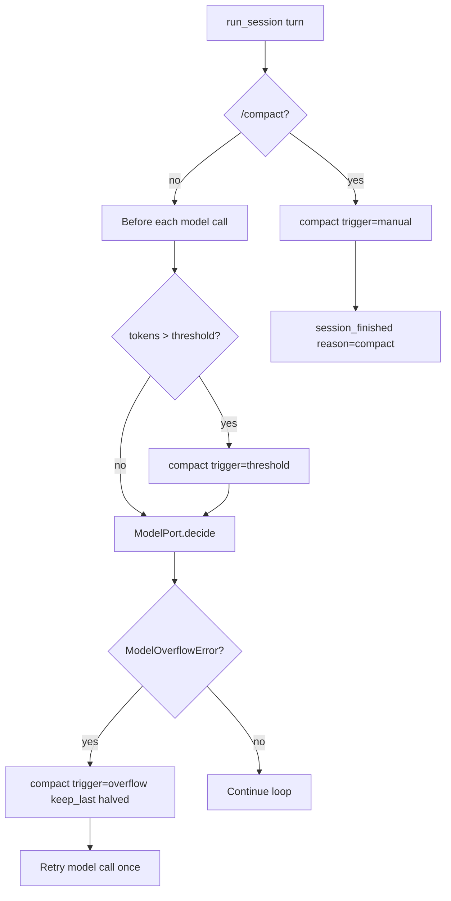

# Context Compaction

HarnessLab compacts long session transcripts so the next model call stays
within the configured context budget. Compaction is **loop-owned**
(`core/compaction.py`); providers only signal overflow via
`ModelOverflowError`.

See also: [`skills/compact.md`](../../skills/compact.md) (operator guide),
[`data-model.md`](data-model.md) (trace payloads),
[`overview.md`](overview.md) (loop integration).

## Why compaction exists

| Problem | Compaction response |
| --- | --- |
| Estimated tokens exceed threshold before a model call | Proactive summary + keep tail |
| Provider returns context overflow | Emergency compact (smaller tail) + one retry |
| Operator wants a clean slate mid-session | Manual `/compact` |

Compaction **does not** replace durable memory — use `/remember` or
`/remember-global` for facts that must survive summarization.

## Triggers



| Trigger | When | `keep_last` | Model call? |
| --- | --- | --- | --- |
| `threshold` | `estimate_messages_tokens > compaction_threshold_tokens` | `compaction_keep_last_messages` (default 20) | Yes — after compact |
| `overflow` | Adapter raises `ModelOverflowError` | `max(1, configured // 2)` | Yes — one retry |
| `manual` | User sends `/compact` (Web UI or CLI) | configured `keep_last` | **No** — compaction only |

Trace events: `compaction_started` (with `trigger`) → `compaction_completed`.
Manual compaction ends the turn with `session_finished` reason `compact`.

## Algorithm

1. Split `session.messages` into **prefix** (to summarize) and **tail**
   (last `keep_last` messages, verbatim).
2. Run `summarizer(prefix_messages)` → one summary string.
3. Replace prefix with a single `system` message:

   ```text
   <system-reminder>
   {summary}
   </system-reminder>
   ```

4. Recompute token estimate for trace payload.

### Token estimation

`estimate_tokens(text) = max(1, len(text) // 4)` — intentionally
model-agnostic so the loop can decide **whether** to compact without a
vendor tokenizer. Adapters may report finer counts in `model_call.context`.

### Summarizers

| Summarizer | Used when | Behavior |
| --- | --- | --- |
| `_fallback_summarizer` | Default offline / eval | Deterministic clip of roles + content |
| `LiveSummarizer(model)` | Live CLI / serve with LLM | One-shot summary prompt; falls back on empty output |

`format_message_for_summary()` builds transcript lines for LLM summarization.
Assistant messages include a clipped `reasoning_text` prefix when present so
thinking context is not silently dropped from the summary input.

## Thinking / reasoning after compaction

| Message region | `reasoning_text` on disk | On provider wire |
| --- | --- | --- |
| **Kept tail** (last K messages) | Preserved | Replayed when required (see [`provider-expansion.md`](provider-expansion.md) § replay) |
| **Compacted prefix** | Removed from timeline | Summary may mention clipped thinking via summarizer input only |

DeepSeek and similar APIs require `reasoning_content` on **every**
historical assistant message that still has persisted thinking in the kept
tail, including tool-loop assistants across later user turns — the
OpenAI-chat transform replays `Message.reasoning_text` by message id.
See [`provider-expansion.md`](provider-expansion.md) §6.6.1 and
[`guides/deepseek-thinking-troubleshooting.md`](../guides/deepseek-thinking-troubleshooting.md).

**Operator rule:** durable decisions belong in `/remember`, not in thinking
blocks that compaction may summarize away.

## Configuration

From `~/.config/harnesslab/config.json` (see
[`scripts/harnesslab.config.example.json`](../../scripts/harnesslab.config.example.json)):

| Key | Role |
| --- | --- |
| `limits.compaction_threshold_tokens` | Auto-compact when conversation estimate exceeds |
| `limits.compaction_keep_last_messages` | Tail size K |
| `limits.context_window_tokens` | Hard context limit for `ContextSnapshot` |

Env overrides may exist for tests (`RuntimeLimits` in eval tasks).

## Slash command

- **`/compact`** — force compaction now; listed in `GET /api/composer/commands`.
- Documented for users in [`skills/compact.md`](../../skills/compact.md).

## Eval coverage

- `eval/tasks/08_compaction_on_threshold.yaml` — threshold trigger with low limit override.

## Related code

| File | Responsibility |
| --- | --- |
| `src/harnesslab/core/compaction.py` | Estimation, compact, summarizers, `/compact` parse |
| `src/harnesslab/core/loop.py` | Pre-call compact, overflow retry, manual turn |
| `src/harnesslab/core/context.py` | `ContextSnapshot` after compaction |
