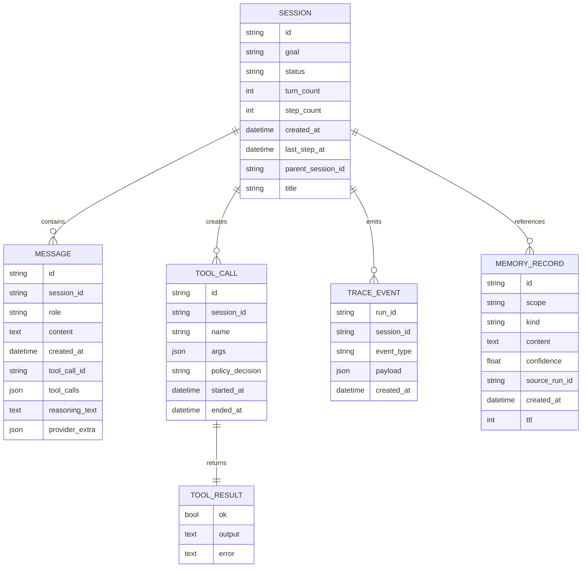

# Data Model Overview

## Purpose

This document defines the primary runtime records used by HarnessLab.
The goal is to keep data contracts stable even if implementation details change.

## Entity Relationship (Conceptual)



Diagram style and naming rules are defined in
`docs/architecture/diagram-conventions.md`.

## Session

Represents a conversational run context. Phase 2.3 makes
Session a first-class persisted entity with explicit lifecycle.

Fields:

- `id`: unique session ID
- `goal`: high-level user objective
- `status`: `pending | running | waiting_user | done | failed | aborted`
  - `pending`: created but no turn executed yet
  - `running`: inner loop is mid-flight, or hit `max_steps`
    without a terminal decision
  - `waiting_user`: model returned `Decision.kind == "ask_user"`
  - `done`: model returned `Decision.kind == "final"`
  - `failed` / `aborted`: reserved for runtime/operator failure
    paths
- `turn_count`: number of user inputs processed
- `step_count`: number of inner-loop iterations executed across
  all turns (Phase 2.1)
- `messages`: ordered message timeline
- `created_at`: creation timestamp
- `last_step_at`: timestamp of the most recent inner step (None
  until the first step runs)
- `parent_session_id`: when this session was created via
  `loop.fork(parent_id, ...)`, points to the parent (None
  otherwise)
- `title`: short human label derived from the goal at `start()`
  time and used by `harnesslab session ls`
- `model_backend` (optional): per-session provider backend override;
  when `null`, the operator default from `~/.config/harnesslab/config.json`
  applies (Web UI session model picker)
- `model_id` (optional): catalog model id pinned for this session
- `model_effort` (optional): reasoning/thinking level for the session
  override (provider-specific semantics; see Web API)
- `budget_usage`: cumulative budget counters persisted with the
  session:
  - `llm_calls_total`
  - `tool_calls_total`
  - `tokens_total`
  - `wall_time_ms_total`
  - `cost_usd_total`
  - `last_budget_status` (`ok|soft_exceeded|hard_exceeded`)

## Message

Represents one communication unit in a session.

Suggested fields:

- `id`: unique message ID
- `role`: `system | user | assistant | tool`
- `content`: text payload
- `created_at`: timestamp
- `tool_call_id` (optional): linkage for tool-originated messages
- `tool_calls` (optional): OpenAI-style assistant tool request payload
  recorded immediately before a tool result message so chat providers
  can replay the turn without a 400 invalid-history error
- `reasoning_text` (optional): normalized chain-of-thought text captured
  from provider responses (e.g. DeepSeek ``reasoning_content``) for
  replay when the API requires it in a tool loop
- `provider_extra` (optional): opaque vendor payload when normalization
  would lose data (Anthropic thinking blocks, Gemini thought signatures)

### Provider catalog & transforms (Post-MVP P1)

Model metadata lives under ``providers/catalog/*.json`` and is loaded by
``ModelCatalog``. Each entry records ``api_family``, context limits, and
thinking defaults. Message serialization for networked adapters runs through
``providers/transforms/`` hooks (``serialize_messages``, ``parse_response``,
``replay_policy``) keyed by ``api_family``. See
``docs/architecture/provider-expansion.md`` §6.

## ToolCall

Represents a requested tool action.

Suggested fields:

- `id`: unique tool call ID
- `session_id`: owning session ID
- `name`: tool name
- `args`: argument payload
- `policy_decision`: `allow:<reason>` or `deny:<reason>` recorded by the policy layer
- `started_at`: execution start timestamp (UTC); `None` if the call was denied
- `ended_at`: execution end timestamp (UTC); `None` if the call was denied

Extended fields (future):

- `resource_usage`
- `stdout_ref` / `stderr_ref`

## ToolResult

Represents normalized tool execution outcome.

Suggested fields:

- `ok`: boolean success indicator
- `output`: normalized output text
- `error` (optional): failure reason

## TraceEvent

> **Status:** Current runtime contract (v1). Target replacement:
> [`SpanRecord`](#spanrecord-v2--design-approved-not-shipped) per
> [`observability-v2.md`](observability-v2.md). Retired at cutover — no
> prolonged dual-write.

Represents one telemetry event for replay and debugging.

Top-level fields:

- `run_id`: run/session correlation ID
- `session_id`: session ID
- `event_type`: semantic event label
- `payload`: event-type-specific attributes (see below)
- `created_at`: timestamp

### Event types and payload shapes

The shape of `payload` is part of the public trace contract: the Step 5
replayer reads `user_input_received` and `decision_made` to rebuild a
`ReplayModel`, and `tool_executed` / `tool_denied` / `tool_invalid_args`
shapes are what `harnesslab metrics` aggregates.

| `event_type` | payload (required keys) |
| --- | --- |
| `session_started` | `goal: str` |
| `user_input_received` | `turn_index: int`, `user_input: str` |
| `user_steer_received` | `turn_index: int`, `step_index: int`, `user_input: str`, `steer_index: int` |
| `sub_agent_spawned` | `child_session_id: str`, `parent_session_id: str`, `goal: str`, `max_steps: int` |
| `sub_agent_completed` | `child_session_id: str`, `parent_session_id: str`, `goal: str`, `step_count: int`, `status: str`, `final_response_preview: str`, `budget_usage: object` |
| `skill_installed` | optional audit payload: `name: str`, `scope: str` (`workspace` \| `user`), `source: str` (catalog id, path, or URL) — emitted only on explicit operator install, not model tool calls |
| `step_started` | `step_index: int`, `reason: "initial" \| "after_<prev_outcome>"` |
| `model_call_started` | `step_index`, optional `thinking_likely: bool` |
| `model_call` | `decision_kind`, `latency_ms`, `context: ContextSnapshot`, optional: `model_name`, `provider`, `request_tokens`, `response_tokens`, `total_tokens`, `usage_breakdown`, `cost_estimate`, `reasoning_text`, `prompt_blocks[]`, `api_messages[]` |
| `decision_made` | `kind: "assistant" \| "plan" \| "tool" \| "final" \| "ask_user"`, `tool_name: str \| null`, `tool_args: dict`, `assistant_message: str \| null`, optional `reasoning_text` |
| `plan_emitted` | `plan: str` |
| `tool_invalid_args` | `tool_call_id`, `tool`, `args`, `error` |
| `tool_denied` | `tool_call_id`, `tool`, `args`, `policy_decision`, `reason` |
| `tool_executed` | `tool_call_id`, `tool`, `args`, `policy_decision`, `started_at`, `ended_at`, `duration_ms`, `ok`, `error`, `output_size`, `output_preview`, `output_truncated` |
| `hook_invoked` | `phase: "pre_tool" \| "post_tool"`, `name`, `type`, `tool_name` |
| `hook_blocked` | `phase: "pre_tool"`, `name`, `type`, `tool_name`, `reason` |
| `hook_failed` | `phase: "pre_tool" \| "post_tool"`, `name`, `type`, `tool_name`, `error` |
| `step_completed` | `step_index: int`, `outcome: "final" \| "ask_user" \| "assistant" \| "plan" \| "tool_ok" \| "tool_error" \| "tool_denied" \| "tool_invalid_args"` |
| `compaction_started` | `trigger: "threshold" \| "overflow" \| "manual"`, `message_count`, `estimated_tokens`, `threshold_tokens`, `keep_last` |
| `compaction_completed` | `after_messages: int`, `after_tokens: int` |
| `budget_soft_threshold` | `dimension`, `current`, `limit`, `ratio`, `scope`, `severity="soft"` |
| `budget_hard_exceeded` | `dimension`, `current`, `limit`, `ratio`, `scope`, `severity="hard"` |
| `budget_enforcement_action` | `action: "ask_user" \| "final" \| "error"` |
| `plan_recheck_requested` | `steps_used`, `replan_after_steps` |
| `session_finished` | `reason: "final" \| "ask_user" \| "max_steps" \| "overflow" \| "remember" \| "remember_global" \| "compact"`, `steps: int` |
| `session_titled` | `title: str`, `previous_title: str \| null`, `source: "llm"` |
| `memory_read` | `key: str`, `line_count: int` |
| `memory_written` | `key: str`, `line: str`, `line_count: int`, `source: "remember"` |
| `workspace_memory_read` | `key: str`, `line_count: int` |
| `workspace_memory_written` | `key: str`, `line: str`, `line_count: int`, `source: "remember_global"` |

`tool_executed`'s `output_*` fields, model telemetry fields
(`model_name`, `provider`, token counters), timing fields
(`created_at`, `started_at`, `ended_at`, `duration_ms`,
`latency_ms`), and the Phase 2.6 `context` snapshot are considered
"volatile" by the divergence detector (see
`docs/architecture/overview.md`, Replay & Divergence Model).
`context` is volatile because token estimates depend on tool
outputs that embed workspace paths.

### Web SSE events (not persisted)

The Web UI may receive **non-trace** SSE events during a turn:
``reasoning_delta`` and ``assistant_delta`` (token streaming). These are
ephemeral UI payloads — not appended to ``trace.jsonl`` — and are excluded
from replay. See ``docs/architecture/webui-design.md`` § SSE.

### ContextSnapshot payload shape (Phase 2.6)

Attached to every `model_call.payload.context`:

| Field | Source |
| --- | --- |
| `conversation_tokens` | `estimate_messages_tokens(session.messages)` |
| `message_count` | `len(session.messages)` |
| `limit_tokens` | `RuntimeLimits.context_window_tokens` |
| `compaction_threshold_tokens` | `RuntimeLimits.compaction_threshold_tokens` |
| `usage_ratio` | `conversation_tokens / limit_tokens` |
| `threshold_ratio` | `conversation_tokens / compaction_threshold_tokens` |
| `prompt_tokens_estimate` | optional, adapter-supplied total of composed prompt blocks |
| `static_block_tokens` | optional, adapter-supplied |
| `dynamic_block_tokens` | optional, adapter-supplied |
| `prompt_block_names` | optional, ordered list of prompt block names |
| `context_breakdown_tokens` | optional, token buckets for UI-style context panes (`system_prompt`, `tool_definitions`, `rules`, `skills`, `subagent_definitions`, `summarized_conversation`, `conversation`) |

## SpanRecord (v2 — shipped)

Normative spec: [`observability-v2.md`](observability-v2.md). One JSONL line
per **completed** span at `.harnesslab/spans.jsonl`. Primary telemetry for
new runs; flat `TraceEvent` / v1 `trace.jsonl` are legacy-only.

Top-level fields:

| Field | Notes |
| --- | --- |
| `resource` | Process-scoped snapshot (OTel Resource parity) |
| `trace_id`, `span_id`, `parent_span_id` | Span identity; new `trace_id` per turn |
| `name`, `kind` | e.g. `llm.generate`, `client` |
| `session_id`, `turn_index` | Top-level correlation (duplicate span attrs for filter) |
| `start_time`, `end_time`, `duration_ms` | Volatile — stripped in replay compare |
| `status`, `status_message` | OTel span status |
| `attributes` | Stable semantic replay surface (`harnesslab.*`, `gen_ai.*`) |
| `events` | Nested instant records (`SpanEvent`) |
| `metrics` | Volatile telemetry (tokens, latency, cost, `context`) |
| `links` (optional) | Cross-trace links (e.g. `sub_agent.run` → child turn root) |

**Port:** `SpanRecorderPort` — `start_span`, `end_span`, `add_span_event`,
`add_span_link`, `current_span(session_id)`. See observability-v2 § D4.

**`run_id`:** Not carried forward. Use `trace_id` per turn + `session_id`.

**Replay compare:** Span forest preorder DFS per turn, not flat event list.
See observability-v2 § D7.

## MemoryRecord (Planned)

Represents a durable memory item.

Suggested fields:

- `id`
- `scope`: `session | user | global`
- `kind`: `fact | preference | lesson | incident`
- `content`
- `confidence`
- `source_run_id`
- `created_at`
- `ttl` (optional)

## ID and Timestamp Conventions

- IDs should be opaque and stable (prefix + random suffix is acceptable)
- Timestamps should use UTC
- Event ordering should rely on explicit ordering plus timestamps, not timestamps alone

## Storage Evolution Plan

1. In-memory stores for MVP — shipped (Step 1)
2. SQLite persistence for sessions/messages/memory — shipped (Step 3)
3. Optional vector index or retrieval index for memory records — planned
4. Artifact storage references for large outputs — **shipped (Phase 5.2)**
   via `ArtifactStorePort`; metadata in SQLite (`artifacts` table v6),
   blobs under `.harnesslab/artifacts/`; enabled when
   `limits.artifact_threshold_bytes` or `HARNESSLAB_ARTIFACT_THRESHOLD_BYTES`
   is set.

### Current SQLite Schema (managed by `storage.sqlite.MIGRATIONS`)

```sql
CREATE TABLE schema_version (
    version INTEGER NOT NULL PRIMARY KEY,
    applied_at TEXT NOT NULL
);

-- v1
CREATE TABLE sessions (
    id TEXT PRIMARY KEY,
    goal TEXT NOT NULL,
    status TEXT NOT NULL,
    turn_count INTEGER NOT NULL,
    created_at TEXT NOT NULL
);
-- v2 (Phase 2.3 — session as first-class citizen)
ALTER TABLE sessions ADD COLUMN step_count INTEGER NOT NULL DEFAULT 0;
ALTER TABLE sessions ADD COLUMN last_step_at TEXT;
ALTER TABLE sessions ADD COLUMN parent_session_id TEXT
    REFERENCES sessions(id) ON DELETE SET NULL;
ALTER TABLE sessions ADD COLUMN title TEXT;
-- v9 (Web UI — per-session model override)
ALTER TABLE sessions ADD COLUMN model_backend TEXT;
ALTER TABLE sessions ADD COLUMN model_id TEXT;
ALTER TABLE sessions ADD COLUMN model_effort TEXT;
CREATE INDEX idx_sessions_status_created ON sessions(status, created_at DESC);
CREATE INDEX idx_sessions_parent ON sessions(parent_session_id);

CREATE TABLE messages (
    id TEXT PRIMARY KEY,
    session_id TEXT NOT NULL REFERENCES sessions(id) ON DELETE CASCADE,
    role TEXT NOT NULL,
    content TEXT NOT NULL,
    created_at TEXT NOT NULL,
    tool_call_id TEXT,
    tool_calls TEXT,
    reasoning_text TEXT,
    provider_extra TEXT,
    ord INTEGER NOT NULL
);
-- v3: tool_calls column; v4: reasoning_text + provider_extra (Post-MVP P1)

CREATE INDEX idx_messages_session_ord ON messages(session_id, ord);

CREATE TABLE memory_kv (
    key TEXT PRIMARY KEY,
    value TEXT NOT NULL,
    updated_at TEXT NOT NULL
);
```

Notes:

- `messages.ord` preserves intra-session ordering; events are not relied
  on timestamps alone (see "ID and Timestamp Conventions" above).
- `memory_kv` is the MVP key/value table that backs `MemoryStorePort`.
  The richer `MemoryRecord` model above will be added in its own table
  when retrieval/writeback policy lands, without breaking `memory_kv`.
- `traces` are emitted to JSONL only; persisting them to SQLite is
  deferred (the Step 5 replayer reads JSONL directly, which is enough
  for the current divergence/metrics use cases). v2 target file:
  `.harnesslab/spans.jsonl` ([`observability-v2.md`](observability-v2.md)).

### OpenTelemetry export (Post-MVP P7 → Observability v2)

> **Superseded:** v1 flat-event `OtelTraceRecorder` is retired at Observability
> v2 cutover. OTLP export uses native span lifecycle via `OtelSpanRecorder`
> (`telemetry/otel_span_recorder.py`) on the same `SpanRecorderPort` composite
> as local JSONL. See [`observability-v2.md`](observability-v2.md) § D4, O4.

When `HARNESSLAB_OTEL=1` or `OTEL_EXPORTER_OTLP_ENDPOINT` is set, CLI and
`hl-serve` emit **lifecycle spans** (not zero-duration flat events):

- **Span names:** e.g. `harnesslab.turn`, `harnesslab.step`, `llm.generate`, `tool.{name}`
- **Resource:** process-scoped (`service.name`, `deployment.environment`, …)
- **Span attributes:** session/turn correlation (`harnesslab.session.id`, …)
- **Metrics:** token counters, latency, cost on `SpanRecord.metrics` → OTel instruments

Eval and replay **must not** depend on OTel export or collector availability.

## Compatibility Guidance

To simplify Python -> TypeScript migration:

- Keep field names stable and language-neutral
- Keep enums explicit
- Avoid implicit side effects in model constructors
- Prefer contract tests at the boundary layer
