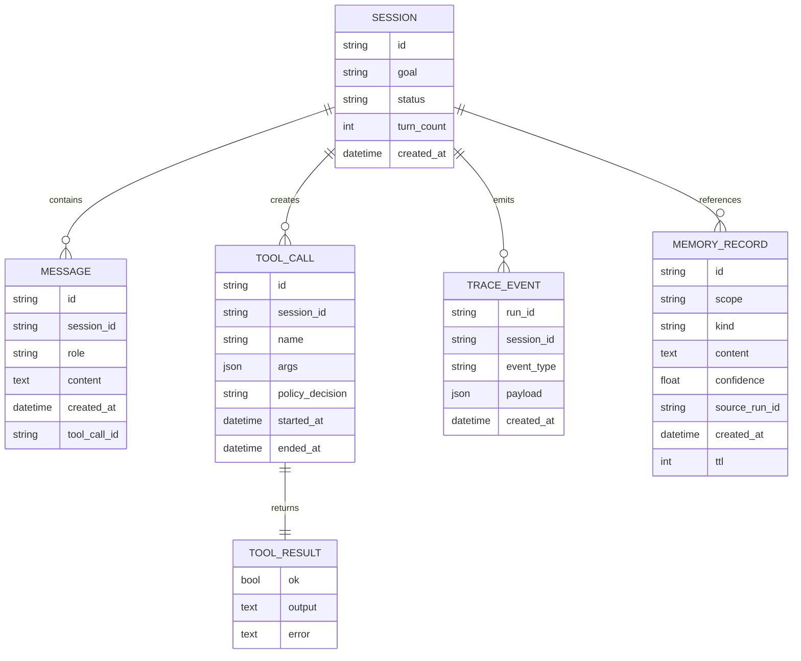

# Data Model Overview

## Purpose

This document defines the primary runtime records used by HarnessLab.
The goal is to keep data contracts stable even if implementation details change.

## Entity Relationship (Conceptual)

Diagram style and naming rules are defined in
`docs/architecture/diagram-conventions.md`.

## Session

Represents a conversational run context.

Suggested fields:

- `id`: unique session ID
- `goal`: high-level user objective
- `status`: `running | done | failed`
- `turn_count`: number of processed turns
- `messages`: ordered message timeline
- `created_at`: creation timestamp

## Message

Represents one communication unit in a session.

Suggested fields:

- `id`: unique message ID
- `role`: `system | user | assistant | tool`
- `content`: text payload
- `created_at`: timestamp
- `tool_call_id` (optional): linkage for tool-originated messages

## ToolCall

Represents a requested tool action.

Suggested fields:

- `id`: unique tool call ID
- `name`: tool name
- `args`: argument payload

Extended fields (future):

- `policy_decision`
- `started_at`
- `ended_at`
- `resource_usage`
- `stdout_ref` / `stderr_ref`

## ToolResult

Represents normalized tool execution outcome.

Suggested fields:

- `ok`: boolean success indicator
- `output`: normalized output text
- `error` (optional): failure reason

## TraceEvent

Represents one telemetry event for replay and debugging.

Suggested fields:

- `run_id`: run/session correlation ID
- `session_id`: session ID
- `event_type`: semantic event label
- `payload`: event attributes
- `created_at`: timestamp

## MemoryRecord (Planned)

Represents a durable memory item.

Suggested fields:

- `id`
- `scope`: `session | user | global`
- `kind`: `fact | preference | lesson | incident`
- `content`
- `confidence`
- `source_run_id`
- `created_at`
- `ttl` (optional)

## ID and Timestamp Conventions

- IDs should be opaque and stable (prefix + random suffix is acceptable)
- Timestamps should use UTC
- Event ordering should rely on explicit ordering plus timestamps, not timestamps alone

## Storage Evolution Plan

1. In-memory stores for MVP
2. SQLite persistence for sessions/messages/traces
3. Optional vector index or retrieval index for memory records
4. Artifact storage references for large outputs

## Compatibility Guidance

To simplify Python -> TypeScript migration:

- Keep field names stable and language-neutral
- Keep enums explicit
- Avoid implicit side effects in model constructors
- Prefer contract tests at the boundary layer
