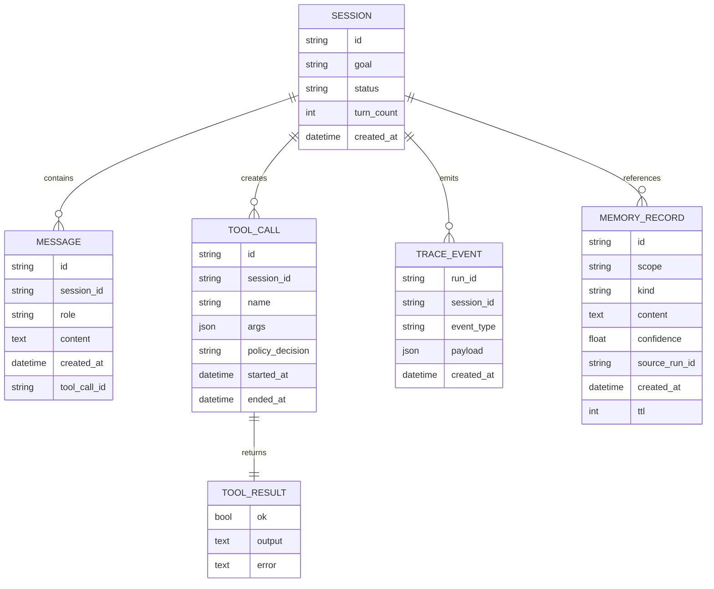

# Data Model Overview

## Purpose

This document defines the primary runtime records used by HarnessLab.
The goal is to keep data contracts stable even if implementation details change.

## Entity Relationship (Conceptual)



Diagram style and naming rules are defined in
`docs/architecture/diagram-conventions.md`.

## Session

Represents a conversational run context.

Suggested fields:

- `id`: unique session ID
- `goal`: high-level user objective
- `status`: `running | done | failed`
- `turn_count`: number of processed turns
- `messages`: ordered message timeline
- `created_at`: creation timestamp

## Message

Represents one communication unit in a session.

Suggested fields:

- `id`: unique message ID
- `role`: `system | user | assistant | tool`
- `content`: text payload
- `created_at`: timestamp
- `tool_call_id` (optional): linkage for tool-originated messages

## ToolCall

Represents a requested tool action.

Suggested fields:

- `id`: unique tool call ID
- `session_id`: owning session ID
- `name`: tool name
- `args`: argument payload
- `policy_decision`: `allow:<reason>` or `deny:<reason>` recorded by the policy layer
- `started_at`: execution start timestamp (UTC); `None` if the call was denied
- `ended_at`: execution end timestamp (UTC); `None` if the call was denied

Extended fields (future):

- `resource_usage`
- `stdout_ref` / `stderr_ref`

## ToolResult

Represents normalized tool execution outcome.

Suggested fields:

- `ok`: boolean success indicator
- `output`: normalized output text
- `error` (optional): failure reason

## TraceEvent

Represents one telemetry event for replay and debugging.

Top-level fields:

- `run_id`: run/session correlation ID
- `session_id`: session ID
- `event_type`: semantic event label
- `payload`: event-type-specific attributes (see below)
- `created_at`: timestamp

### Event types and payload shapes

The shape of `payload` is part of the public trace contract: the Step 5
replayer reads `user_input_received` and `decision_made` to rebuild a
`ReplayModel`, and `tool_executed` / `tool_denied` / `tool_invalid_args`
shapes are what `harnesslab metrics` aggregates.

| `event_type` | payload (required keys) |
| --- | --- |
| `session_started` | `goal: str` |
| `user_input_received` | `turn_index: int`, `user_input: str` |
| `model_call` | `decision_kind`, `latency_ms`, optional: `model_name`, `provider`, `request_tokens`, `response_tokens`, `total_tokens` |
| `decision_made` | `kind: "assistant" \| "tool"`, `tool_name: str \| null`, `tool_args: dict`, `assistant_message: str \| null` |
| `tool_invalid_args` | `tool_call_id`, `tool`, `args`, `error` |
| `tool_denied` | `tool_call_id`, `tool`, `args`, `policy_decision`, `reason` |
| `tool_executed` | `tool_call_id`, `tool`, `args`, `policy_decision`, `started_at`, `ended_at`, `duration_ms`, `ok`, `error`, `output_size`, `output_preview`, `output_truncated` |

`tool_executed`'s `output_*` fields, model telemetry fields
(`model_name`, `provider`, token counters), and timing fields
(`created_at`, `started_at`, `ended_at`, `duration_ms`, `latency_ms`)
are considered "volatile" by the divergence detector (see
`docs/architecture/overview.md`, Replay & Divergence Model).

## MemoryRecord (Planned)

Represents a durable memory item.

Suggested fields:

- `id`
- `scope`: `session | user | global`
- `kind`: `fact | preference | lesson | incident`
- `content`
- `confidence`
- `source_run_id`
- `created_at`
- `ttl` (optional)

## ID and Timestamp Conventions

- IDs should be opaque and stable (prefix + random suffix is acceptable)
- Timestamps should use UTC
- Event ordering should rely on explicit ordering plus timestamps, not timestamps alone

## Storage Evolution Plan

1. In-memory stores for MVP — shipped (Step 1)
2. SQLite persistence for sessions/messages/memory — shipped (Step 3)
3. Optional vector index or retrieval index for memory records — planned
4. Artifact storage references for large outputs — planned

### Current SQLite Schema (managed by `storage.sqlite.MIGRATIONS`)

```sql
CREATE TABLE schema_version (
    version INTEGER NOT NULL PRIMARY KEY,
    applied_at TEXT NOT NULL
);

CREATE TABLE sessions (
    id TEXT PRIMARY KEY,
    goal TEXT NOT NULL,
    status TEXT NOT NULL,
    turn_count INTEGER NOT NULL,
    created_at TEXT NOT NULL
);

CREATE TABLE messages (
    id TEXT PRIMARY KEY,
    session_id TEXT NOT NULL REFERENCES sessions(id) ON DELETE CASCADE,
    role TEXT NOT NULL,
    content TEXT NOT NULL,
    created_at TEXT NOT NULL,
    tool_call_id TEXT,
    ord INTEGER NOT NULL
);

CREATE INDEX idx_messages_session_ord ON messages(session_id, ord);

CREATE TABLE memory_kv (
    key TEXT PRIMARY KEY,
    value TEXT NOT NULL,
    updated_at TEXT NOT NULL
);
```

Notes:

- `messages.ord` preserves intra-session ordering; events are not relied
  on timestamps alone (see "ID and Timestamp Conventions" above).
- `memory_kv` is the MVP key/value table that backs `MemoryStorePort`.
  The richer `MemoryRecord` model above will be added in its own table
  when retrieval/writeback policy lands, without breaking `memory_kv`.
- `traces` are emitted to JSONL only; persisting them to SQLite is
  deferred (the Step 5 replayer reads JSONL directly, which is enough
  for the current divergence/metrics use cases).

## Compatibility Guidance

To simplify Python -> TypeScript migration:

- Keep field names stable and language-neutral
- Keep enums explicit
- Avoid implicit side effects in model constructors
- Prefer contract tests at the boundary layer
