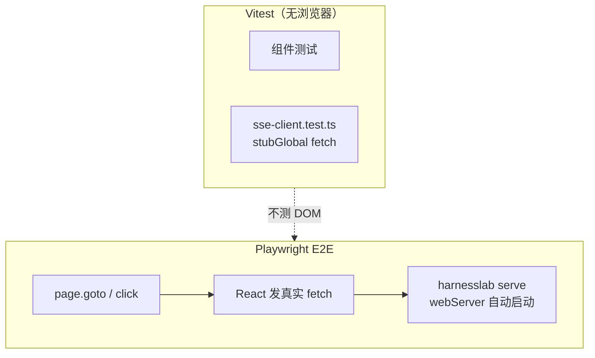

# Frontend TS Migration RFC (OpenClaw-style)

Status: **Complete** (Phases A–E). TS Web UI is the only shipped frontend;
legacy `web/static/` removed.

## Why this exists

HarnessLab previously shipped a legacy static Web UI (`web/static/`). Phase 5+
features (proposal review, budgets, hooks, checkpoints, streaming UX)
benefit from:

- stronger type safety
- modular UI composition
- reusable API client + SSE abstractions
- better testability and maintainability

This RFC defines the migration plan to a TypeScript-based frontend,
while keeping the existing Python runtime and API contracts stable.

Product UX principles, turn layout, and Thinking/Thought semantics are
documented in [`webui-design.md`](webui-design.md).

## Current progress snapshot

- `webui/` scaffold exists (Vite + React + TS + typed API/SSE helpers).
- Build target is `src/harnesslab/web/static_ts/` (`bun run build` or `./hl-serve build`).
- `harnesslab serve` serves the TS bundle from `static_ts/` after
  `./hl-serve build` (503 when missing).
- Phase B read surfaces are live in TS UI (sessions / trace / proposals / settings).
- Phase C interactive parity shipped:
  - composer send + SSE `trace` / `reasoning_delta` / `assistant_delta` / `done` / `error`
  - `/` slash palette via `GET /api/composer/commands`
  - Cursor-style `/skillname`; `/compact`, `/remember`, `/remember-global`
  - session fork; tool cards; stream error rendering
  - IME-safe composer; localStorage session/mode restore; model picker → `config.json`
  - **Main assistant replies always full** (Cursor-like); Thinking / Tool rows use left-side disclosure
- Phase D **complete** (proposal gates, budgets, MCP health, checkpoint rewind UI).
- Phase E **complete**: legacy `web/static/` deleted; TS-only serve path.
- **UI-1** (visual shell): design tokens; `app-shell` layout (sidebar + main + trace); composer dock — **shipped** — see [`webui-design.md`](webui-design.md) Visual evolution
- **UI-2** (sidebar): session search/filter; removed legacy `SessionPicker` / `ChatTopBar` — **shipped**
- **UI-3** (tool/thought): compact/detailed activity toggle + chat text size — **shipped**
- **UI-4a** (compact button + sidebar rename) — **shipped**
- **UI-4b** (activity panel + scroll-collapse composer) — **shipped**
- **UI-4c** (light/dark theme) — **shipped**
- **UI-5** (steer queue, per-session model) — **done** (`POST /api/sessions/{id}/steer`, `TurnSteerBuffer`)

## Scope and non-goals

Scope:

- Migrate Web UI implementation to TypeScript incrementally.
- Preserve existing server APIs and session semantics.
- Keep localhost-first serving model (`harnesslab serve`).

Non-goals:

- No immediate backend rewrite to Node/TS.
- No distributed runtime or plugin marketplace changes.
- No forced redesign of loop/policy contracts during UI migration.

## Design principles (OpenClaw-inspired)

1. **Typed boundary first**: maintain TS schemas aligned with documented JSON payloads.
2. **Feature modules**: `sessions`, `trace`, `proposals`, `settings`, `composer` as slices.
3. **Single stream abstraction**: one SSE client layer for trace/delta/done/error.
4. **State is explicit**: loading/error/empty states per feature module.
5. **Progressive migration**: legacy static UI remains fallback until Phase E exit.

## Target stack

- Runtime: `React` + `TypeScript`
- Build/dev: `Vite` + `bun` (see `webui/README.md`)
- Data fetching: `@tanstack/react-query`
- Validation: `zod` + thin helpers
- Testing: `vitest` + `@testing-library/react`；Playwright E2E 冒烟见 `webui/e2e/` 与 [`guides/browser-automation.md`](../guides/browser-automation.md)

## Migration phases

### Phase A: foundation — DONE

Typed `api-client` + `sse-client`; build pipeline → `static_ts/`.

### Phase B: read surfaces parity — DONE

Session list/detail, trace panel, proposal list/detail read-only.

### Phase C: interactive parity — DONE

Composer, SSE streaming, fork, slash commands, tool cards, model picker persistence.

### Phase D: advanced controls — IN PROGRESS

| Item | Status |
| --- | --- |
| Proposal transitions + gate runs | Done |
| Budget usage / budget events in session workspace | Done |
| MCP health in Settings | Done (needs `tools.mcp_servers` in config) |
| Hook event visualization in trace | Partial (trace labels exist) |
| Session checkpoints list + rewind confirm + file diff preview | **Done** — Advanced trace column |
| Provider failover surfacing | Planned |

**Exit:** Phase 5 Web surfaces fully hosted in TS frontend.

### Phase E: default switch & legacy removal — **Done**

- TS build output is **required** for Web UI (`static_ts/` after `./hl-serve build`).
- Legacy `web/static/` removed; `HARNESSLAB_WEB_UI_VERSION=legacy` raises at serve time.
- Missing bundle → HTTP 503 with build instructions (no HTML fallback).

## Frontend testing coverage strategy

分层测试，避免迁移阻塞功能交付。完整操作说明见 [`webui/README.md`](../../webui/README.md) § Playwright E2E。

### 三层职责（勿与 Agent 浏览器混淆）

| 层级 | 工具 | 运行环境 | 网络 | 职责 |
| --- | --- | --- | --- | --- |
| 单元 / 组件 | Vitest + Testing Library | jsdom | **mock `fetch`** | 组件逻辑、SSE 客户端解析顺序 |
| 流式集成 | Vitest + Python pytest | jsdom / 无浏览器 | mock 或真实 SSE | `trace` → delta → `done` 顺序 |
| E2E 冒烟 | Playwright (`webui/e2e/`) | headless Chromium | **真实 localhost API** | UI 壳层：sidebar、tabs、Settings |
| Python runtime | pytest | — | — | loop、API 契约；不含 Web UI DOM |

**要点：** E2E **不是** `page.route` mock 网络；是无头浏览器里的真实点击 + 真实 HTTP。Vitest 里 mock SSE **不是** Playwright 职责。

### 各层状态

| Layer | Purpose | Status |
| --- | --- | --- |
| Utility | Pure helpers (`gate-utils`, `thoughtUtils`, …) | Active |
| Component | RTL + Vitest on feature slices | Active |
| **Stream integration** | SSE ordering: `trace` → deltas → `done`; error events | **Done** — `sse-client.test.ts` + `test_web_sse_stream_event_ordering` |
| E2E smoke | Playwright UI shell smoke | **Done** — `webui/e2e/smoke.spec.ts` |
| E2E chat workflow | Composer 发消息 + SSE 流式回复 | **未做**（可选后续） |

**Stream integration:**

1. **Unit (done):** `sse-client.test.ts` feeds synthetic SSE chunks; asserts handler call order and `stream:true` on POST body.
2. **Reducer (done):** `liveTurnStream.test.ts` for delta → LiveTurn state.
3. **Python (done):** `tests/test_web_server.py` asserts `trace` precedes `done` on live SSE turn.
4. **Next (optional):** `useComposerController` integration test with mocked `postSse` returning a full turn script.
5. **Next (optional E2E):** Playwright 点击 Composer、`waitForResponse` / 等待 DOM，**仍走真实 API**，不用 mock fetch。

Agent 浏览器（MCP Playwright）与 Web UI E2E 是两种 Playwright 用途，见 [`guides/browser-automation.md`](../guides/browser-automation.md)。

## Compatibility and rollout controls

- Env: `HARNESSLAB_WEB_UI_VERSION=legacy|ts`
- Config: `web_ui_version` in operator config
- CI: Python tests + `cd webui && bun run check && bun test && bun run build && bun run test:e2e`
- `./hl-serve build` / `./hl-serve restart --build` for local frontend refresh

## Risks and mitigations

- **API drift** → contract tests + schema docs in `web-api.md`
- **SSE regressions** → stream integration tests (above)
- **Migration vs features** → phased replacement; legacy frozen

## Acceptance criteria for legacy removal (Phase E exit)

1. TS UI covers all Phase D items (including rewind).
2. One release cycle with TS default and no P2 regressions reported.
3. `web/static/` deleted; docs and `serve` fallback simplified.
