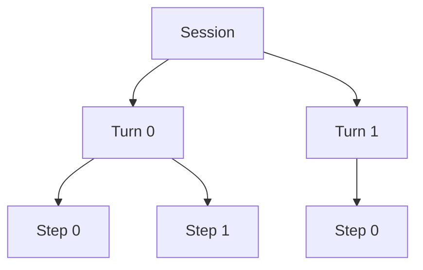
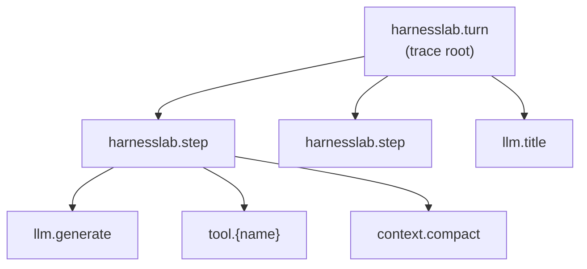
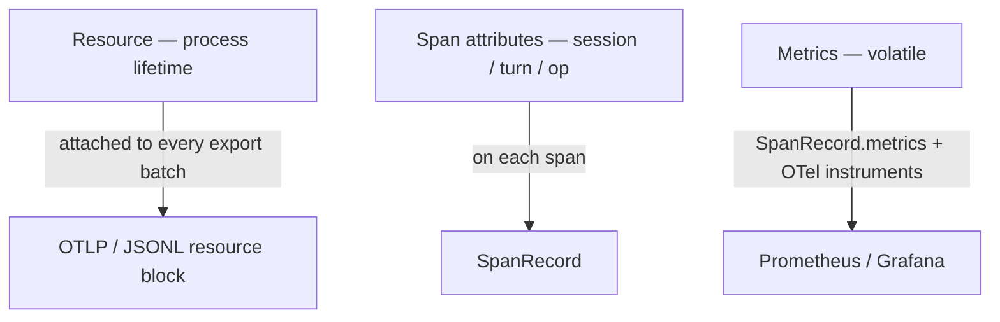
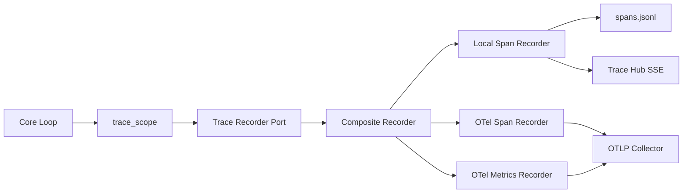

# Observability v2 — Span-First Design

## Purpose

This document defines the **target observability architecture** for HarnessLab:
OpenTelemetry-aligned spans as the primary telemetry model, with dual export
(local JSONL + optional OTLP) and no dependency on legacy flat `TraceEvent`
semantics.

Status: **shipped** (Observability v2 cutover complete). The runtime emits
`SpanRecord` rows to `.harnesslab/spans.jsonl` via `SpanRecorderPort`.
v1 flat `TraceEvent` / `trace.jsonl` recorders and Web UI heuristic tree
(`buildTraceSpanTree.ts`) have been **removed**; `TraceEvent` remains only
as a legacy model type for a few aggregate/replay helpers.

Related docs:

- [`data-model.md`](data-model.md) — `SpanRecord` + legacy `TraceEvent` reference
- [`provider-expansion.md`](provider-expansion.md) §11 — v1 OTel fan-out (deprecated)
- [`webui-design.md`](webui-design.md) — Trace Tab (native span tree via SSE)
- [`diagram-conventions.md`](diagram-conventions.md) — Mermaid style rules

---

## Background (v1 pain — resolved at cutover)

Before Observability v2 shipped, HarnessLab recorded **flat audit events**
(`step_started`, `model_call`, `tool_executed`, …) via
`TraceRecorderPort.record(TraceEvent)`. Each row had no `parent_span_id`. The
Web UI reconstructed a Jaeger-style tree in the browser (`buildTraceSpanTree.ts`)
by guessing parentage from event order and type — an approximation documented in
[`webui-design.md`](webui-design.md).

Post-MVP P7 added an optional **OTel fan-out** (`OtelTraceRecorder`) that
maps each flat event to a **zero-duration, sibling span**. That proves OTLP
export works but does not model execution structure or durations correctly.

**Observability v2** replaces both patterns with **native span lifecycle**
instrumentation at the loop boundary.

---

## Session and Turn

These terms appear in the data model, the loop API, and the span hierarchy.
They are **not the same thing**.

### Definitions

| Concept | What it is | Runtime anchor | Persists? |
| --- | --- | --- | --- |
| **Session** | A durable conversation container: messages, memory, budget, status, title | `Session` row in `SessionStore`; created by `HarnessLoop.start()` or `start_child()` | Yes — survives across multiple user messages until `done` / `failed` / `aborted` |
| **Turn** | One processing cycle: the operator (or tool) sends **one** user-visible input and the loop produces **one** assistant-facing outcome for that input | One call to `HarnessLoop.run_session(session_id, user_input, max_steps=…)` (or a shortcut turn such as `/remember`, `/compact`, `/skill list`) | No separate row — recorded only as telemetry + appended messages |
| **Step** | One inner-loop iteration inside a turn: one model decision (+ optional tool execution) | The `for step_index in range(max_steps)` body inside `run_session` | No separate row — `session.step_count` increments per step |

### Relationship



In code (`core/loop.py`):

- `session.turn_count` is the **zero-based index of the next turn** when
  `user_input_received` fires; it increments **once per `run_session` return**.
- `session.step_count` counts **model decisions across the whole session**,
  not reset per turn.
- `run_turn(...)` is exactly `run_session(..., max_steps=1)` — a turn with at
  most one step.

### Special turns (still one turn each)

These paths bypass the inner step loop but still count as a turn (except where
noted):

| Path | Span under turn | Inner steps |
| --- | --- | --- |
| Normal chat | `harnesslab.step` × N | Yes |
| `/remember`, `/remember-global` | `slash.remember` (instant or short) | No |
| `/compact` | `context.compact` | No ( compaction only ) |
| `/skill list\|add\|remove\|clear` | `skill.command` | No |
| `/skill <name> …` (invoke) | `skill.invoke` wrapping normal steps | Yes (extended `max_steps`) |
| `spawn_sub_agent` tool | `sub_agent.run` under `tool.spawn_sub_agent` | Child session is a **separate session** |

### Child sessions (multi-agent)

A child session is a **new `Session` row** with `parent_session_id` set. It has
its own message timeline. Each **turn** in the child session gets its own
`trace_id` like any other session. The parent's `sub_agent.run` span (in the
**parent turn's trace**) links to the **root span of the child's first turn
trace** — it does not nest the child's spans inside the parent's trace.

### Trace boundary (v2)

| Scope | `trace_id` | Root span |
| --- | --- | --- |
| **Turn** | **New ID** at each `run_session` (or shortcut turn) start | `harnesslab.turn` |
| **Session** | **Not** a single trace — correlates across turns via `session_id` on every span | No long-lived session root span |

A session may run for hours or days across many turns. One trace per turn keeps
Jaeger / Tempo traces bounded, avoids giant trace blobs, and matches
request-scoped APM practice. Operators reconstruct a full conversation by
filtering on `session_id` (local JSONL, Web UI, or backend query).

---

## Design decisions

### D1 — Span-first, not event-first

**Decision:** Instrument the runtime with `start_span` / `end_span` at operation
boundaries. Do **not** map legacy `event_type` strings 1:1 to spans.

**Rationale:** Flat events were a logging convenience. OTel spans model
**structure + duration**. A single model call should be one `llm.generate`
span, not `model_call_started` + `model_call` + `decision_made`.

**Rejected:** Keep `TraceEvent` as source of truth and derive spans in a
decorator (current P7 approach).

### D2 — One trace per turn

**Decision:** Each turn gets a **new `trace_id`** when `run_session` (or a
shortcut turn handler) starts. All spans for that turn share that trace. The
`harnesslab.turn` span is the **trace root**.

**Rationale:**

- Sessions can run for a long time; a single trace would grow without bound
  and perform poorly in Jaeger / Tempo.
- One turn ≈ one operator request — natural bounded unit for latency and cost.
- Failed or slow turns are isolated in the backend without drowning in history.

**Session correlation:** Every span carries `session_id` and `turn_index` (stable
attributes). The Web UI and CLI group turns by `session_id`; they do **not**
require one trace per session.

**Rejected:** One trace per session (unbounded trace size; poor backend UX for
long conversations).

### D3 — Span hierarchy (normative)

Each diagram below is **one trace** (one turn). A multi-turn session produces
**multiple independent traces** with the same `session_id`.



| Span name | OTel kind | Parent | When opened | When closed | Duration |
| --- | --- | --- | --- | --- | --- |
| `harnesslab.turn` | internal | — (**trace root**) | Start of `run_session` (or shortcut turn) | Turn returns to caller | One user input → outcome |
| `harnesslab.step` | internal | turn | Each inner-loop iteration | Step decision applied | One model decision cycle |
| `llm.generate` | **client** | step | Before `ModelPort.decide` | After decision (+ overflow retry path) | Model latency |
| `llm.title` | client | turn | `_maybe_auto_title` LLM call (end of turn) | Title resolved | Short |
| `tool.{name}` | internal | step | Tool decision accepted | Tool path complete (incl. hooks) | Tool wall time |
| `tool.hooks.pre` | internal | tool.{name} | Pre-tool hook runner | Pre hooks done | Hook wall time |
| `tool.execute` | internal | tool.{name} | `ToolRegistry.execute` | Result returned | Execute wall time |
| `tool.hooks.post` | internal | tool.{name} | Post-tool hook runner | Post hooks done | Hook wall time |
| `context.compact` | internal | step **or** turn | `_do_compact` entry | Compaction finished | Summarization + rewrite |
| `skill.invoke` | internal | turn | Skill invoke turn begins | Turn returns | Extended run |
| `skill.command` | internal | turn | `/skill …` shortcut | Reply sent | Short |
| `slash.remember` | internal | turn | `/remember` paths | Reply sent | Short |
| `sub_agent.run` | internal | tool.spawn_sub_agent | Child `run_session` | Child completes | Child session wall time |
| `session.checkpoint` | internal | step | Checkpoint creation | Checkpoint stored | Short |

Instant facts (policy deny, budget threshold, invalid args) are **`SpanEvent`**
records on the active span — not separate top-level spans — unless they represent
a timed sub-operation (e.g. `tool.hooks.pre`).

### D4 — Rewrite `TraceRecorderPort`

**Decision:** Replace `record(TraceEvent)` with a span lifecycle port (names
illustrative; exact signatures land in `core/contracts.py` during implementation):

```python
class TraceRecorderPort(Protocol):
    def start_span(
        self,
        name: str,
        *,
        session_id: str,
        kind: SpanKind = "internal",
        attributes: dict[str, Any] | None = None,
        parent: SpanHandle | None = None,
    ) -> SpanHandle: ...

    def end_span(
        self,
        handle: SpanHandle,
        *,
        status: SpanStatus = "ok",
        status_message: str | None = None,
        attributes: dict[str, Any] | None = None,
    ) -> None: ...

    def add_span_event(
        self,
        handle: SpanHandle,
        name: str,
        attributes: dict[str, Any] | None = None,
    ) -> None: ...

    def add_span_link(
        self,
        handle: SpanHandle,
        *,
        linked_trace_id: str,
        linked_span_id: str,
        attributes: dict[str, Any] | None = None,
    ) -> None: ...

    def current_span(self, session_id: str) -> SpanHandle | None: ...
```

Loop code uses a `trace_scope` context manager (`core/trace_scope.py`) so
`HarnessLoop` stays readable.

**`trace_scope` requirements (normative):**

- **Exception-safe:** `end_span` MUST run on normal return and on exception
  (`try` / `finally` or `@contextmanager`). An unclosed span is a bug; O1
  contract tests cover leak detection on raised errors.
- **Session-scoped context:** `current_span(session_id)` disambiguates
  concurrent turns in `hl-serve`. Implementation uses a per-`session_id` stack
  (not OTel `contextvars` alone) because one process serves many sessions.
- **Explicit parent:** Callers pass `parent=` when the parent is not the
  current span for that session (e.g. `context.compact` under turn for
  `/compact`, under step for threshold/overflow — see
  [Compaction parent rule](#compaction-parent-rule)).
- **Trace root:** Only `harnesslab.turn` sets `is_trace_root=True`, allocating
  a new `trace_id` for the turn.

**Rationale:** Matching OTel Tracer semantics is the correct abstraction; a
flat `record()` port forces every backend to reconstruct spans from events.

### D5 — Dual export mode

**Decision:** Every completed span is exported to **two independent sinks**
when enabled:

| Mode | Default | Sink | Purpose |
| --- | --- | --- | --- |
| **local** | on | `.harnesslab/spans.jsonl` | Eval, replay, Web UI, offline tools |
| **otlp** | off (env/config) | OpenTelemetry Collector → Jaeger / Tempo / Grafana | Team backends |
| **console** | off | `ConsoleSpanExporter` | Local dev without Collector |

Local export is **not** a degraded OTel mode — it writes the same
`SpanRecord` shape the OTLP path derives. Eval and replay **must not** require
a Collector (AGENTS.md rule preserved).

Environment variables (v2, additive to v1 until cutover):

- `HARNESSLAB_OTEL=1` — enable OTLP trace export
- `OTEL_EXPORTER_OTLP_ENDPOINT` — OTLP HTTP endpoint
- `HARNESSLAB_OTEL_CONSOLE=1` — optional stdout spans

### D6 — Persistence format: `SpanRecord`

**Decision:** Replace v1 `TraceEvent` JSONL with **one JSON line per completed
span**:

```json
{
  "resource": {
    "service.name": "harnesslab",
    "service.version": "0.1.0",
    "service.instance.id": "localhost:4242",
    "deployment.environment": "local",
    "harnesslab.workspace": "HarnessLab"
  },
  "trace_id": "abc…",
  "span_id": "def…",
  "parent_span_id": "…",
  "name": "llm.generate",
  "kind": "client",
  "session_id": "ses_…",
  "turn_index": 0,
  "start_time": "2026-05-31T12:00:00.000Z",
  "end_time": "2026-05-31T12:00:01.234Z",
  "duration_ms": 1234.0,
  "status": "ok",
  "status_message": null,
  "attributes": {
    "harnesslab.session.id": "ses_…",
    "harnesslab.turn.index": 0,
    "gen_ai.system": "deepseek",
    "gen_ai.request.model": "deepseek-v4-flash",
    "harnesslab.decision.kind": "tool",
    "harnesslab.step.index": 0
  },
  "events": [
    { "name": "budget.soft_threshold", "time": "…", "attributes": { "dimension": "tokens" } }
  ],
  "metrics": {
    "latency_ms": 1234,
    "total_tokens": 512,
    "cost_usd": 0.0012
  }
}
```

Field split:

- **`resource`** — process-scoped snapshot (see [D11](#d11--otel-resource-vs-span-attributes))
- **`session_id`**, **`turn_index`** — top-level correlation (duplicate
  `harnesslab.session.id` / `harnesslab.turn.index` for cheap filtering)
- **`attributes`** — semantic replay surface (stable keys)
- **`metrics`** — volatile telemetry (tokens, latency, cost) — stripped by
  divergence compare, same philosophy as v1 `model_call` volatile fields
- **`events`** — nested instant records (replaces many v1 event types)

Default path: `.harnesslab/spans.jsonl` (v1 `trace.jsonl` retired at cutover).
One JSONL file may contain spans from **many traces** (many turns); consumers
filter or group by `session_id` + `trace_id`.

**`run_id` (v1):** Retired. v1 `TraceEvent.run_id` correlated events within
one process invocation; v2 uses **`trace_id` per turn** plus top-level
`session_id`. Child sessions remain separate `session_id` rows linked via
`sub_agent.run` span links — not via a shared `run_id`.

**Resource block duplication:** Each JSONL line repeats the process `resource`
snapshot for self-contained rows and OTLP parity. Expect ~200–400 bytes per
line overhead; acceptable for local audit files. A sidecar `.harnesslab/resource.json`
is a non-goal unless file size becomes a measured problem.

### D7 — Semantic replay on span forests

**Decision:** `replay/divergence.py` compares **span topology + stable
attributes + span events**, not flat event sequences.

For a multi-turn eval task, compare an **ordered list of turn traces** (each
identified by `turn_index` within the same `session_id`), not one monolithic
forest.

Normalizations (extends v1 rules):

1. Strip `trace_id`, `span_id`, `parent_span_id`, all of `metrics.*`
2. Strip timing fields on spans and events (`start_time`, `end_time`,
   `duration_ms`, event `time`)
3. Keep existing ID-prefix normalization for `ses_*`, `tool_*`, etc. in
   attributes
4. Compare each turn trace as a **canonical preorder tree** (algorithm below)

**Rejected:** Coupling eval pass/fail to OTLP availability.

#### Span-forest compare algorithm (normative)

Applies to `replay/divergence.py` and eval semantic baselines (O5).

**Step 1 — Partition by turn.** Group completed spans with the same
`session_id`. Within each group, bucket by `trace_id` (one bucket = one turn).
Sort buckets by `turn_index` ascending. Missing or duplicate `turn_index` for
the same session is a divergence.

**Step 2 — Build tree per turn.** For each bucket, index spans by `span_id`.
Root is the unique span with `parent_span_id == null` (must be
`harnesslab.turn`). Attach children by `parent_span_id`. **Sibling order** is
the order spans first appear in the normalized span list (JSONL read order /
recorder completion order). This order is semantic — do not re-sort siblings
by name or duration.

**Step 3 — Normalize each node.** For every span and nested event, apply v1-style
ID-prefix normalization and strip volatile fields (step 1–3 above). The
compare surface per node is:

```text
(name, kind, stable_attributes_dict, [events…], [children…])
```

`events` on a span: ordered list of `(event_name, stable_event_attrs)`; event
order is significant.

**Step 4 — Preorder DFS compare.** Walk original and replay trees in preorder
(depth-first, siblings left-to-right in sibling order). At each position,
compare node surfaces for equality. First mismatch yields a `Divergence` with
path like `turn[1]/harnesslab.step[0]/llm.generate[1]`.

**Step 5 — Multi-turn session.** Compare turn lists length-first, then each
turn trace pairwise by index. A single-turn replay task compares one turn only.

**Span links** (`sub_agent.run` → child turn root): compared as normalized
`(linked_trace_id, linked_span_id, link_attrs)` on the parent span after ID
normalization replaces concrete ids with `<trace>_001` / `<span>_001` in
**encounter order** across the turn trace.

#### Golden test cases (O5 MUST cover)

| Case | What must match after normalize |
| --- | --- |
| Single step, tool ok | `turn → step → llm.generate + tool.{name}` |
| Overflow retry | `step → llm.generate, context.compact, llm.generate` (sibling order) |
| Policy deny | `tool.{name}` span + event `tool.policy_denied` (no execute child) |
| `/compact` shortcut | `turn → context.compact` (compact parent = turn, no step) |
| Threshold compact in loop | `step → context.compact` (compact parent = step) |
| Sub-agent spawn | `tool.spawn_sub_agent → sub_agent.run` + link attrs |
| Multi-turn session | Two turn traces, `turn_index` 0 then 1 |
| Budget soft threshold | Event `budget.soft_threshold` on `harnesslab.step` |
| Failover attempts | `llm.generate` attr `harnesslab.failover.attempts` stable when > 0 |

### D8 — Retire v1 `TraceEvent` at cutover (no long dual-write)

**Decision:** Implement v2 as a **single coordinated migration**, not a
prolonged period where the loop writes both `trace.jsonl` (events) and
`spans.jsonl` (spans) in parallel.

**What “migration” means here**

| Phase | Runtime behavior |
| --- | --- |
| **Today (v1)** | Loop → flat `TraceEvent` → `trace.jsonl`; optional flat OTel fan-out |
| **Cutover PR series (v2)** | Loop → span port → `spans.jsonl` + optional OTLP; v1 events removed |
| **After cutover** | Eval baselines regenerated from v2 traces; docs/tests updated |

**Why not dual-write?** Dual-write sounds safer but doubles instrumentation
complexity, invites drift (event tree ≠ span tree), and delays the real refactor.
HarnessLab owns the eval baselines in-repo — regenerating them after v2 is the
correct hygiene step.

**Operator impact:** Existing `.harnesslab/trace.jsonl` files are **not**
auto-converted. Historical traces remain readable by v1 tooling until removed;
new runs write `spans.jsonl` only.

### D9 — Web UI reads native spans

**Decision:** Trace Tab renders `SpanRecord` trees directly. Delete the
heuristic `buildTraceSpanTree` path after cutover.

**Session-scoped view:** `GET /api/sessions/{id}/trace` returns all completed
spans for the session (flat `SpanRecord[]`). The Web UI groups by `trace_id`
(one group = one turn). Default to the **latest turn's trace**; allow selecting
prior turns from a turn list (by `turn_index` + duration).

**Trace Tab visualization:** Jaeger-inspired waterfall + right detail sidebar;
Tags / Process / Events as accordion + KV tables; in-flight merge via SSE
`span.started`. Product layout documented in [`webui-design.md`](webui-design.md)
§ Trace 视图（UI-F2）.

#### SSE transport contract (v2)

Normative wire format lives in [`web-api.md`](web-api.md) § Server-Sent Events; summary:

| SSE `event` | When emitted | Payload | Consumers |
| --- | --- | --- | --- |
| `span.started` | `start_span` | `{ trace_id, span_id, parent_span_id, name, kind, session_id, turn_index, attributes }` | Live Turn progress, Activity Feed |
| `span.event` | `add_span_event` | `{ trace_id, span_id, name, attributes, time }` | Activity Feed (budget, policy deny, …) |
| `span.completed` | `end_span` | Full `SpanRecord` | Trace Tab, JSONL append, metrics fan-out |
| `span.link` | `add_span_link` | `{ trace_id, span_id, linked_trace_id, linked_span_id, attributes }` | Live Turn sub-agent row |

**Responsibility split:**

- **In-flight UX** (Activity Feed, tool cards, step indicators): driven by
  `span.started` / `span.event` / `span.link` plus existing token deltas.
- **Post-hoc trace** (Trace Tab, export, replay): driven by `span.completed`
  (and persisted `spans.jsonl`).
- **Token streaming** unchanged: `assistant_delta`, `reasoning_delta` remain
  ephemeral — not written to JSONL or span attrs.

`TraceHub` (v1) becomes **`SpanHub`**: subscribe to the four SSE event kinds;
fan out to JSONL recorder and OTLP composite. See [Consumer migration](#consumer-migration).

`GET /api/sessions/{id}/trace` returns a flat list of completed `SpanRecord`
rows for the session (see [`web-api.md`](web-api.md)); not v1 flat events.

### D10 — Metrics follow spans

**Decision:** `OtelMetricsRecorder` (Phase 5.6) listens to **completed
`SpanRecord`** (from the composite recorder), not v1 `event_type` strings.

Example mappings:

| Span / event | Metric |
| --- | --- |
| `llm.generate` metrics | `harnesslab.model.latency_ms`, token counters |
| `tool.execute` metrics | `harnesslab.tool.duration_ms` |
| `harnesslab.turn` duration | `harnesslab.turn.wall_ms` |

### D11 — OTel resource vs span attributes

**Decision:** Split telemetry dimensions by OTel layer:

| Layer | Scope | Examples |
| --- | --- | --- |
| **Resource** | Process / deployment — one `TracerProvider` per process | `service.name`, `service.instance.id` = `{host}:{pid}` |
| **Span attributes** | Session / turn / operation — every span | `harnesslab.session.id`, `harnesslab.turn.index` |
| **Span metrics** | Volatile measurements — `SpanRecord.metrics` + OTel instruments | tokens, latency, cost |

**Session correlation lives on spans, not Resource.** `hl-serve` handles many
sessions in one process; Resource cannot vary per session without per-session
providers (rejected).

**Optional CLI shortcut:** when `HARNESSLAB_OTEL_SESSION_AS_INSTANCE=1` **and**
the process is serving a single session, set `service.instance.id` to
`session_id` so Jaeger queries can use the standard resource filter. Default
off; never enabled for multi-session serve.

Normative attribute tables: [OTel resource and attribute conventions](#otel-resource-and-attribute-conventions).

---

## OTel resource and attribute conventions

This section is the **stable naming contract** for v2 local export and OTLP
export. Implementations MUST use these keys; backends and the Web UI depend on
consistent names.

References:

- [OpenTelemetry Resource semantic conventions](https://opentelemetry.io/docs/specs/semconv/resource/)
- [OpenTelemetry GenAI spans (incubating)](https://opentelemetry.io/docs/specs/semconv/gen-ai/gen-ai-spans/)

**Semconv stability:** GenAI attribute names are incubating. Implementations
MUST define keys in `telemetry/span_attributes.py` (or equivalent constants
module) pinned to the spec version cited in this doc's References. Semconv
renames require an explicit doc + baseline update PR — no ad-hoc key drift in
adapters.

### Three layers (summary)



### Resource attributes (process-scoped)

Set once on `TracerProvider` at process start. Copied into each
`SpanRecord.resource` block in local JSONL for parity with OTLP.

| Key | Required | Value | Notes |
| --- | --- | --- | --- |
| `service.name` | yes | `harnesslab` | Stable product id |
| `service.version` | yes | package version from `pyproject.toml` | e.g. `0.1.0` |
| `service.instance.id` | yes | `{host.name}:{process.pid}` | Process identity; see D11 override |
| `deployment.environment` | yes | `local` by default; from operator config when set | e.g. `local`, `dev`, `staging` |
| `harnesslab.workspace` | recommended | workspace directory **basename** only | Avoid full paths in export (privacy + portability) |

Optional: enable OTel SDK resource detectors (`host.name`, `process.pid`) in
addition to explicit keys above.

**CLI single-session override** (`HARNESSLAB_OTEL_SESSION_AS_INSTANCE=1`):

| Key | Value |
| --- | --- |
| `service.instance.id` | active `session_id` |

Only when exactly one session is active in the process (typical `harnesslab run`
CLI). `hl-serve` MUST ignore this flag.

### Span attributes — all spans

Every completed span carries these in `SpanRecord.attributes` (and OTel span
attrs). Top-level `SpanRecord.session_id` / `turn_index` duplicate the same
values for cheap JSONL filtering.

| Key | Required | Value |
| --- | --- | --- |
| `harnesslab.session.id` | yes | `ses_*` |
| `harnesslab.turn.index` | yes | zero-based turn index for this trace |

Optional on all spans when known:

| Key | Value |
| --- | --- |
| `harnesslab.parent_session.id` | set when `session.parent_session_id` is non-null (child sessions) |

Do **not** duplicate `trace_id` / `span_id` into attributes — they are
top-level on `SpanRecord`.

### Turn root (`harnesslab.turn`)

Set at span start; enrich at span end.

| Key | When | Stable for replay? |
| --- | --- | --- |
| `harnesslab.session.goal` | start | yes (preview ≤ 256 chars) |
| `harnesslab.user_input.preview` | start | yes (preview ≤ 256 chars) |
| `harnesslab.max_steps` | start | yes |
| `harnesslab.shell_profile` | start | yes, when configured |
| `harnesslab.terminal.reason` | end | yes (`final`, `ask_user`, `max_steps`, …) |
| `harnesslab.steps.used` | end | yes |

First turn of a session (`turn_index == 0`) MAY add span event
`session.created` with full `goal` if the preview attr is truncated.

### Step (`harnesslab.step`)

| Key | When | Stable? |
| --- | --- | --- |
| `harnesslab.step.index` | start | yes |
| `harnesslab.step.reason` | start | yes (`initial`, `after_tool_ok`, …) |
| `harnesslab.step.outcome` | end | yes |

### LLM spans (`llm.generate`, `llm.title`)

Use **OpenTelemetry GenAI** keys where applicable; `harnesslab.*` for
HarnessLab-specific fields.

| Key | Span | Stable? | Layer |
| --- | --- | --- | --- |
| `gen_ai.system` | both | yes | provider id (`deepseek`, `openai`, …) |
| `gen_ai.request.model` | both | yes | model id |
| `harnesslab.decision.kind` | `llm.generate` | yes | end attr |
| `harnesslab.thinking.enabled` | `llm.generate` | yes | start attr |
| `harnesslab.failover.attempts` | `llm.generate` | yes | when > 0 |

Volatile — **`SpanRecord.metrics` only**, not semantic replay attrs:

| Metric key | Source |
| --- | --- |
| `latency_ms` | wall clock |
| `input_tokens` / `output_tokens` / `total_tokens` | provider usage |
| `reasoning_tokens` | when reported |
| `cost_usd` | pricing catalog estimate |

Context snapshot fields (Phase 2.6) go in `metrics.context` or a nested
object — same volatility rules as v1 `model_call.payload.context`.

### Tool spans (`tool.{name}`, hooks, execute)

| Key | Span | Stable? |
| --- | --- | --- |
| `harnesslab.tool.name` | all tool spans | yes |
| `harnesslab.tool_call.id` | all tool spans | normalized in replay |
| `harnesslab.tool.ok` | `tool.{name}` | end attr |
| `harnesslab.policy.decision` | `tool.{name}` | yes |
| `harnesslab.hook.name` | hook spans | yes |
| `harnesslab.hook.type` | hook spans | yes (`shell`, `http`, `prompt`) |
| `harnesslab.hook.phase` | hook spans | yes (`pre_tool`, `post_tool`) |

Volatile metrics: `duration_ms` on execute/hook spans; `output_size` /
`output_preview` in metrics only (strip in replay, same as v1).

Instant failures — **span events** on `tool.{name}`:

| Event name | When |
| --- | --- |
| `tool.args_invalid` | schema validation failed |
| `tool.policy_denied` | policy blocked |
| `tool.hook_blocked` | pre-hook blocked |

### Compaction (`context.compact`)

| Key | Stable? |
| --- | --- |
| `harnesslab.compaction.trigger` | yes (`threshold`, `manual`, `overflow`) |
| `harnesslab.compaction.keep_last` | yes |
| `harnesslab.compaction.messages_before` | yes |
| `harnesslab.compaction.messages_after` | end attr |

Volatile: `duration_ms`, token estimates in metrics.

### Skill spans (`skill.invoke`, `skill.command`)

| Key | Span | Stable? |
| --- | --- | --- |
| `harnesslab.skill.name` | invoke | yes |
| `harnesslab.skill.command` | command | yes (`list`, `add`, `remove`, …) |
| `harnesslab.skill.task_preview` | invoke | yes (preview) |

### Sub-agent (`sub_agent.run`)

| Key | Stable? |
| --- | --- |
| `harnesslab.child_session.id` | yes |
| `harnesslab.sub_agent.goal` | yes (preview) |
| `harnesslab.sub_agent.max_steps` | yes |

Plus **span link** to the root span of the child's first turn trace:

| Link attribute | Value |
| --- | --- |
| `harnesslab.link.kind` | `sub_agent` |
| `linked.trace_id` / `linked.span_id` | child turn root |

**Link timing (normative):** `sub_agent.run` opens before the child
`run_session` call. The link is written when the child turn root span
(`harnesslab.turn`) **completes**, using that span's `trace_id` and `span_id`.
If the child fails or aborts, the link still points at the child turn root;
parent span `status` reflects failure (`error` + `status_message`). Emit
`span.link` on SSE when the link is attached (may be after child turn ends).

### Compaction parent rule

| Trigger | Parent span |
| --- | --- |
| `/compact` slash (shortcut turn) | `harnesslab.turn` |
| Auto threshold inside step loop | `harnesslab.step` |
| Overflow recovery inside step loop | `harnesslab.step` |

### Budget and planning — span events

Attach to `harnesslab.step` (or turn root for turn-scoped budget):

| Event name | Stable attrs |
| --- | --- |
| `budget.soft_threshold` | `dimension`, `scope` |
| `budget.hard_exceeded` | `dimension`, `scope` |
| `budget.enforcement_action` | `action` |
| `plan.emitted` | — |
| `plan.recheck_requested` | `steps_used`, `replan_after_steps` |
| `user.steer` | `step_index`, `steer_index` |

### `SpanRecord` resource block (local JSONL)

Each JSONL line includes a `resource` object mirroring the process Resource
snapshot at export time:

```json
{
  "resource": {
    "service.name": "harnesslab",
    "service.version": "0.1.0",
    "service.instance.id": "localhost:4242",
    "deployment.environment": "local",
    "harnesslab.workspace": "HarnessLab"
  },
  "trace_id": "…",
  "span_id": "…",
  "session_id": "ses_…",
  "turn_index": 0,
  "name": "llm.generate",
  "attributes": {
    "harnesslab.session.id": "ses_…",
    "harnesslab.turn.index": 0,
    "gen_ai.system": "deepseek",
    "gen_ai.request.model": "deepseek-v4-flash"
  },
  "metrics": {
    "latency_ms": 1234,
    "total_tokens": 512,
    "cost_usd": 0.0012
  }
}
```

### Environment variables (telemetry)

| Variable | Effect |
| --- | --- |
| `HARNESSLAB_OTEL=1` | Enable OTLP trace + metrics export |
| `OTEL_EXPORTER_OTLP_ENDPOINT` | OTLP HTTP endpoint |
| `HARNESSLAB_OTEL_CONSOLE=1` | Console span exporter (dev) |
| `HARNESSLAB_OTEL_SESSION_AS_INSTANCE=1` | CLI only: `service.instance.id` = `session_id` |
| `HARNESSLAB_DEPLOYMENT_ENV` | Overrides `deployment.environment` resource (optional) |

### Backend query examples

**All turns for a session** (span attr — works in serve and CLI):

```text
service.name = "harnesslab" AND harnesslab.session.id = "ses_abc123"
```

**Single session in CLI shortcut mode**:

```text
service.name = "harnesslab" AND service.instance.id = "ses_abc123"
```

**Slow model calls across workspace**:

```text
name = "llm.generate" AND harnesslab.workspace = "HarnessLab"
```

---

## Architecture



### Loop instrumentation sketch

```python
# run_session — simplified; opens a NEW trace_id for this turn
with trace_scope(
    trace,
    "harnesslab.turn",
    session,
    turn_index=session.turn_count,
    is_trace_root=True,
) as turn:
    for step_index in range(max_steps):
        with trace_scope(trace, "harnesslab.step", session, parent=turn, ...):
            self._maybe_compact(...)          # opens context.compact
            with trace_scope(trace, "llm.generate", session, kind="client"):
                decision = self._call_model_with_overflow(...)
            self._apply_decision(...)         # opens tool.* tree
    self._maybe_auto_title(session)           # llm.title under turn root
```

Overflow retry path (nested spans under the same step):

```
harnesslab.turn          (trace root)
└── harnesslab.step
    ├── llm.generate          (attempt 1, error: overflow)
    ├── context.compact     (trigger=overflow)
    └── llm.generate          (attempt 2)
```

Multi-turn session in Jaeger: three separate traces, same `session_id`:

```
trace_id=T0  session_id=ses_x  turn_index=0
trace_id=T1  session_id=ses_x  turn_index=1
trace_id=T2  session_id=ses_x  turn_index=2
```

---

## v1 → v2 mapping (informative)

This table explains what happens to common v1 events. It is **not** an
alignment spec — v1 types are removed, not preserved.

| v1 `event_type` | v2 representation |
| --- | --- |
| `session_started` | Turn 0 root attrs (`session.goal`, …) + optional span event on first turn only |
| `user_input_received` | `harnesslab.turn` root attrs (`turn_index`, input preview) |
| `step_started` / `step_completed` | `harnesslab.step` span lifecycle + `outcome` attr |
| `model_call_started` / `model_call` | Single `llm.generate` span + `metrics` |
| `decision_made` | `llm.generate` attr or span event `decision.applied` |
| `tool_executed` / `tool_denied` / `tool_invalid_args` | `tool.{name}` span + events |
| `hook_*` | `tool.hooks.pre` / `post` spans or events |
| `compaction_*` | `context.compact` span |
| `sub_agent_*` | `sub_agent.run` span + link to child session trace |
| `budget_*` | Span events on `harnesslab.step` |
| `session_finished` | `harnesslab.turn` attr `terminal.reason` |
| `session_titled` | `llm.title` span or turn event |
| `checkpoint_restored` | Span event `session.checkpoint_restored` on active turn or step span |
| `user_steer_received` | Span event `user.steer` on `harnesslab.step` |

---

## Consumer migration

Every v1 consumer of `TraceEvent` / `trace.jsonl` migrated in the cutover
series. This table is the **cutover checklist** (all rows **done** on `main`).

| Consumer | v1 dependency | v2 path | Phase | Status |
| --- | --- | --- | --- | --- |
| `JsonlTraceRecorder` | `record(TraceEvent)` | `LocalSpanRecorder` → `spans.jsonl` | O2 | **DONE** |
| `OtelTraceRecorder` | flat event → zero-duration span | `OtelSpanRecorder` lifecycle spans | O4 | **DONE** |
| `OtelMetricsRecorder` | `event_type` on `model_call` | `SpanRecord.metrics` on completed spans | O4 | **DONE** |
| `TraceHub` / Web SSE | `trace` events | `SpanHub` → `span.started` / `span.event` / `span.completed` / `span.link` | O6 | **DONE** |
| `buildTraceSpanTree.ts` | heuristic tree | delete; native `parent_span_id` (`spanTree.ts`) | O6 | **DONE** |
| `activityFeed.ts` | `ACTIVITY_EVENT_TYPES` | map from span lifecycle | O6 | **DONE** |
| `liveTurnReducer.ts` | flat trace events | `liveTurnSpanReducer.ts` + span SSE | O6 | **DONE** |
| `replay/divergence.py` | ordered event list | span-forest compare ([D7](#d7--semantic-replay-on-span-forests)) | O5 | **DONE** |
| `ReplayTraceRecorder` | in-memory events | in-memory `SpanRecord` list (`ReplaySpanRecorder`) | O5 | **DONE** |
| `eval/task.py` `events_include` | `ExpectedEvent.event_type` | `ExpectedSpan` (name + attr contains) or span-event assert | O5 | **DONE** |
| `improve/fingerprint.py` | `tool_executed` / `tool_denied` / … | fingerprint from `tool.{name}` spans + events | O5 | **DONE** |
| `harnesslab metrics` / usage aggregate | `model_call` payload | `llm.generate` `SpanRecord.metrics` | O4–O5 | **DONE** |
| `GET /api/sessions/{id}/trace` | flat events JSON | `SpanRecord[]` grouped by turn | O6 | **DONE** |
| Web UI Trace Tab | heuristic Jaeger clone | native span tree + Jaeger-style detail sidebar (`TraceSpanPanel`) | O6 | **DONE** |
| Historical `trace.jsonl` on disk | v1 tooling | no auto-convert; optional read-only v1 adapter out of scope | — | N/A |

**Eval task schema (O5):** Replace `ExpectedEvent` with `ExpectedSpan`:

```yaml
events_include:  # renamed in implementation to spans_include or kept with v2 semantics
  - name: tool.read_file
    attributes_contains:
      harnesslab.tool.ok: true
  - span_event: tool.policy_denied
    on_span: tool.write_file
```

Golden YAML tasks in `eval/suites/` are regenerated after cutover.

## Implementation phases

| Phase | Deliverable | Touches |
| --- | --- | --- |
| **O0** | This document + roadmap entry | docs |
| **O1** | `SpanRecord`, `SpanHandle`, new `TraceRecorderPort`, `trace_scope`, attribute constants, contract tests; **draft** `TraceEvent` retirement note in `data-model.md` | `core/`, `tests/`, `docs/architecture/data-model.md` (draft port) |
| **O2** | `LocalSpanRecorder`, `CompositeTraceRecorder`, `spans.jsonl` + `resource` block; `ReplaySpanRecorder` stub | `telemetry/` |
| **O3** | Loop span instrumentation (llm, tool, compact, skill, sub-agent); compaction parent rule; sub-agent link timing | `core/loop.py`, tools |
| **O4** | `OtelSpanRecorder` + process Resource; `OtelMetricsRecorder` on completed spans; env vars per [conventions](#environment-variables-telemetry) | `telemetry/` |
| **O5** | Span-forest divergence + [golden tests](#golden-test-cases-o5-must-cover); eval `ExpectedSpan`; replay/cli read `spans.jsonl`; `improve/fingerprint.py` | `replay/`, `eval/`, `improve/` |
| **O6** | `SpanHub` + SSE contract; Web UI Trace/Activity/Live Turn; remove heuristic tree | `webui/`, `web/`, `web-api.md` |
| **O7** | Final docs sync (`data-model.md`, `overview.md`, `provider-expansion.md` §11); sample Collector compose; regenerate eval baselines | docs, `eval/baselines/` |

**Cutover PR discipline:** Land O1–O4 in sequence on a feature branch; merge to
main only when O5–O7 complete so the runtime never dual-writes v1 events and v2
spans on `main`.

Contract-change rule (AGENTS.md): O1 adds draft port + `SpanRecord` to
`data-model.md`; O7 finalizes v1 removal text. O5–O6 update
[`web-api.md`](web-api.md) and [`overview.md`](overview.md) in the same series.

---

## Non-goals

- Auto-instrument every `httpx` / vendor SDK call (provider layer stays
  explicit; see [`provider-expansion.md`](provider-expansion.md) §11.3)
- Storing OTel blobs in SQLite session rows
- Background/async sub-agents invisible to trace
- Long-term dual v1/v2 write paths
- Coupling eval to an external Collector
- OTLP head sampling (deferred; export all spans locally; operators may add
  Collector-side sampling)

---

## Open questions (resolved)

| Question | Resolution |
| --- | --- |
| Session vs turn in traces? | **Session** = durable container, correlated by `session_id` on spans. **Turn** = one `run_session` call = **one trace** with `harnesslab.turn` as root. See [Session and Turn](#session-and-turn) and [Trace boundary](#trace-boundary-v2). |
| Legacy compatibility window? | **No prolonged dual-write.** Single cutover + regenerate eval baselines. See [D8](#d8--retire-v1-traceevent-at-cutover-no-long-dual-write). |
| Trace per session or per turn? | **Per turn** ([D2](#d2--one-trace-per-turn)). Long sessions produce many traces; group by `session_id`. |
| Resource vs session correlation? | **Resource** = process (`service.instance.id` = `{host}:{pid}`). **Session** = span attr `harnesslab.session.id`. CLI optional override: [D11](#d11--otel-resource-vs-span-attributes). |
| Live UI during long spans? | **`span.started` / `span.event` / `span.link`** on SSE for in-flight UX; **`span.completed`** for persistence. Token deltas unchanged. See [D9](#d9--web-ui-reads-native-spans). |
| Span replay compare algorithm? | **Preorder DFS**, sibling order = recorder completion order; multi-turn by `turn_index`. See [D7](#span-forest-compare-algorithm-normative). |
| v1 `run_id`? | **Retired**; use per-turn `trace_id` + `session_id`. See [D6](#d6--persistence-format-spanrecord). |

---

## References

- OpenTelemetry Python: https://opentelemetry.io/docs/languages/python/
- OpenTelemetry trace API: https://opentelemetry-python.readthedocs.io/en/stable/api/trace.html
- Existing Grafana metrics dashboard: [`../observability/grafana-harnesslab-metrics.json`](../observability/grafana-harnesslab-metrics.json)
