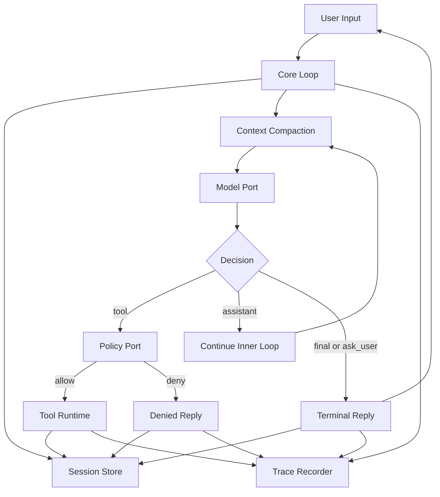
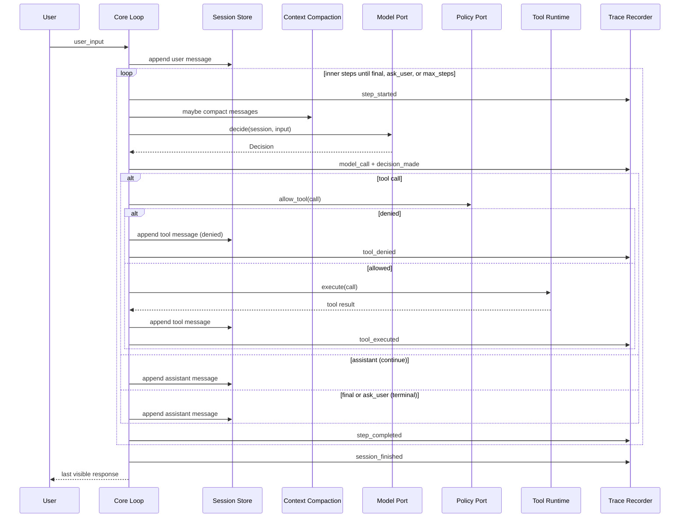
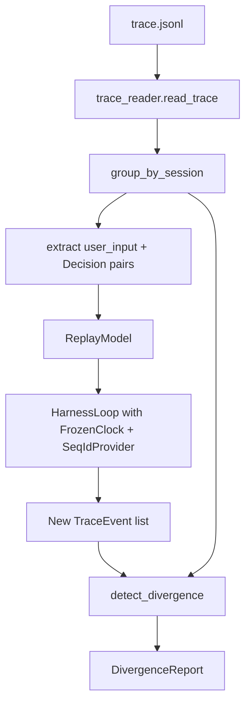
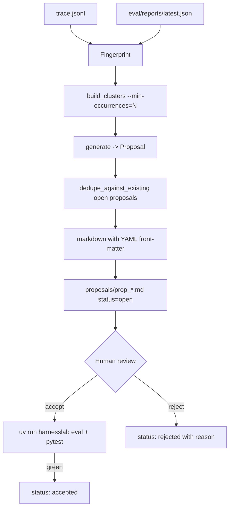

# HarnessLab Architecture Overview

## Purpose

HarnessLab is a learning-focused agent harness that emphasizes clear boundaries,
safe tool execution, and reproducible behavior.

The project starts with a local single-process runtime and evolves toward
stronger observability and automated improvement workflows.

## System Map

## Goals

- Build a minimal but complete agentic loop
- Keep tool execution policy-driven and auditable
- Make session and memory explicit, not implicit
- Keep components replaceable to support future migration (Python -> TypeScript)
- Preserve deterministic evaluation and regression checks

## Non-Goals (MVP)

- Multi-agent orchestration
- Distributed execution
- Runtime plugin marketplace
- Fully automated self-modifying code paths

## Layered Architecture

1. `core`
   - Loop orchestration, state transitions, and contracts
   - Decides assistant reply vs tool call
2. `policy`
   - Authorization checks before tool execution
   - Path and command validation
3. `tools`
   - Tool registry and concrete tool implementations
   - File and shell adapters behind stable interfaces
4. `session`
   - Conversation state lifecycle
   - Session identifiers and message timelines
5. `memory`
   - Long-lived records beyond one turn/session
   - Retrieval and writeback policy boundary
6. `telemetry`
   - Structured traces, run events, and replay-friendly artifacts
7. `eval`
   - YAML task suites, pass rate tracking, and regression gating
   - `harnesslab eval` CLI subcommand; baseline JSON in-repo
8. `replay`
   - Trace reader, deterministic session replayer, divergence detector
   - `harnesslab replay` / `harnesslab metrics` CLI subcommands
9. `improve`
   - Failure fingerprinting, clustering, advisory proposal generation
   - `harnesslab propose` CLI subcommand; proposals committed under
     `proposals/` with explicit accept/reject lifecycle
10. `providers`
   - External `ModelPort` adapters (e.g. DeepSeek)
   - Runtime-selectable backend for `harnesslab run --model ...`
11. `core/prompt` (Phase 2.2)
   - File-loaded static blocks + factory-built dynamic blocks
   - `PromptComposer` assembles `(static, dynamic, conversation)`
     into a `ComposedPrompt` consumed by real providers
12. `core/compaction` (Phase 2.4)
   - Token estimator, threshold check, message-history compactor
   - `LiveSummarizer` (opt-in LLM summary) + `ModelOverflowError`
     contract between adapters and the loop
13. `core/context` (Phase 2.6)
   - `ContextSnapshot` published on every `model_call` event;
     surfaced through `harnesslab context` and `harnesslab metrics`

## Runtime Flow (Multi-step Session — Phase 2.1)

`run_session(session_id, user_input, max_steps=N)` drives the
inner agent loop. Each iteration emits `step_started`, calls the
model, applies the decision, and emits `step_completed`. The loop
exits on a terminal decision (`Decision.kind ∈ {final, ask_user}`)
or when `max_steps` is reached.

1. `start(goal=...)` opens the session and derives a short
   `title` from the goal.
2. `run_session` appends the user message, then enters the inner
   loop:
   - `_maybe_compact` runs against the session message list. When
     `should_compact(messages, threshold) == True`, emit
     `compaction_started(trigger=threshold)`, summarize older
     messages, emit `compaction_completed`.
   - `_call_model_with_overflow` calls the model. On
     `ModelOverflowError`, emit
     `compaction_started(trigger=overflow)`, compact more
     aggressively (`keep_last = max(1, configured // 2)`), and
     retry the call once.
   - The model returns a `Decision` (`assistant | tool | final |
     ask_user`).
   - For `tool`, policy validates; if allowed, the tool runs and
     a tool result message is appended. The next inner step then
     runs with empty `user_input`.
   - For `assistant`, the assistant text is appended and the loop
     continues.
   - For `final` / `ask_user`, the loop exits.
3. `session_finished` is recorded with the terminal reason
   (`final | ask_user | max_steps`).
4. `session.status` is updated (`done | waiting_user | running`)
   and persisted.

The single-turn `run_turn(session_id, user_input)` is a
`run_session(..., max_steps=1)` wrapper kept for backward
compatibility.

Diagram style and naming rules are defined in
`docs/architecture/diagram-conventions.md`.

## Stability Boundaries

The following contracts should remain stable across implementations:

- `ModelPort`
- `PolicyPort`
- `ToolPort`
- `SessionStorePort`
- `MemoryStorePort`
- `TraceRecorderPort`
- `ClockPort`
- `IdPort`

`ClockPort` and `IdPort` are non-negotiable for deterministic replay: the loop
must obtain every timestamp and every entity ID from them, never directly from
`datetime.now()` or `uuid4()` at call sites.

All infrastructure details (storage engine, model provider, runtime language)
should be replaceable behind these contracts.

## Architecture Decisions (Current)

- Single process runtime for fast iteration
- JSONL trace output for transparent debugging
- Policy-first tool execution (deny by default for unknown tools)
- Built-in tool surface (Phase 2.5): `read_file`, `write_file`,
  `edit_file`, `grep`, `glob`, `run_shell_safe` with expanded read-only
  shell allowlist and git subcommand gate
- Deterministic core via injected `ClockPort` and `IdPort` (replay-ready by construction)
- Shell tool runs argv with `shell=False`; policy bans shell metacharacters
- `ToolRegistry` normalizes both "unknown tool" and tool exceptions into
  `ToolResult(ok=False)` so the loop only sees the normalized result shape
- Trace is the source of truth for replay: `user_input_received` plus a
  full `decision_made` payload (`kind`, `tool_name`, `tool_args`,
  `assistant_message`) is sufficient to rebuild a `ReplayModel` without
  consulting the original Session or model
- Model invocation is now auditable via `model_call` trace events
  (decision kind, latency, optional token counters/provider meta, and
  a `ContextSnapshot`)
- The agent loop is autonomous (Phase 2.1): the model decides when to
  stop (`Decision.kind ∈ {final, ask_user}`); the loop never returns
  to the user mid-task on its own — only on a terminal decision or
  when `max_steps` is hit
- Prompts are composed, not hardcoded (Phase 2.2): the static system
  prompt is a sequence of versioned markdown blocks loaded at import
  time; dynamic blocks (`env`, `agents_md`, `tool_guide`) are
  contributed per-call by the runtime; provider adapters render the
  composer's output rather than carrying their own template
- Sessions are persistent first-class entities (Phase 2.3):
  `status`, `step_count`, `last_step_at`, `parent_session_id`, and
  `title` are part of the contract; `harnesslab session ls/show/
  resume/fork` are the user-facing surface
- Context windows are managed by the loop, not the model (Phase 2.4):
  a token threshold triggers compaction before each call, and a
  `ModelOverflowError` from the adapter triggers emergency compaction
  with a retry. Summarization defaults to a deterministic fallback;
  `LiveSummarizer` is an opt-in LLM-backed wrapper
- Context usage is observable per-call (Phase 2.6): every `model_call`
  carries a `ContextSnapshot`, and `harnesslab context show/series`
  surfaces it without requiring trace replay

## Replay & Divergence Model (Step 5)

The replayer takes a JSONL trace, extracts `(user_input, Decision)` pairs
from each session, and drives the production loop with `ReplayModel`
backed by those decisions plus `FrozenClock` + `SeqIdProvider`. The new
trace is then compared to the original by `detect_divergence`.

Two comparison modes:

- **Semantic (default).** Normalizes prefix ids (`ses_*`, `msg_*`,
  `tool_*`, `run_*`) to `<prefix>_NNN` in first-appearance order, and
  scrubs volatile fields: timestamps (`created_at`, `started_at`,
  `ended_at`, `duration_ms`, `latency_ms`), tool output text
  (`output_preview`, `output_size`, `output_truncated`), provider
  telemetry (`model_name`, `provider`, `request_tokens`,
  `response_tokens`, `total_tokens`), and the Phase 2.6 `context`
  snapshot on `model_call` events. What remains — event order, event
  types, tool name, args, policy decision, `ok` / `error` — must match
  exactly. This is the right mode for any trace produced by `SystemClock`
  + `UuidIdProvider`.
- **Strict.** No normalization; byte-for-byte comparison. Only sensible
  for traces already produced by `FrozenClock` + `SeqIdProvider`
  (e.g. eval task traces).

Unreplayable traces raise `UnreplayableTraceError` early: missing
`session_started`, dangling `user_input_received` without a paired
`decision_made`, or a `decision_made` payload that fails to validate as
a `Decision`. The CLI surfaces this as exit code 2.

## Improvement Loop (Step 6)

The proposal generator mines failures from two sources and turns
recurring clusters into advisory markdown files. Nothing is ever
applied automatically; humans review and accept each proposal under
the gate of `harnesslab eval` + `pytest`.

Failure signal sources and their fingerprint shapes:

| Source | Trigger | Fingerprint |
| --- | --- | --- |
| trace | `tool_executed.ok=false` | `tool_executed:<tool>:<short_error>` |
| trace | `tool_denied` | `tool_denied:<tool>:<short_reason>` |
| trace | `tool_invalid_args` | `tool_invalid_args:<tool>:<short_error>` |
| eval report | `TaskResult.passed=false` | `eval:<task_name>:<short_failure>` |

`replay` divergences are intentionally **not** failure signals;
divergence may reflect IO state changes (workspace contents) rather
than loop misbehavior. If a divergence reflects a real regression the
right place to encode it is a new eval task.

Suggested-action text is generated from hand-written templates keyed
by cluster `kind`. The project does not call an LLM here:

- It would add a network and credential dependency that the rest of
  the runtime carefully avoids.
- It would obscure the contract that proposals are deterministic
  artifacts of `(trace, eval_report)` plus version-pinned templates.
- It would muddy the AGENTS.md guarantee that proposals are advisory
  and never self-modify the codebase.

## Provider Integration (Post-MVP Phase 1)

`ModelPort` remains the stable contract. Concrete providers now live
under `src/harnesslab/providers/`:

- `SimpleModel`: deterministic parser model for eval/replay and offline
  workflows.
- `DeepSeekModel`: networked provider for `harnesslab run --model deepseek`.

This split keeps deterministic quality gates intact:

- `run --model deepseek` can be non-deterministic by design.
- `eval`, `replay`, and contract tests continue to rely on deterministic
  clocks/ids/models so baseline and divergence behavior stay stable.

## Prompt Composer (Phase 2.2)

`core/prompt/composer.py` assembles a `ComposedPrompt` per model
call. The composer concatenates three layers:

1. **Static blocks** — markdown files under
   `core/prompt/blocks/` loaded at import time
   (`00_identity.md`, `01_harness.md`, `02_safety.md`,
   `03_style.md`, `04_engineering.md`). Their order is fixed by
   filename prefix. `${variable}` placeholders (e.g.
   `${model_name}`) are substituted at build time.
2. **Dynamic blocks** — per-call factories in
   `core/prompt/dynamic.py`:
   - `build_env_block(workspace_root)` — CWD, platform, date,
     optional git summary.
   - `build_agents_md_block(workspace_root)` — folds `AGENTS.md`
     into the prompt when present.
   - `build_tool_guide_block(registry)` — lists the live tool
     surface so the model sees what is registered today, not what
     was registered when a static prompt was written.
3. **Conversation blocks** — derived from `session.messages` and
   role-tagged for the provider's chat format.

`ComposedPrompt.as_openai_messages()` collapses adjacent system
blocks into a single OpenAI-shaped message; `as_text()` returns
the flat string used by adapters that want a single prompt;
`snapshot()` returns the ordered block names for introspection.

`DeepSeekModel` consumes the composer directly: each call passes
the live session, the dynamic blocks provider (wired by
`cli.build_runtime`), and the `model_name` variable. The adapter
also exposes prompt-side token estimates through
`last_call_meta()` for the Phase 2.6 `ContextSnapshot`.

## Compaction (Phase 2.4)

`core/compaction.py` is the loop's defence against context-window
pressure. Two trigger paths feed into the same code path:

- **Threshold trigger.** Before each model call, the loop runs
  `should_compact(messages, threshold_tokens)`. When
  `estimate_messages_tokens(messages) > threshold`, the loop
  emits `compaction_started(trigger=threshold)`, calls
  `compact_messages(messages, keep_last=K, summarizer=…)`,
  and emits `compaction_completed` with the resulting message
  count and token estimate.
- **Overflow trigger.** Adapters raise `ModelOverflowError`
  when the provider rejects a request because the context window
  is full. `_call_model_with_overflow` catches it, runs an
  emergency compaction (`keep_last = max(1, configured // 2)`,
  trigger=`overflow`), retries the model call once, and falls back
  to a terminal `final` decision with an explanatory message if
  the second attempt also overflows.

Summarization is pluggable. The default `_fallback_summarizer` is
deterministic and LLM-free (good for tests, eval, and offline
workflows). `LiveSummarizer(model)` sends a summarization prompt
to a `ModelPort` and returns its assistant text fenced in
`<system-reminder>` tags; on empty model output it falls back to
the deterministic summary so compaction always succeeds.

## Context Observability (Phase 2.6)

Every `model_call` event carries a `ContextSnapshot` produced by
`core/context.py`:

- **Loop-side fields** (always present): `conversation_tokens`,
  `message_count`, `limit_tokens`,
  `compaction_threshold_tokens`, `usage_ratio`,
  `threshold_ratio`.
- **Adapter-side fields** (optional, populated when the model
  exposes them through `last_call_meta()`):
  `prompt_tokens_estimate`, `static_block_tokens`,
  `dynamic_block_tokens`, `prompt_block_names`.

`Metrics` aggregates `max_conversation_tokens`,
`peak_usage_ratio`, `compactions`, and `overflow_recoveries`
across a trace; `harnesslab context show/series` surfaces the
per-call snapshots without needing to replay. The divergence
detector treats the `context` field as informational (token
estimates depend on tool outputs that embed workspace paths), so
adding `ContextSnapshot` did not break eval/replay round-trips.

## Planned Evolution

1. Replace in-memory stores with SQLite-backed stores — DONE (Step 3)
2. Add deterministic replay from traces — DONE (Step 5)
3. Add evaluation task sets and baseline diffing — DONE (Step 4)
4. Introduce metrics dashboards or reports — partial (Step 5 CLI
   aggregation plus Phase 2.6 `harnesslab context`; static HTML
   dashboards remain deferred — see `docs/roadmap.md`)
5. Add guarded self-improvement proposal pipeline — DONE (Step 6,
   advisory-only by AGENTS.md contract)
6. Real autonomous agent loop with prompt composer, persistent
   sessions, auto compaction, and context observability — DONE
   (Phase 2.1–2.6)
7. Memory retrieval/writeback policy on top of the session
   substrate — deferred (see `docs/roadmap.md` "Deferred")
