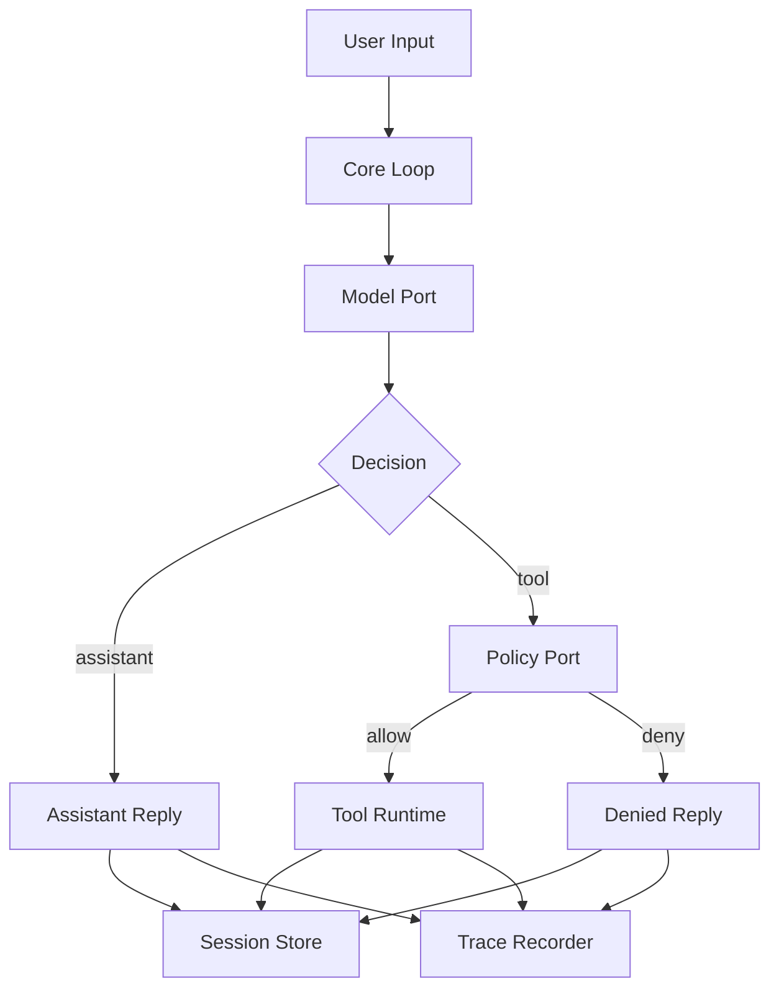
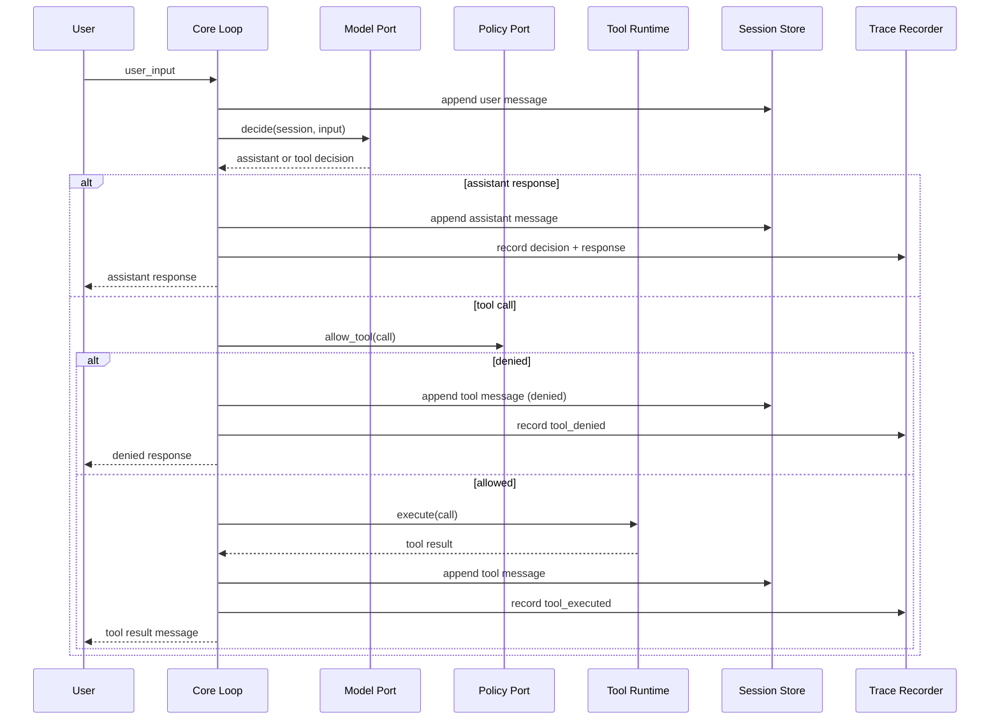
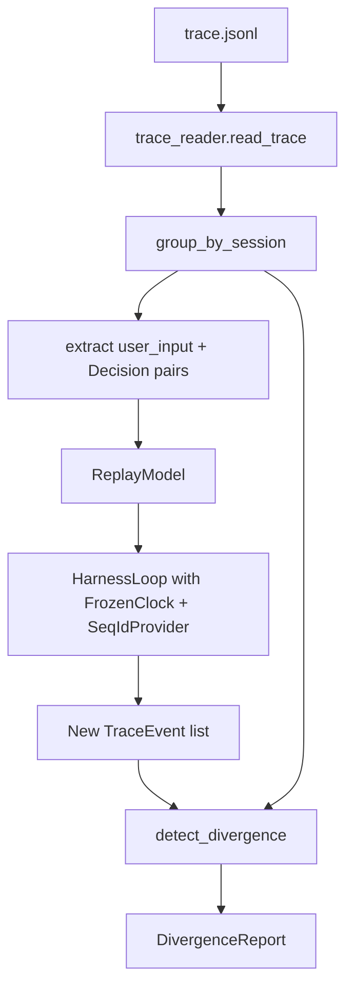

# HarnessLab Architecture Overview

## Purpose

HarnessLab is a learning-focused agent harness that emphasizes clear boundaries,
safe tool execution, and reproducible behavior.

The project starts with a local single-process runtime and evolves toward
stronger observability and automated improvement workflows.

## System Map

## Goals

- Build a minimal but complete agentic loop
- Keep tool execution policy-driven and auditable
- Make session and memory explicit, not implicit
- Keep components replaceable to support future migration (Python -> TypeScript)
- Preserve deterministic evaluation and regression checks

## Non-Goals (MVP)

- Multi-agent orchestration
- Distributed execution
- Runtime plugin marketplace
- Fully automated self-modifying code paths

## Layered Architecture

1. `core`
   - Loop orchestration, state transitions, and contracts
   - Decides assistant reply vs tool call
2. `policy`
   - Authorization checks before tool execution
   - Path and command validation
3. `tools`
   - Tool registry and concrete tool implementations
   - File and shell adapters behind stable interfaces
4. `session`
   - Conversation state lifecycle
   - Session identifiers and message timelines
5. `memory`
   - Long-lived records beyond one turn/session
   - Retrieval and writeback policy boundary
6. `telemetry`
   - Structured traces, run events, and replay-friendly artifacts
7. `eval`
   - YAML task suites, pass rate tracking, and regression gating
   - `harnesslab eval` CLI subcommand; baseline JSON in-repo
8. `replay`
   - Trace reader, deterministic session replayer, divergence detector
   - `harnesslab replay` / `harnesslab metrics` CLI subcommands

## Runtime Flow (Single Turn)

1. Receive user input
2. Append a user message to the session
3. Model decides:
   - assistant response, or
   - tool invocation
4. Policy validates the tool call
5. Tool executes (or is denied)
6. Result is recorded to session + trace
7. Assistant-visible output is returned

Diagram style and naming rules are defined in
`docs/architecture/diagram-conventions.md`.

## Stability Boundaries

The following contracts should remain stable across implementations:

- `ModelPort`
- `PolicyPort`
- `ToolPort`
- `SessionStorePort`
- `MemoryStorePort`
- `TraceRecorderPort`
- `ClockPort`
- `IdPort`

`ClockPort` and `IdPort` are non-negotiable for deterministic replay: the loop
must obtain every timestamp and every entity ID from them, never directly from
`datetime.now()` or `uuid4()` at call sites.

All infrastructure details (storage engine, model provider, runtime language)
should be replaceable behind these contracts.

## Architecture Decisions (Current)

- Single process runtime for fast iteration
- JSONL trace output for transparent debugging
- Policy-first tool execution (deny by default for unknown tools)
- Small built-in tool surface in MVP (`read_file`, `write_file`, `run_shell_safe`)
- Deterministic core via injected `ClockPort` and `IdPort` (replay-ready by construction)
- Shell tool runs argv with `shell=False`; policy bans shell metacharacters
- `ToolRegistry` normalizes both "unknown tool" and tool exceptions into
  `ToolResult(ok=False)` so the loop only sees the normalized result shape
- Trace is the source of truth for replay: `user_input_received` plus a
  full `decision_made` payload (`kind`, `tool_name`, `tool_args`,
  `assistant_message`) is sufficient to rebuild a `ReplayModel` without
  consulting the original Session or model

## Replay & Divergence Model (Step 5)

The replayer takes a JSONL trace, extracts `(user_input, Decision)` pairs
from each session, and drives the production loop with `ReplayModel`
backed by those decisions plus `FrozenClock` + `SeqIdProvider`. The new
trace is then compared to the original by `detect_divergence`.

Two comparison modes:

- **Semantic (default).** Normalizes prefix ids (`ses_*`, `msg_*`,
  `tool_*`, `run_*`) to `<prefix>_NNN` in first-appearance order, and
  scrubs volatile fields: timestamps (`created_at`, `started_at`,
  `ended_at`, `duration_ms`) and tool output text (`output_preview`,
  `output_size`, `output_truncated`). What remains — event order, event
  types, tool name, args, policy decision, `ok` / `error` — must match
  exactly. This is the right mode for any trace produced by `SystemClock`
  + `UuidIdProvider`.
- **Strict.** No normalization; byte-for-byte comparison. Only sensible
  for traces already produced by `FrozenClock` + `SeqIdProvider`
  (e.g. eval task traces).

Unreplayable traces raise `UnreplayableTraceError` early: missing
`session_started`, dangling `user_input_received` without a paired
`decision_made`, or a `decision_made` payload that fails to validate as
a `Decision`. The CLI surfaces this as exit code 2.

## Planned Evolution

1. Replace in-memory stores with SQLite-backed stores — DONE (Step 3)
2. Add deterministic replay from traces — DONE (Step 5)
3. Add evaluation task sets and baseline diffing — DONE (Step 4)
4. Introduce metrics dashboards or reports — partial (Step 5: CLI
   aggregation; dashboards remain future work)
5. Add guarded self-improvement proposal pipeline — Step 6
