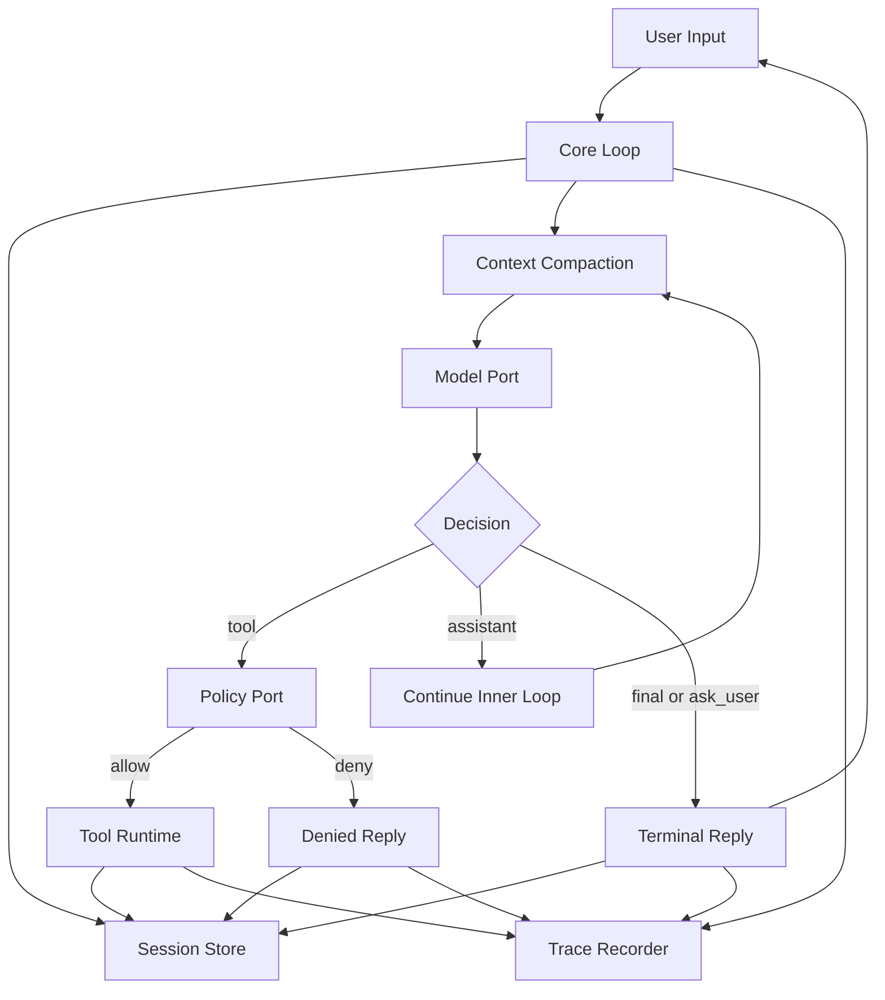
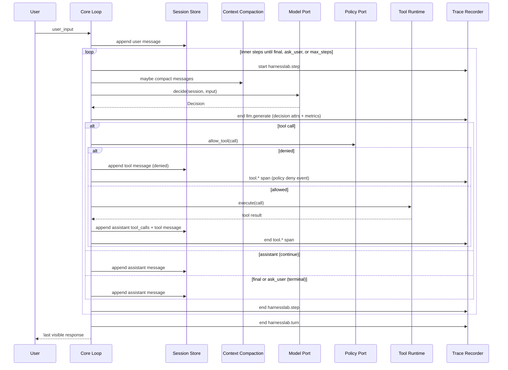
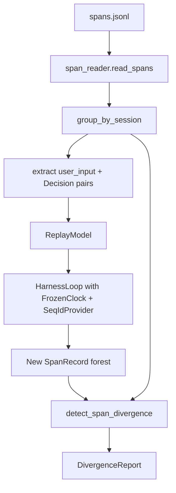
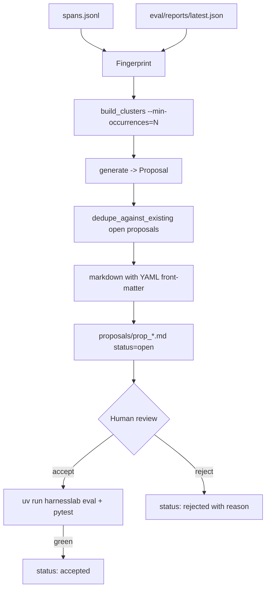
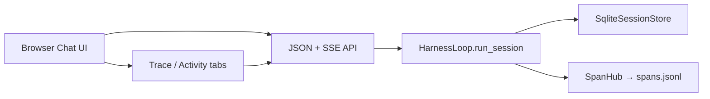
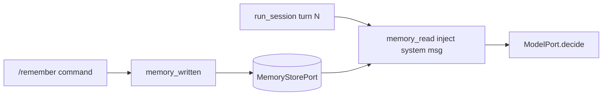

# HarnessLab Architecture Overview

## Purpose

HarnessLab is a learning-focused agent harness that emphasizes clear boundaries,
safe tool execution, and reproducible behavior. For why the repo exists, what
it is not, and a suggested reading order, see
[`../why-harnesslab.md`](../why-harnesslab.md).

The project starts with a local single-process runtime and evolves toward
stronger observability and automated improvement workflows.

## System Map

## Goals

- Build a minimal but complete agentic loop
- Keep tool execution policy-driven and auditable
- Make session and memory explicit, not implicit
- Keep components replaceable to support future migration (Python -> TypeScript)
- Preserve deterministic evaluation and regression checks

## Non-Goals (MVP)

- Multi-agent orchestration
- Distributed execution
- Runtime plugin marketplace
- Fully automated self-modifying code paths

## Layered Architecture

1. `core`
   - Loop orchestration, state transitions, and contracts
   - Decides assistant reply vs tool call
2. `policy`
   - Authorization checks before tool execution
   - Path and command validation
3. `tools`
   - Tool registry and concrete tool implementations
   - File and shell adapters behind stable interfaces
4. `session`
   - Conversation state lifecycle
   - Session identifiers and message timelines
5. `memory`
   - Long-lived records beyond one turn/session
   - Retrieval and writeback policy boundary
6. `telemetry`
   - Structured traces, run events, and replay-friendly artifacts
   - Application logging (`telemetry.log`, stdlib) for operational diagnostics
7. `eval`
   - YAML task suites, pass rate tracking, and regression gating
   - `harnesslab eval` CLI subcommand; baseline JSON in-repo
8. `replay`
   - Span reader, deterministic session replayer, divergence detector
   - `harnesslab replay` / `harnesslab metrics` CLI subcommands
9. `improve` / `tune`
   - `improve`: failure fingerprinting, clustering, advisory proposal
     generation with Beta-Binomial posterior failure-rate scoring (Bayesian
     self-evolution Layer A); `harnesslab propose`, proposals committed under
     `proposals/` with explicit accept/reject lifecycle
   - `tune`: deterministic GP Bayesian optimization over runtime knobs, scored
     by the eval suite (Layer B1); `harnesslab tune`, advisory `config_tuning`
     proposals. `tune/prompt/`: LLM-generated prompt candidates scored by an
     isolated live-model benchmark and ranked by a Beta-Binomial success
     posterior (Layer B2); `harnesslab tune-prompt`, advisory `prompt_tuning`
     proposals
10. `providers`
   - External `ModelPort` adapters (e.g. DeepSeek)
   - Runtime-selectable backend for `harnesslab run --model ...`
11. `core/prompt` (Phase 2.2)
   - File-loaded static blocks + factory-built dynamic blocks
   - `PromptComposer` assembles `(static, dynamic, conversation)`
     into a `ComposedPrompt` consumed by real providers
12. `core/compaction` (Phase 2.4)
   - Token estimator, threshold check, message-history compactor
   - `LiveSummarizer` (opt-in LLM summary) + `ModelOverflowError`
     contract between adapters and the loop
13. `core/context` (Phase 2.6)
   - `ContextSnapshot` published on every **`llm.generate`** span
     (`SpanRecord.metrics.context`); surfaced through `harnesslab context`
     and `harnesslab metrics`
14. `web` (Phase 3.2)
   - Localhost HTTP server + static chat UI (`harnesslab serve`)
   - Thin JSON API over the same `HarnessLoop` / SQLite sessions
15. `core/title` (Phase 3.2)
   - Placeholder titles from goals; optional `LiveTitleNamer` after
     the first turn when using a live model backend

## Runtime Flow (Multi-step Session — Phase 2.1)

`run_session(session_id, user_input, max_steps=N)` drives the
inner agent loop. Each iteration opens **`harnesslab.step`** spans, calls the
model under **`llm.generate`**, runs tools under **`tool.{name}`**, and exits
on a terminal decision (`Decision.kind ∈ {final, ask_user}`) or when
`max_steps` is reached. See [`observability-v2.md`](observability-v2.md) for
the normative span tree.

1. `start(goal=...)` opens the session and derives a short
   `title` from the goal.
2. `run_session` appends the user message, then enters the inner
   loop:
   - `_maybe_compact` runs against the session message list. When
     `should_compact(messages, threshold) == True`, open a
     **`context.compact`** span, summarize older messages, end span.
   - `_call_model_with_overflow` calls the model. On
     `ModelOverflowError`, compact more aggressively
     (`keep_last = max(1, configured // 2)`) under another
     **`context.compact`** span, and retry once.
  - The model returns a `Decision` (`assistant | plan | tool | final |
    ask_user`).
   - For `tool`, policy validates; if allowed, the tool runs and
     a tool result message is appended. The next inner step then
     runs with empty `user_input`.
  - For `assistant`, the assistant text is appended and the loop
    continues.
  - For `plan`, the assistant plan text is appended with
    `provider_extra.is_plan=true`; a **`plan_emitted`** span event records it.
    Optional `replan_after_steps` emits a system reminder
    (`plan_recheck_requested`) after N non-terminal steps.
   - For `final` / `ask_user`, the loop exits.
3. Turn completes; **`harnesslab.turn`** span ends with terminal reason
   (`final | ask_user | max_steps`).
4. `session.status` is updated (`done | waiting_user | running`)
   and persisted.
5. When a `MemoryStorePort` is wired (Phase 3.3), `/remember <text>`
   stores an explicit note; the next turn injects notes as a `system`
   message (`memory_read` / `memory_written` span events).

The single-turn `run_turn(session_id, user_input)` is a
`run_session(..., max_steps=1)` wrapper kept for backward
compatibility.

### Budget guardrails (Phase 5.10)

Budget control is separate from context compaction:

- **Compaction** answers "can this prompt fit the model context window?"
- **Budget guardrails** answer "should this session keep spending?"

Current budget dimensions:

- Per-turn: LLM call count, tool call count, wall-time (ms)
- Per-session: token total, tool call total, wall-time (ms), estimated
  cost (USD via [`providers/pricing`](architecture/pricing.md) catalog)

Behavior:

- After each model call the loop accumulates token totals and estimated
  USD cost (canonical `usage_breakdown` + `estimate_call_cost`) into
  `session.budget_usage`. **`llm.generate`** span `metrics` include
  `usage_breakdown` and `cost_estimate` when adapters supply them.
- Soft threshold (`budget.soft_ratio`) emits a **`budget_soft_threshold`** span event and continues.
- Hard threshold emits **`budget_hard_exceeded`**, then applies
  `budget.action_on_hard` (`ask_user`, `final`, or `error`).
- The loop records **`budget_enforcement_action`** when hard limits are enforced.

Diagram style and naming rules are defined in
`docs/architecture/diagram-conventions.md`.

## Stability Boundaries

The following contracts should remain stable across implementations:

- `ModelPort`
- `PolicyPort`
- `ToolPort`
- `SessionStorePort` — `create` / `get` / `save` / `list` / `delete`
  (`delete` is idempotent and removes the session plus its messages;
  it does not cascade to child sessions)
- `MemoryStorePort`
- `ArtifactStorePort`
- `SpanRecorderPort`
- `ClockPort`
- `IdPort`

`ClockPort` and `IdPort` are non-negotiable for deterministic replay: the loop
must obtain every timestamp and every entity ID from them, never directly from
`datetime.now()` or `uuid4()` at call sites.

All infrastructure details (storage engine, model provider, runtime language)
should be replaceable behind these contracts.

## Application logging

HarnessLab uses stdlib ``logging`` via ``harnesslab.telemetry.log``. Logs are
**complementary** to JSONL trace — not a replacement:

| Signal | Role |
|--------|------|
| **Trace (JSONL)** | Replay/eval source of truth; completed `SpanRecord` rows |
| **Log (stderr)** | Session lifecycle, provider errors, migrations, tool summary |

Configure with ``HARNESSLAB_LOG=DEBUG|INFO|WARNING|ERROR`` or CLI
``harnesslab --log-level INFO run ...``. Defaults: ``INFO`` for CLI,
``WARNING`` under pytest. Third-party HTTP loggers (httpx/openai) are capped
at ``WARNING`` unless the app level is ``DEBUG``.

## Architecture Decisions (Current)

- Single process runtime for fast iteration
- JSONL span output (`.harnesslab/spans.jsonl`) for transparent debugging
- Policy-first tool execution (deny by default for unknown tools)
- Built-in tool surface: `read_file`, `write_file`, `edit_file`,
  `apply_patch`, `grep`, `glob`, `fetch_url`, `web_search`,
  `html_to_markdown`, `read_pdf`, `run_shell_safe` with expanded
  read-only shell allowlist, git subcommand gate, and profile-aware
  `fetch_url` policy (`strict` allowlist; `dev`/`read_only` open HTTPS
  + denylist + robots advisory)
- Deterministic core via injected `ClockPort` and `IdPort` (replay-ready by construction)
- Shell tool runs argv with `shell=False`; policy bans shell metacharacters
- `ToolRegistry` normalizes both "unknown tool" and tool exceptions into
  `ToolResult(ok=False)` so the loop only sees the normalized result shape
- Tool lifecycle hooks are opt-in (Phase 5.8): ordered `pre_tool`/`post_tool`
  hook chains can annotate or block tool calls; hook failures are trace-visible
  and non-fatal by default
- Trace is the source of truth for replay: per-turn **span forests**
  with stable `harnesslab.decision.*` / tool attrs on **`llm.generate`**
  and **`tool.{name}`** spans are sufficient to rebuild a `ReplayModel`
  without consulting the original Session or model
- Model invocation is auditable via **`llm.generate`** spans (decision kind,
  latency, optional token counters/provider meta, and `ContextSnapshot`
  under `metrics.context`)
- The agent loop is autonomous (Phase 2.1): the model decides when to
  stop (`Decision.kind ∈ {final, ask_user}`); the loop never returns
  to the user mid-task on its own — only on a terminal decision or
  when `max_steps` is hit
- Prompts are composed, not hardcoded (Phase 2.2): the static system
  prompt is a sequence of versioned markdown blocks loaded at import
  time; dynamic blocks (`env`, `agents_md`, `skills`, `tool_guide`) are
  contributed per-call by the runtime; provider adapters render the
  composer's output rather than carrying their own template
- Sessions are persistent first-class entities (Phase 2.3):
  `status`, `step_count`, `last_step_at`, `parent_session_id`, and
  `title` are part of the contract; `harnesslab session ls/show/
  resume/fork` are the user-facing surface
- Context windows are managed by the loop, not the model (Phase 2.4):
  a token threshold triggers compaction before each call, and a
  `ModelOverflowError` from the adapter triggers emergency compaction
  with a retry. Summarization defaults to a deterministic fallback;
  `LiveSummarizer` is an opt-in LLM-backed wrapper
- Context usage is observable per-call (Phase 2.6): every **`llm.generate`**
  span carries `metrics.context` (`ContextSnapshot`), and `harnesslab context show/series`
  surfaces it without requiring span replay

## Replay & Divergence Model (Step 5)

The replayer takes a JSONL span file, extracts `(user_input, Decision)` pairs
from each session, and drives the production loop with `ReplayModel`
backed by those decisions plus `FrozenClock` + `SeqIdProvider`. The new
span forest is then compared to the original by `detect_span_divergence`.

Two comparison modes:

- **Semantic (default).** Normalizes prefix ids (`ses_*`, `msg_*`,
  `tool_*`, `run_*`) to `<prefix>_NNN` in first-appearance order, and
  scrubs volatile fields: timestamps (`created_at`, `started_at`,
  `ended_at`, `duration_ms`, `latency_ms`), tool output text
  (`output_preview`, `output_size`, `output_truncated`), provider
  telemetry (`model_name`, `provider`, `request_tokens`,
  `response_tokens`, `total_tokens`), and the Phase 2.6 `context`
  snapshot on `llm.generate` span metrics. What remains — span forest
  shape, span names, tool args, policy decision, `ok` / `error` — must
  match exactly. This is the right mode for any span file produced by
  `SystemClock` + `UuidIdProvider`.
- **Strict.** No normalization; byte-for-byte comparison. Only sensible
  for traces already produced by `FrozenClock` + `SeqIdProvider`
  (e.g. eval task traces).

Unreplayable traces raise `UnreplayableTraceError` early: missing
`session_started`, dangling `user_input_received` without a paired
`decision_made`, or a `decision_made` payload that fails to validate as
a `Decision`. The CLI surfaces this as exit code 2.

## Improvement Loop (Step 6)

The proposal generator mines failures from two sources and turns
recurring clusters into advisory markdown files. Nothing is ever
applied automatically; humans review and accept each proposal under
the gate of `harnesslab eval` + `pytest`.

Clusters are scored with a deterministic Beta-Binomial posterior failure
rate (Layer A of [`docs/research/bayesian-self-evolution.md`](../research/bayesian-self-evolution.md)).
The denominator ("trials") is the offending tool's **total** invocation count
(successes + failures), not just its failures, so a 2/2 failure on a rarely
used tool can outrank a 2/50 failure on a busy one. A weak empirical-Bayes
prior centred on the global base rate shrinks sparse clusters so one-off
spikes do not over-fire. Proposals carry `trials`, `posterior_failure_rate`,
`credible_interval`, and `priority` (the lower 90% credible bound, used as the
ranking key); the scorer is closed-form with no RNG, preserving the
deterministic-artifact contract.

Failure signal sources and their fingerprint shapes:

| Source | Trigger | Fingerprint |
| --- | --- | --- |
| spans | `tool.*` span with `harnesslab.tool.ok=false` | `tool_failure:tool_executed:<tool>:<short_error>` |
| spans | `tool.*` span event `tool.policy_denied` | `policy_denial:tool_denied:<tool>:<short_reason>` |
| spans | `tool.*` span event `tool.args_invalid` | `invalid_args:tool_invalid_args:<tool>:<short_error>` |
| eval report | `TaskResult.passed=false` | `eval:<task_name>:<short_failure>` |

`replay` divergences are intentionally **not** failure signals;
divergence may reflect IO state changes (workspace contents) rather
than loop misbehavior. If a divergence reflects a real regression the
right place to encode it is a new eval task.

Suggested-action text is generated from hand-written templates keyed
by cluster `kind`. The `improve` generator does not call an LLM here
(the Layer B2 prompt tuner is a separate, opt-in, advisory path that may —
see AGENTS.md Proposal Handling §5 amendment):

- It would add a network and credential dependency that the rest of
  the runtime carefully avoids.
- It would obscure the contract that proposals are deterministic
  artifacts of `(trace, eval_report)` plus version-pinned templates.
- It would muddy the AGENTS.md guarantee that proposals are advisory
  and never self-modify the codebase.

## Configuration Tuning (Layer B1)

`harnesslab tune` runs deterministic Gaussian-process Bayesian optimization
over the runtime knob space (`RuntimeLimits` + `shell_profile`), scored by the
eval suite as utility, and writes an advisory `config_tuning` proposal
(default-vs-best diff). It optimizes only knobs the **deterministic** eval
models react to — not prompt text or sampling params, which `SimpleModel` /
`ReplayModel` ignore. The surrogate (`src/harnesslab/tune/gp.py`) is a
dependency-free RBF GP with Expected-Improvement acquisition and **no RNG**, so
the search is reproducible and the proposal is a deterministic artifact of
`(suite, search_space)`. Like improvement proposals, the suggestion is
**advisory** and never applied automatically. Design and rationale (including
why prompt/sampling tuning needs a live-model benchmark, deferred to B2):
[`docs/research/bayesian-self-evolution.md`](../research/bayesian-self-evolution.md).

## Prompt Tuning (Layer B2)

`harnesslab tune-prompt` closes the gap B1 deferred: it tunes the **system
prompt** itself, which the deterministic eval models cannot score. Candidates
come from one of two mutually-exclusive sources — `--candidates <frozen.json>`
(produced upstream by any means) or `--generate "<instruction>" --n N` (live
LLM generation that **freezes** the candidates to disk before scoring). The
command then scores each candidate against a **live model**
benchmark (the production loop with `composer=candidate.composer()`, scored by
`final_reply_contains` substring presence), and ranks them by a Beta-Binomial
**success-rate** posterior that reuses the Layer A estimator
(`src/harnesslab/improve/scoring.py`, with the pass count as numerator). The
baseline prompt is always benchmarked alongside, and the best candidate becomes
an advisory `prompt_tuning` proposal.

Two safety properties make the LLM use here compatible with the project's
rules (AGENTS.md "Proposal Handling" §5 amendment): (1) **generation/scoring
separation** — the LLM call is offline and its output is frozen before scoring;
(2) **isolation** — the live-model benchmark is completely separate from
`eval` / `replay`, which stay deterministic. The proposal is **advisory** and
never auto-applied. The benchmark is non-deterministic, so a narrow margin
should be re-confirmed with higher `--repeats`. Modules:
`src/harnesslab/tune/prompt/`.

## Provider Integration (Post-MVP Phase 1)

`ModelPort` remains the stable contract. Concrete providers now live
under `src/harnesslab/providers/`:

- `SimpleModel`: deterministic parser model for eval/replay and offline
  workflows.
- `DeepSeekModel`: networked provider for `harnesslab run --model deepseek`.
  Default API model is `deepseek-v4-flash` (non-thinking); config/env may
  select `deepseek-v4-pro`. Legacy `deepseek-chat` aliases remain accepted.

Phase 4.1 adds `providers/registry.py`: `create_model(backend, config, …)`
maps `config.model.default_backend` to `SimpleModel` or `DeepSeekModel`
without inlining provider construction in `cli.build_runtime`.

MVP adapters call OpenAI-compatible HTTP via `httpx` directly. When adding
OpenAI, Anthropic, or other vendors, prefer official SDKs behind the same
registry factory (streaming, reasoning fields, vendor maintenance) rather
than growing bespoke HTTP clients per provider.

This split keeps deterministic quality gates intact:

- `run --model deepseek` can be non-deterministic by design.
- `eval`, `replay`, and contract tests continue to rely on deterministic
  clocks/ids/models so baseline and divergence behavior stay stable.

## Prompt Composer (Phase 2.2)

`core/prompt/composer.py` assembles a `ComposedPrompt` per model
call. The composer concatenates three layers:

1. **Static blocks** — markdown files under
   `core/prompt/blocks/` loaded at import time
   (`00_identity.md`, `01_harness.md`, `02_safety.md`,
   `03_style.md`, `04_engineering.md`). Their order is fixed by
   filename prefix. `${variable}` placeholders (e.g.
   `${model_name}`) are substituted at build time.
2. **Dynamic blocks** — per-call factories in
   `core/prompt/dynamic.py`:
   - `build_env_block(workspace_root)` — CWD, platform, date,
     optional git summary.
   - `build_agents_md_block(workspace_root)` — folds `AGENTS.md`
     into the prompt when present.
   - `build_skills_block(workspace_root)` — folds `skills/*.md` into
     one dynamic skills block when present.
   - `build_tool_guide_block(registry)` — lists the live tool
     surface so the model sees what is registered today, not what
     was registered when a static prompt was written.
3. **Conversation blocks** — derived from `session.messages` and
   role-tagged for the provider's chat format.

`ComposedPrompt.as_openai_messages()` collapses adjacent system
blocks into a single OpenAI-shaped message; `as_text()` returns
the flat string used by adapters that want a single prompt;
`snapshot()` returns the ordered block names for introspection.

`DeepSeekModel` consumes the composer directly: each call passes
the live session, the dynamic blocks provider (wired by
`cli.build_runtime`), and the `model_name` variable. The adapter
also exposes prompt-side token estimates through
`last_call_meta()` for the Phase 2.6 `ContextSnapshot`.

## Compaction (Phase 2.4)

Full reference: [`compaction.md`](compaction.md). Summary:

`core/compaction.py` is the loop's defence against context-window
pressure. Two automatic trigger paths plus manual ``/compact`` feed into
the same code path:

- **Threshold trigger.** Before each model call, the loop runs
  `should_compact(messages, threshold_tokens)`. When
  `estimate_messages_tokens(messages) > threshold`, the loop opens a
  **`context.compact`** span (`trigger=threshold`), calls
  `compact_messages(messages, keep_last=K, summarizer=…)`, and ends the span
  with the resulting message count and token estimate.
- **Overflow trigger.** Adapters raise `ModelOverflowError`
  when the provider rejects a request because the context window
  is full. `_call_model_with_overflow` catches it, runs an
  emergency **`context.compact`** span (`keep_last = max(1, configured // 2)`,
  `trigger=overflow`), retries the model call once, and falls back
  to a terminal `final` decision with an explanatory message if
  the second attempt also overflows.
- **Manual trigger.** The slash command ``/compact`` (Web UI palette
  or CLI) compacts immediately with the configured ``keep_last`` via a
  **`context.compact`** span (`trigger=manual`). See ``skills/compact.md``.

Summarization is pluggable. The default `_fallback_summarizer` is
deterministic and LLM-free (good for tests, eval, and offline
workflows). `LiveSummarizer(model)` sends a summarization prompt
to a `ModelPort` and returns its assistant text fenced in
`<system-reminder>` tags; on empty model output it falls back to
the deterministic summary so compaction always succeeds.

**Thinking / reasoning after compaction:** see [`compaction.md`](compaction.md)
and [`provider-expansion.md`](provider-expansion.md) § replay policy.
Durable facts should use ``/remember`` or ``/remember-global``.

## Context Observability (Phase 2.6)

Every **`llm.generate`** span carries `metrics.context` — a
`ContextSnapshot` produced by `core/context.py`:

- **Loop-side fields** (always present): `conversation_tokens`,
  `message_count`, `limit_tokens`,
  `compaction_threshold_tokens`, `usage_ratio`,
  `threshold_ratio`.
- **Adapter-side fields** (optional, populated when the model
  exposes them through `last_call_meta()`):
  `prompt_tokens_estimate`, `static_block_tokens`,
  `dynamic_block_tokens`, `prompt_block_names`.

`Metrics` aggregates `max_conversation_tokens`,
`peak_usage_ratio`, `compactions`, and `overflow_recoveries`
across a session's spans; `harnesslab context show/series` surfaces the
per-call snapshots without needing to replay. The divergence
detector treats `metrics.context` as informational (token
estimates depend on tool outputs that embed workspace paths), so
adding `ContextSnapshot` did not break eval/replay round-trips.

## Web Chat UI (Phase 3.2)

Design principles, turn layout, Thinking/Thought UX, and SSE semantics are
documented in [`webui-design.md`](webui-design.md). **Trace is the engine;
Chat is the product** — the chat Tab delivers full conversation UX without
opening the Trace Tab.

`harnesslab serve` binds a **localhost-only** HTTP server that
reuses the production runtime — no duplicate loop logic.

**HTTP contract:** [`web-api.md`](web-api.md) (endpoints, SSE, slash commands).

See [`web-api.md`](web-api.md) for the full endpoint list. Highlights:

- JSON CRUD for sessions, proposals, settings, model switch
- `POST .../messages` with optional SSE (`stream: true`)
- `GET /api/composer/commands` for the `/` slash palette
- Token deltas: `reasoning_delta` / `assistant_delta` (DeepSeek first)

The default browser client uses **SSE** (`Accept: text/event-stream`)
so span lifecycle events stream live during each turn (`span.started`,
`span.event`, `span.completed`, `span.link`). When the active
model supports it (DeepSeek first), ``reasoning_delta`` / ``assistant_delta``
events stream token text into the LiveTurn panel. ``GET /api/composer/commands``
feeds the ``/`` slash palette (built-ins + workspace skills). Simple mode
translates spans into **LiveTurn** activity in the chat panel (Thinking…,
Tool rows, final answer) without requiring the Trace Tab. The **Trace Tab**
(Jaeger-inspired waterfall + detail sidebar) exposes span trees, Tags /
Process / Events KV tables, and a **Prompt inspector** on each
``llm.generate`` span (``prompt_blocks`` + ``api_messages`` full text). The message
list shows **user** and non-empty **assistant** replies; optional
`reasoning_text` renders as collapsible **Thought** blocks. Internal
`tool` / `system` rows remain in SQLite for the model loop.

By default `serve` serves the **TypeScript** bundle under
`web/static_ts/` (build with `./hl-serve build`). If the bundle is
missing, static routes return **503** with build instructions — there is
no legacy HTML fallback.

## Session auto-titles (Phase 3.2)

Initial `Session.title` is derived from the goal string
(`derive_title_from_text`). After the first completed turn, an optional
`LiveTitleNamer` (enabled for DeepSeek) sends a **minimal** one-shot
prompt (first user message + short assistant excerpt only) and replaces
the title when the model returns a plain-text `final` reply. Failures
are silent; a successful rename is recorded as an **`llm.title`** span.
The `simple` model path skips LLM naming so eval/replay stay
deterministic.

## Memory on Session (Phase 3.3)

HarnessLab separates **session** (working conversation state) from
**memory** (durable notes outside the message timeline):

| Layer | What it holds | Lifecycle |
| --- | --- | --- |
| `Session.messages` | Full turn-by-turn transcript | Compacted when context budget is exceeded |
| `MemoryStorePort` | Rolling notes keyed by `session:{id}:notes` | Survives compaction; re-injected each turn |

**Read path:** at the start of each `run_session`, if notes exist,
the loop appends a `system` message and emits `memory_read`.

**Write path:** when the user sends ``/remember <text>``, the loop
stores an explicit note (no model call) and emits ``memory_written``.
Ordinary ``final`` turns do **not** auto-write memory.

**Out of scope (Phase 3.3):** vector search, rich ``MemoryRecord``
schema (see ``data-model.md``).

### Workspace memory lite (Phase 4.5)

Optional cross-session notes keyed by workspace root hash
(``workspace:{sha16}:notes``):

| Command | Scope | Span events |
| --- | --- | --- |
| ``/remember <text>`` | Current session only | `memory_written` / `memory_read` |
| ``/remember-global <text>`` | All sessions in workspace | `workspace_memory_written` / `workspace_memory_read` |
| ``/compact`` | Force compaction now (``trigger=manual``); no model call | `context.compact` (manual) |

Writes are explicit user commands only (no LLM extraction). The loop
requires ``workspace_root`` on ``HarnessLoop`` for inject/write.

### Skills (Phase 5.2)

Workspace skills live under ``skills/*.md``. The prompt composer now
selects a **bounded subset** per turn instead of injecting every skill:

- **Pinned first**: session-selected skills from ``/skill`` commands or ``/skillname`` direct invoke.
- **Then relevance**: lightweight lexical overlap against the latest
  user message.
- **Cap**: up to 3 skills per turn.

Selection mode is operator-configurable via
``tools.skills.selection_mode`` (or env
``HARNESSLAB_SKILL_SELECTION_MODE``):

- ``heuristic`` (default): runtime picks a bounded subset before model call.
- ``model``: inject full skill catalog + bodies so the model picks in-context.

The selection is controlled with explicit slash commands:

| Command | Effect |
| --- | --- |
| ``/skillname`` | Pin workspace skill ``skills/skillname.md`` (Cursor-style invoke) |
| ``/skill`` or ``/skill list`` | Show available + selected skills |
| ``/skill add <name>`` (or ``/skill <name>``) | Pin a skill for current session |
| ``/skill remove <name>`` | Unpin a previously selected skill |
| ``/skill clear`` | Clear all pinned skills for current session |

### Skills catalog (Phase 7)

Discovery and install are **operator-initiated** (no model auto-install):

- **Bundled index** (`bundled` catalog source): sample skills shipped with HarnessLab.
- **Configurable sources**: ``tools.skills.catalog_sources`` — local JSON index paths
  and HTTPS URLs (cached under ``~/.config/harnesslab/catalog-cache/``).
- **CLI**: ``harnesslab skill list|search|install|remove``; ``install --catalog-id``.
- **Web UI**: Settings → Skills — search, markdown preview, catalog install.
- **Install targets**: ``<workspace>/skills/`` or ``~/.config/harnesslab/skills/``
  (workspace wins on name conflict).

See [`docs/guides/skills.md`](../guides/skills.md).

## Planned Evolution

1. Replace in-memory stores with SQLite-backed stores — DONE (Step 3)
2. Add deterministic replay from traces — DONE (Step 5)
3. Add evaluation task sets and baseline diffing — DONE (Step 4)
4. Introduce metrics dashboards or reports — partial (Step 5 CLI
   aggregation plus Phase 2.6 `harnesslab context`; static HTML
   dashboards remain deferred — see `docs/roadmap.md`)
5. Add guarded self-improvement proposal pipeline — DONE (Step 6,
   advisory-only by AGENTS.md contract)
6. Real autonomous agent loop with prompt composer, persistent
   sessions, auto compaction, and context observability — DONE
   (Phase 2.1–2.6)
7. Web chat UI + LLM session auto-titles — DONE (Phase 3.2)
8. Memory on session (read/write policy) — DONE (Phase 3.3)
9. Cross-session memory / vector retrieval — **lite workspace notes
   shipped (Phase 4.5)**; vector RAG still planned
