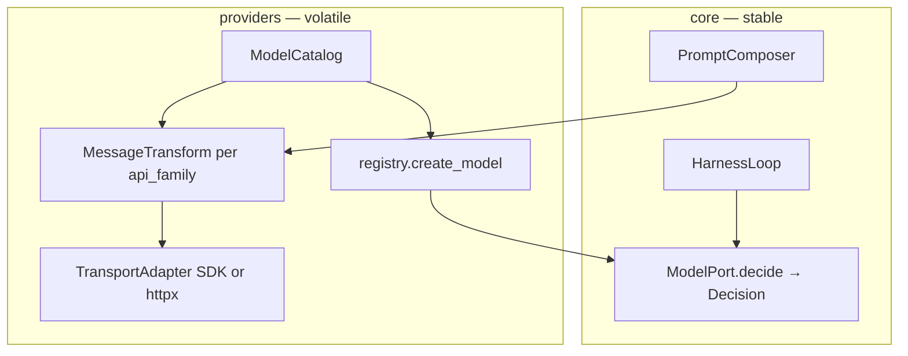

# Post-MVP Provider Expansion — Research & Design

Status: **design only** (no implementation in this phase).  
Goal: support multiple vendors (OpenAI, Anthropic, Google, DeepSeek, proxies)
without leaking SDK shapes into `core`, while handling **thinking / reasoning**
correctly per vendor.

Related: [overview.md](./overview.md) (Provider Integration), [data-model.md](./data-model.md),
[model-parameters.md](./model-parameters.md) (per-model official parameters),
[AGENTS.md](../../AGENTS.md) (ModelPort stability, eval determinism).

### Pinned upstream references

External **GitHub** links below use **commit SHAs** (snapshot: 2026-03) so citations
stay stable if default branches move or files are renamed.

| Repository | Commit |
|------------|--------|
| [anomalyco/opencode](https://github.com/anomalyco/opencode) | `0cf99cf5f961eba7ae74f94ba5475f807393840a` |
| [openclaw/openclaw](https://github.com/openclaw/openclaw) | `4d150209c31bafa5487be9ee7e653215947c7604` |
| [0xtresser/OpenCode-Book](https://github.com/0xtresser/OpenCode-Book) | `54ab3d350488de6fe654db0cd69d844cded5d55e` |
| [openai/openai-python](https://github.com/openai/openai-python) | `e75766769547601a25ed83b666c4d0fd046881f0` |
| [anthropics/anthropic-sdk-python](https://github.com/anthropics/anthropic-sdk-python) | `5db69c6d5f3e7e39023973ca4b235046e5661157` |
| [googleapis/python-genai](https://github.com/googleapis/python-genai) | `cd66b68e3dbffdf4bc5dc99d7949a775797d1c54` |

Vendor platform docs (DeepSeek, OpenAI, Anthropic, Google) remain live URLs — re-check
when upgrading SDK majors. [OpenCode-Book](https://www.opencodebook.xyz) also publishes
on the web; the SHA-pinned markdown in GitHub is the archival citation used here.

---

## 1. Problem statement

HarnessLab MVP ships one networked adapter (`DeepSeekModel`) that speaks
**OpenAI Chat Completions** over raw `httpx`. That was correct for MVP, but
Post-MVP expansion hits four hard problems:

| Problem | Why it matters |
|--------|----------------|
| **Multiple API families** | Anthropic uses `messages` + `thinking` blocks; OpenAI is moving toward **Responses API**; Google uses `generateContent` + `ThinkingConfig`. Not everything fits `POST /v1/chat/completions`. |
| **Thinking is not portable** | Toggle names, effort levels, budgets, and replay rules differ by vendor and even by model generation within one vendor. |
| **Tool + thinking replay** | After a tool call, some APIs require full reasoning/thinking blocks on the next request; omitting them yields **400** errors. |
| **Agent harness constraints** | `ModelPort` must stay stable; `eval` / `replay` must stay deterministic; trace payloads treat token counts as volatile but **decision/tool shapes** must replay. |

Official SDKs (OpenAI Python, Anthropic Python, Google GenAI) are the right
**transport** layer for Post-MVP — not because every vendor is “OpenAI-compatible”,
but because they track breaking API changes, streaming, auth, and retries.

---

## 2. Vendor survey — API families & thinking (2026-03)

This section is the **maintenance reference**. Re-check vendor docs when adding
a model or upgrading SDK major versions.

### 2.1 Summary matrix

| Vendor / family | Primary API | Thinking control (user-facing) | Reasoning in response | Tool + thinking replay rule (high level) |
|-----------------|-------------|--------------------------------|-------------------------|------------------------------------------|
| **DeepSeek** | OpenAI-compatible Chat Completions | `thinking.type`: `enabled` / `disabled`; effort via `reasoning_effort` or Anthropic-style `output_config.effort` | `reasoning_content` on message (OpenAI shape) | **With tools:** must pass back `reasoning_content` on assistant messages in the tool loop. **Without tools:** prior turn reasoning can be omitted on next user turn. |
| **OpenAI** (reasoning models) | **Responses API** preferred; Chat Completions legacy | `reasoning.effort`: model-dependent (`none`, `low`, `medium`, `high`, `xhigh`, …) | `reasoning` items / `reasoning_tokens` in usage | Interleaved thinking + tool calls; prefer Responses for new work. Chat Completions uses `max_completion_tokens`. |
| **Anthropic** (Claude 4.x) | **Messages API** (`/v1/messages`) | **Adaptive (recommended):** `thinking.type: adaptive` + `output_config.effort`. **Legacy:** `thinking.type: enabled` + `budget_tokens` (deprecated on newer Opus) | `thinking` blocks in content array | **Tool use:** only `tool_choice: auto` or `none`; must return **complete unmodified** thinking blocks for last assistant message in tool loop. |
| **Google Gemini** | **generateContent** (AI Studio / Vertex) | **Gemini 3+:** `thinking_level` (e.g. `low` / `high`). **Gemini 2.5:** `thinking_budget` (0 = off where supported, -1 = dynamic). **Do not mix** level + budget on same request. | Thought summaries / thought parts (see API); usage metadata | Tool calling uses Gemini function calling; replay must preserve thought signatures where required (proxy plugins in OpenClaw sanitize these). |

### 2.2 DeepSeek (OpenAI-compatible + dual control formats)

- Docs: [Thinking Mode](https://api-docs.deepseek.com/guides/thinking_mode)
- Models: `deepseek-v4-flash`, `deepseek-v4-pro` ([Pricing / quick start](https://api-docs.deepseek.com/quick_start/pricing))
- Base URL: `https://api.deepseek.com/v1`
- **HarnessLab today:** `thinking: {type: disabled}` for agent default (latency/cost); maps to top-level JSON field when using raw HTTP (not nested `extra_body` unless using OpenAI SDK).
- **OpenAI SDK note:** pass `thinking` in `extra_body` when using `openai` package.

### 2.3 OpenAI (reasoning / GPT-5.x / o-series)

- Docs: [Reasoning models](https://developers.openai.com/api/docs/guides/reasoning)
- Latest model guide: [Using GPT-5.5](https://developers.openai.com/api/docs/guides/latest-model)
- **Key design point:** OpenAI explicitly recommends **Responses API** over Chat Completions for reasoning models.
- **Effort:** `reasoning.effort` — defaults vary by model (e.g. GPT-5.5 defaults to `medium`).
- **Billing / telemetry:** `usage.completion_tokens_details.reasoning_tokens` (count reasoning separately for cost attribution).
- Azure mirror: [Azure reasoning models](https://learn.microsoft.com/en-us/azure/foundry/openai/how-to/reasoning)

### 2.4 Anthropic (Messages API — not OpenAI SDK)

- Docs: [Extended thinking](https://platform.claude.com/docs/en/build-with-claude/extended-thinking)
- Adaptive thinking: [Adaptive thinking](https://platform.claude.com/docs/en/build-with-claude/adaptive-thinking)
- Migration (Opus 4.7+): [Model migration guide](https://platform.claude.com/docs/en/about-claude/models/migration-guide)
- **Must use** `anthropic` Python SDK (or hand-roll Messages API) — OpenAI SDK is the wrong wire format.
- **Tool + thinking:** `tool_choice` restricted; thinking blocks are first-class structured content, not a string field on assistant message.

### 2.5 Google Gemini (generateContent)

- Docs: [Gemini thinking (AI Studio)](https://ai.google.dev/gemini-api/docs/thinking)
- Vertex: [Thinking on Vertex AI](https://docs.cloud.google.com/vertex-ai/generative-ai/docs/thinking)
- **Gemini 2.5 vs 3:** different parameters (`thinking_budget` vs `thinking_level`); catalog must record per-model schema.
- Known pitfall: thinking budget vs `max_output_tokens` interaction ([python-genai#782](https://github.com/googleapis/python-genai/issues/782)).

### 2.6 Proxies & routers (OpenRouter, LiteLLM, etc.)

- OpenRouter / compatible gateways often expose **OpenAI Chat Completions** surface but forward to Anthropic/Gemini backends with different thinking behavior.
- OpenCode documents a LiteLLM quirk: tool history may require a placeholder tool definition ([OpenCode LLM module — 7.5](https://github.com/0xtresser/OpenCode-Book/blob/54ab3d350488de6fe654db0cd69d844cded5d55e/EN/Chapter_07_Provider_Multi_Model_Adaptation_Layer/7.5_LLM_Module_Streaming_Call_Implementation.md)).
- **Design implication:** treat “OpenAI-compatible URL” as a **transport profile**, not as proof of thinking semantics. Metadata must record `reasoning_support: proxy | native | none`.

---

## 3. Thinking / reasoning — conceptual model

Vendors use different words for the same idea. HarnessLab should normalize
**configuration** and **storage**, not force one JSON shape on the wire.

### 3.1 Normalized configuration (operator / config.json)

Proposed user-facing knob (maps per model via catalog):

```yaml
# Conceptual — not implemented yet
thinking:
  mode: off | adaptive | effort | budget
  effort: low | medium | high | max | xhigh   # when mode=effort or adaptive
  budget_tokens: int | null                    # when mode=budget (legacy Anthropic / Gemini 2.5)
```

**Defaults for HarnessLab agent loop:** `mode: off` for tool-heavy daily use
(same as today’s DeepSeek `disabled`), opt-in per model in config.

### 3.2 Normalized storage (session / SQLite)

Today `Message` has `content`, `tool_calls`, `tool_call_id` only. Post-MVP needs:

| Field (proposed) | Purpose |
|------------------|---------|
| `reasoning_text` or vendor-neutral `reasoning_blocks` | Persist CoT for replay when API requires it |
| `provider_extra: dict` | Opaque round-trip blob (Anthropic thinking blocks, Gemini thought signatures) when normalization would lose data |
| `api_family` on **`llm.generate`** span attrs / metrics | Which transform ran (for debugging) |

**Replay policy** (when to inject reasoning on the next call) must be **per api_family + model**, not global:

| Scenario | Typical policy |
|----------|----------------|
| Plain multi-turn chat, no tools | Drop prior reasoning from wire (DeepSeek, OpenAI many cases) |
| Tool loop in same turn | Keep assistant reasoning/thinking blocks until tool loop completes |
| New user turn after final answer | Vendor-specific (often drop unless Anthropic interleaved chain says otherwise) |

OpenClaw encodes this as **ProviderReplayFamily** hooks; OpenCode as **ProviderTransform.message()** before send.

### 3.3 Trace / eval implications

- **`llm.generate`** span `metrics` treat token counts as volatile.
- Reasoning **text** should be **volatile in semantic replay compare** (like `metrics.context`), but **structural presence** (e.g. “tool step had reasoning block”) may need contract tests.
- `eval` / `ReplayModel` path unchanged — no network, no thinking.

---

## 4. OpenCode — what to learn

Primary reference: community [OpenCode-Book](https://github.com/0xtresser/OpenCode-Book)
(pinned commit above), cross-linked to upstream OpenCode source where useful.

| Topic | OpenCode-Book (pinned) | OpenCode source (pinned) |
|-------|------------------------|--------------------------|
| Vercel AI SDK as unified layer | [7.1 Vercel AI SDK Integration](https://github.com/0xtresser/OpenCode-Book/blob/54ab3d350488de6fe654db0cd69d844cded5d55e/EN/Chapter_07_Provider_Multi_Model_Adaptation_Layer/7.1_Vercel_AI_SDK_Integration.md) | — |
| Provider registration | [7.2 Provider Registration and Resolution](https://github.com/0xtresser/OpenCode-Book/blob/54ab3d350488de6fe654db0cd69d844cded5d55e/EN/Chapter_07_Provider_Multi_Model_Adaptation_Layer/7.2_Provider_Registration_and_Resolution.md) | [`provider/provider.ts`](https://github.com/anomalyco/opencode/blob/0cf99cf5f961eba7ae74f94ba5475f807393840a/packages/opencode/src/provider/provider.ts) |
| Model metadata (models.dev) | [7.3 Model Metadata System](https://github.com/0xtresser/OpenCode-Book/blob/54ab3d350488de6fe654db0cd69d844cded5d55e/EN/Chapter_07_Provider_Multi_Model_Adaptation_Layer/7.3_Model_Metadata_System.md) | [`provider/schema.ts`](https://github.com/anomalyco/opencode/blob/0cf99cf5f961eba7ae74f94ba5475f807393840a/packages/opencode/src/provider/schema.ts) |
| ProviderTransform | [7.4 ProviderTransform](https://github.com/0xtresser/OpenCode-Book/blob/54ab3d350488de6fe654db0cd69d844cded5d55e/EN/Chapter_07_Provider_Multi_Model_Adaptation_Layer/7.4_ProviderTransform_Differentiated_Adaptation.md) | [`provider/transform.ts`](https://github.com/anomalyco/opencode/blob/0cf99cf5f961eba7ae74f94ba5475f807393840a/packages/opencode/src/provider/transform.ts) |
| LLM.stream / streaming | [7.5 LLM Module](https://github.com/0xtresser/OpenCode-Book/blob/54ab3d350488de6fe654db0cd69d844cded5d55e/EN/Chapter_07_Provider_Multi_Model_Adaptation_Layer/7.5_LLM_Module_Streaming_Call_Implementation.md) | — |

### 4.1 Core ideas

1. **Single upper interface** — Session/Agent/Tool call `streamText()`; providers hidden behind `LanguageModelV2` (Vercel AI SDK).
2. **Bundled + dynamic providers** — 20+ SDKs shipped; optional npm install for exotic providers.
3. **Model metadata catalog** — capabilities, context window, pricing, reasoning variants from [models.dev](https://models.dev).
4. **Variants** — user selects `"high"` reasoning; framework maps to vendor-specific params (OpenAI effort, Anthropic budget, etc.).
5. **Layered option merge** — `Provider < Model < Agent < Variant` (predictable overrides).
6. **ProviderTransform** — last-mile message normalization (tool call IDs, cache markers, thinking block filtering) **before** HTTP/SDK call.

### 4.2 Fit for HarnessLab

| OpenCode pattern | HarnessLab adoption |
|------------------|---------------------|
| Vercel AI SDK (TS) | **No direct port.** Python analogue: thin **transport protocols** + official SDKs, not one mega-abstraction. |
| models.dev metadata | **Yes** — static JSON or generated catalog under `providers/catalog/`; map to `OperatorConfig`. |
| Variants / effort | **Yes** — extend `config.json` thinking section (already started for DeepSeek). |
| ProviderTransform | **Yes** — `ProviderMessageTransform` per `api_family`. |
| Dynamic npm providers | **No** — out of scope (AGENTS.md: no plugin marketplace in MVP/post-MVP near term). |

---

## 5. OpenClaw — what to learn

Upstream docs in-repo (pinned commit above):

| Topic | Link |
|-------|------|
| Model providers overview | [model-providers.md](https://github.com/openclaw/openclaw/blob/4d150209c31bafa5487be9ee7e653215947c7604/docs/concepts/model-providers.md) |
| Model selection & failover | [models.md](https://github.com/openclaw/openclaw/blob/4d150209c31bafa5487be9ee7e653215947c7604/docs/concepts/models.md) |
| Building provider plugins | [sdk-provider-plugins.md](https://github.com/openclaw/openclaw/blob/4d150209c31bafa5487be9ee7e653215947c7604/docs/plugins/sdk-provider-plugins.md) |
| Architecture (gateway) | [architecture.md](https://github.com/openclaw/openclaw/blob/4d150209c31bafa5487be9ee7e653215947c7604/docs/concepts/architecture.md) |

### 5.1 Core ideas

1. **Provider plugins** — `registerProvider` with auth, catalog, optional `resolveDynamicModel`.
2. **Model ref** — `provider/model` string everywhere; allowlist in config.
3. **Separation of concerns** — plugin owns vendor HTTP; core owns inference loop (OpenClaw pairs with pi-ai catalog).
4. **Thinking profiles** — per-plugin hooks: `resolveThinkingProfile`, `isBinaryThinking`, `supportsXHighThinking`, `resolveDefaultThinkingLevel`.
5. **Stream families & replay families** — composable wrappers (`google-thinking`, `openrouter-thinking`, `anthropic-by-model`, …) instead of one giant if-chain.
6. **Proxy vs native** — OpenAI-compatible proxy routes **skip** native-only features (Responses store, OpenAI reasoning-compat shaping, Anthropic beta headers on wrong host).

### 5.2 Fit for HarnessLab

| OpenClaw pattern | HarnessLab adoption |
|------------------|---------------------|
| Full plugin marketplace / gateway WS | **No** — single-process harness stays. |
| `provider/model` refs | **Yes** — evolve `model_backend` + `model_name` into structured ref. |
| Catalog + auth env vars | **Partially done** (`operator_config`, `DEEPSEEK_*`). |
| Stream/replay families | **Yes** — Python modules mirroring the hook table (see §6.3). |
| Thinking profiles on plugin | **Yes** — keyed by catalog entry, not hardcoded in DeepSeek adapter. |

---

## 6. HarnessLab proposed architecture

Design principle: **ModelPort stays dumb; intelligence lives in provider layer.**



### 6.1 Keep stable (ports & loop)

- **`ModelPort`**: `decide(session, user_input) -> Decision` unchanged.
- **`Decision`**: terminal + tool kinds unchanged; no SDK types in `core`.
- **`PromptComposer`**: still produces `ComposedPrompt`; conversation blocks stay role-tagged.
- **Eval / replay**: `SimpleModel` / `ReplayModel` only.

### 6.2 Split provider layer into four modules

| Module | Responsibility | Example |
|--------|----------------|---------|
| **`providers/catalog/`** | Static or synced model metadata: `api_family`, context window, thinking schema, tool support, default thinking | `deepseek-v4-flash.yaml`, `claude-sonnet-4-6.json` |
| **`providers/registry.py`** | Config → `(Transport, Transform, catalog entry)` | Already exists; extend beyond `simple` / `deepseek` |
| **`providers/transports/`** | SDK clients: `OpenAIChatTransport`, `AnthropicMessagesTransport`, `GoogleGenAITransport`, `OpenAIResponsesTransport` | Wrap official SDKs |
| **`providers/transforms/`** | `ComposedPrompt` + `Session` → wire messages; response → `Decision` + side effects on `Message` | DeepSeek reasoning_content replay rules |

**Do not** add a fifth “god adapter” per vendor in `deepseek.py` style long-term — split transport vs transform so OpenAI-compatible proxies reuse transport with different catalog flags.

### 6.3 Replay & thinking hooks (OpenClaw-inspired)

Define explicit hooks (Python protocols or small functions):

| Hook | When |
|------|------|
| `serialize_messages(composed, session, catalog_entry)` | Before API call |
| `parse_response(raw, catalog_entry) -> ParsedModelTurn` | After API call |
| `replay_policy(session, catalog_entry) -> ReplayPolicy` | Which stored fields must round-trip on next step |
| `normalize_tool_call_ids(...)` | OpenAI vs Anthropic tool id formats |

Register by `api_family`:

- `openai_chat` — DeepSeek, many proxies, legacy OpenAI chat
- `openai_responses` — OpenAI reasoning-first path
- `anthropic_messages` — Claude native
- `google_generate_content` — Gemini native

### 6.4 Configuration evolution

Extend existing `~/.config/harnesslab/config.json`:

```json
{
  "model": {
    "default_backend": "deepseek",
    "primary": "deepseek/deepseek-v4-flash",
    "fallbacks": ["deepseek/deepseek-v4-pro"],
    "deepseek": { "model_name": "deepseek-v4-flash", "thinking": "disabled" },
    "anthropic": { "model_name": "claude-sonnet-4-6", "thinking": { "mode": "adaptive", "effort": "medium" } },
    "openai": { "model_name": "gpt-5.5", "api": "responses", "reasoning": { "effort": "medium" } }
  }
}
```

Precedence (OpenCode-style): **CLI > env > config > catalog default**.

Secrets: unchanged — env var names in config only.

### 6.5 SDK strategy (Python)

| API family | Recommended SDK | Notes |
|------------|-----------------|-------|
| OpenAI + OpenAI-compatible | [`openai`](https://github.com/openai/openai-python/tree/e75766769547601a25ed83b666c4d0fd046881f0) | DeepSeek via `base_url`; use `extra_body` for thinking when on Chat Completions |
| Anthropic | [`anthropic`](https://github.com/anthropics/anthropic-sdk-python/tree/5db69c6d5f3e7e39023973ca4b235046e5661157) | Messages API only |
| Google Gemini | [`google-genai`](https://github.com/googleapis/python-genai/tree/cd66b68e3dbffdf4bc5dc99d7949a775797d1c54) | Unified AI Studio + Vertex client |
| Optional router | LiteLLM / custom httpx | Last resort for proxies; explicit `api_family: openai_chat_proxy` |

**Migration path for current `DeepSeekModel`:**

1. Introduce `OpenAIChatTransport` using `openai` SDK behind existing transform.
2. Keep `httpx` implementation until parity tests pass, then delete duplicate.
3. No change to `ModelPort` or loop.

### 6.6 Streaming

Web UI SSE streams **span lifecycle** events (`span.started` / `span.event` /
`span.completed` / `span.link`) and, for thinking models, **token deltas**
(`reasoning_delta`, `assistant_delta`) via `stream_context`. Transports with
stream paths: DeepSeek (OpenAI-chat), Anthropic Messages, OpenAI Responses,
Gemini generateContent — all gated by `stream_sink_active()` during Web SSE turns.

Design rule: streaming callbacks stay adapter-internal until the loop grows
an async API; **`spans.jsonl`** (completed spans) remains the source of truth for replay.

### 6.6.1 Thinking replay policy (OpenAI-chat / DeepSeek)

DeepSeek returns HTTP **400** when thinking mode is on and the reserialized
request omits `reasoning_content` on a historical assistant message that
originally had thinking — especially in **tool loops** and long multi-step
turns (deep research).

**Operator runbook:** [`guides/deepseek-thinking-troubleshooting.md`](../guides/deepseek-thinking-troubleshooting.md)
(symptoms, SQLite checks, recovery, recurring failure modes).

HarnessLab persists thinking as `Message.reasoning_text`. On each DeepSeek
call, `serialize_messages()` builds `reasoning_by_message_id` from the
session and passes it to
`ComposedPrompt.as_openai_messages(reasoning_by_message_id=…)`. Each
conversation block with origin `session:<msg_id>` gets `reasoning_content`
on the wire when that message has stored reasoning.

Replay applies to **every assistant message with `reasoning_text`**, not
only rows with `tool_calls` (plan / intermediate assistant steps count too).
Matching is by **message id**, not by sequential index — index-based replay
was a recurring source of 400s when one step lacked stored reasoning.

When thinking is on, **tool assistants without captured reasoning** still
replay `reasoning_content: ""` on the wire (HarnessLab persists
`reasoning_text=""` on append). DeepSeek requires the field to be present
even when the model returned a bare tool call.

| Scenario | Required wire behavior |
| --- | --- |
| Open tool loop (last message `tool`) | Inject `reasoning_content` on assistants that have `reasoning_text` |
| Multi-step same turn (tool → plan/assistant → tool) | Same — all thinking assistants in history |
| New user turn after prior tool loop | Historical thinking assistants still replayed |
| Compacted-away turns | Raw reasoning dropped; tail messages retain `reasoning_text` |
| `reasoning_support: none` | No injection |

Golden tests: `tests/test_openai_chat_transform.py`,
`tests/test_deepseek_provider.py`. When vendor semantics change, update
transform + tests + the troubleshooting guide before catalog entries.

Other API families (Anthropic thinking blocks, Gemini thought signatures)
use family-specific `replay_policy` hooks — audit each when adding multi-turn
tool+thinking sessions.

### 6.7 Extension hooks & plugins (future capability)

**Short answer:** the design **already includes hooks** (§6.3); it does **not** yet include
OpenClaw-style dynamic provider plugins or a marketplace. That boundary is intentional.

| Layer | Today / P1–P5 | Future (optional, post–provider rollout) |
|-------|-------------|------------------------------------------|
| **Transform hooks** | Built-in registry keyed by `api_family` (`serialize_messages`, `parse_response`, `replay_policy`, …) | Same table; new families ship in-repo with tests |
| **Thinking profiles** | Catalog-driven defaults per model | Per-entry overrides in config (no new port) |
| **Loop lifecycle hooks** | Not in scope for provider doc; `HarnessLoop` stays thin | Optional `LoopHookPort` (pre/post step, pre tool) — **separate RFC**; must not bypass `PolicyPort` |
| **Dynamic plugins** | **Out of scope** (AGENTS.md: no plugin marketplace) | **Constrained extension:** local `entry_points` or `~/.config/harnesslab/plugins/` loading **provider transports + telemetry exporters only** — never policy, never tools, never core loop |
| **OpenClaw `registerProvider`** | Analogue = `registry.create_model` + catalog entry | Third-party wheels require explicit operator opt-in + allowlist; eval/replay path unchanged |

**Design rules for any future plugin surface:**

1. Plugins may register `(api_family, TransportAdapter, MessageTransform)` triples — not `ModelPort` replacements.
2. Policy and tool execution stay in-repo; plugins cannot register tools or weaken denylists.
3. `eval` / `ReplayModel` never loads plugins; regression suite stays hermetic.
4. No remote install / marketplace UI — copy or pip-install a known package, enable in config.

OpenCode’s npm-installed exotic providers and OpenClaw’s gateway plugin SDK are useful **patterns**,
not targets for parity. HarnessLab remains a single-process learning harness.

---

## 7. Gap analysis — current codebase

| Area | Today | Needed |
|------|-------|--------|
| Registry | `simple`, `deepseek`, `anthropic`, `openai`, `gemini` | Catalog-driven `provider/model` refs (partial — catalog + backend switch shipped) |
| Message model | `reasoning_text` + `provider_extra` on `Message` | Extend when new replay families need persisted blobs |
| Composer | `as_openai_messages()` + per-family transforms | Optional `as_wire_messages(api_family)` if transforms outgrow OpenAI pivot |
| DeepSeek thinking | Multi-turn + tool-loop `reasoning_content` replay via transform | Extend replay tests when adding new thinking models |
| Trace | `spans.jsonl` + optional OTLP lifecycle export + metrics histograms (Phase 5.6 / O4) | Grafana dashboard JSON optional |
| Tests | Mocked SDK/transport per provider family | Optional `RUN_*_LIVE=1` live lanes; eval stays on `simple` / replay |

---

## 8. Phased rollout

| Phase | Scope | Exit criteria | Status |
|-------|--------|---------------|--------|
| **P0 Design** | This document + catalog schema RFC | Reviewed; linked from roadmap | **DONE** |
| **P1 Catalog + transform interface** | `ModelCatalog`, `ParsedModelTurn`, replay hooks; extend `Message` | Unit tests; docs in data-model.md | **DONE** |
| **P2 DeepSeek via OpenAI SDK** | Transport swap; fix tool-loop `reasoning_content` replay | Existing DeepSeek tests green + new thinking tool-loop test | **DONE** |
| **P3 Anthropic native** | Messages transport + adaptive thinking mapping | Mocked SDK contract tests (no live key required) | **DONE** |
| **P4 OpenAI Responses** | Reasoning effort for GPT-5.x | Mocked SDK contract tests; opt-in config | **DONE** |
| **P5 Gemini** | generateContent + thinking_level/budget split in catalog | One eval-style mock task (no network default) | **DONE** |
| **P6 Provider failover** (optional) | OpenClaw-style fallback chain across configured backends | Contract tests; explicit operator opt-in | **DONE** |
| **P7 OpenTelemetry bridge** | OTel exporter adapter behind `SpanRecorderPort` (see §11) | Traces/metrics in standard backends; eval semantic replay unchanged | **DONE** |

**Explicitly out of scope for P1–P7:** plugin marketplace, multi-agent. Constrained provider plugins remain deferred (§6.7).

---

## 9. Design decisions (record)

1. **Use official SDKs per API family** — not “OpenAI SDK for everything.”
2. **Keep `ModelPort` synchronous and minimal** — streaming is adapter-internal until loop grows async API.
3. **Catalog-driven thinking** — never hardcode “DeepSeek disables thinking” in loop; loop stays vendor-agnostic.
4. **Transform owns replay rules** — loop appends `Message` blobs; transform decides what goes on the wire next call.
5. **Proxies are second-class** — supported via `openai_chat` + flags, with reduced feature set documented.
6. **Eval path never calls SDK** — regression safety preserved.
7. **Hooks are built-in first, plugins later** — transform/replay hooks ship in-repo; optional third-party provider adapters only after P5, with strict allowlist (§6.7).

---

## 10. Maintenance checklist

When adding a model:

1. Add catalog entry with `api_family`, thinking schema, context limits.
2. Implement or reuse transform + transport; add mocked contract tests.
3. Document env vars in `scripts/hl-serve.example.env` and config example JSON.
4. If thinking + tools: add **tool-loop replay test** (mock 400 on missing reasoning)
   and **multi-turn replay test** (new user message after prior tool loop).
5. Update this doc’s matrix (§2.1) if vendor changes semantics.
6. Run `uv run pytest`, `uv run harnesslab eval --skip-tags network`.
7. Optional live smoke:
   - OpenAI wire: `RUN_DEEPSEEK_LIVE=1 DEEPSEEK_API_KEY=... uv run pytest tests/manual/test_deepseek_live.py -m network`
   - Anthropic wire via DeepSeek: `RUN_ANTHROPIC_DEEPSEEK_LIVE=1 DEEPSEEK_API_KEY=... uv run pytest tests/manual/test_anthropic_deepseek_live.py -m network`
   Both are connectivity-only (thinking on/off); not CI. Real Claude uses `ANTHROPIC_API_KEY` without DeepSeek base URL.

---

## 11. OpenTelemetry integration

HarnessLab observability is **first-party span JSONL** via `SpanRecorderPort`,
consumed by CLI (`harnesslab replay`, `metrics`, `context`), eval semantic compare, and
Web UI span SSE. **OpenTelemetry is optional** via fan-out on the same port (P7 / O4).

### 11.1 Why OTel fits alongside JSONL

| Concern | Current | With OTel |
|---------|---------|-----------|
| Loop/tool/model telemetry | `spans.jsonl` — one completed span per row | Same spans **also** exported as lifecycle OTel spans |
| Latency & tokens | Volatile fields on `SpanRecord.metrics` | OTel metrics from completed spans; token counts stripped from span attrs by default |
| Operator backends | File + Web SSE (`SpanHub`) | Export to Jaeger, Grafana Tempo, Datadog, etc. via OTLP when configured |
| Eval / replay | Semantic compare on span forests | **Unchanged** — eval does not depend on OTel; replay ignores volatile OTel resource attrs |

### 11.2 Implemented shape (P7 + Observability v2)

- **`OtelSpanRecorder`** in `telemetry/otel_span_recorder.py` — lifecycle spans on
  `SpanRecorderPort` (composite with `LocalSpanRecorder` → `spans.jsonl`).
- Enabled when `HARNESSLAB_OTEL=1` or `OTEL_EXPORTER_OTLP_ENDPOINT` is set; CLI / `hl-serve`
  wrap default span recorders automatically.
- Span attributes use stable `harnesslab.*` keys; volatile token/latency fields live in
  `SpanRecord.metrics` (see `data-model.md`).
- Semantic replay compare continues to strip volatile fields; OTel trace IDs are **never**
  part of eval baselines.

### 11.3 Non-goals

- Auto-instrument every httpx/SDK call before transform hooks are stable (provider layer first).
- Coupling eval pass/fail to an OTel collector being up.
- Storing OTel blobs inside SQLite session rows.

Tracked as **P7** in §8 (implemented). Eval/replay remain span-JSONL-first.

---

## 12. References (quick index)

| Resource | URL |
|----------|-----|
| DeepSeek thinking | https://api-docs.deepseek.com/guides/thinking_mode |
| DeepSeek pricing / models | https://api-docs.deepseek.com/quick_start/pricing |
| OpenAI reasoning | https://developers.openai.com/api/docs/guides/reasoning |
| OpenAI GPT-5.5 guide | https://developers.openai.com/api/docs/guides/latest-model |
| Anthropic extended thinking | https://platform.claude.com/docs/en/build-with-claude/extended-thinking |
| Anthropic adaptive thinking | https://platform.claude.com/docs/en/build-with-claude/adaptive-thinking |
| Gemini thinking | https://ai.google.dev/gemini-api/docs/thinking |
| OpenCode-Book ch.7 (pinned) | https://github.com/0xtresser/OpenCode-Book/tree/54ab3d350488de6fe654db0cd69d844cded5d55e/EN/Chapter_07_Provider_Multi_Model_Adaptation_Layer |
| OpenCode provider source (pinned) | https://github.com/anomalyco/opencode/tree/0cf99cf5f961eba7ae74f94ba5475f807393840a/packages/opencode/src/provider |
| OpenClaw model providers (pinned) | https://github.com/openclaw/openclaw/blob/4d150209c31bafa5487be9ee7e653215947c7604/docs/concepts/model-providers.md |
| OpenClaw provider plugin SDK (pinned) | https://github.com/openclaw/openclaw/blob/4d150209c31bafa5487be9ee7e653215947c7604/docs/plugins/sdk-provider-plugins.md |
| models.dev (OpenCode metadata source) | https://models.dev |
| OpenTelemetry spec | https://opentelemetry.io/docs/ |
