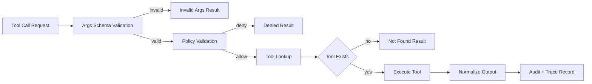
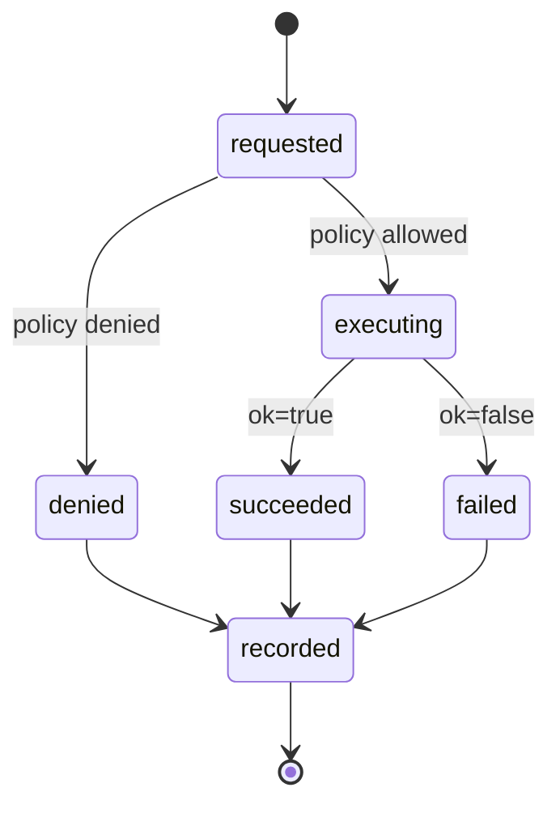

# Tool Runtime and Safety Model

## Scope

This document defines how tools are registered, authorized, executed, and
audited in HarnessLab.

## Execution Pipeline

Schema validation runs before the policy layer so that policy checks can
trust the shape of `call.args`. Unknown tools intentionally pass through
the schema gate and are denied by the policy layer instead, keeping the
"unknown tool" responsibility in exactly one place.

## Design Objectives

- Keep tool execution explicit and policy-gated
- Prevent accidental workspace escape
- Keep behavior deterministic enough for tests and replay
- Preserve a clear audit trail for every tool invocation

## Tool Runtime Components

### Tool Registry

The registry maps a tool name to an executable tool implementation.

Responsibilities:

- Registration (`name -> implementation`)
- Lookup and dispatch
- Standardized error behavior for unknown tools
- `validate_args(call) -> (bool, error)`: validate `call.args` against the
  registered tool's `args_schema`; unknown tools fall through (deferred to
  the policy layer) so the "unknown tool" responsibility lives in exactly
  one place
- Normalize any exception raised by a tool into `ToolResult(ok=False, error="crashed: ...")`
  so that the loop never observes raw exceptions

A registered tool must expose:

- `name`: stable identifier used for lookup
- `description`: short, human-readable purpose
- `args_schema`: JSON Schema describing accepted arguments
- `execute(call) -> ToolResult`: deterministic execution entry point

### Policy Layer

The policy runs before the tool executes.

Responsibilities:

- Validate whether the tool is allowed
- Validate tool arguments for safety boundaries
- Return a structured allow/deny decision with reason

Current checks:

- `read_file` / `write_file` / `edit_file` / `apply_patch`: path must resolve
  inside workspace root (`_check_path`).
- `grep` / `glob`: path is optional; when provided, must resolve
  inside workspace root (`_check_optional_path`).
- `read_pdf`: path must resolve inside workspace root (`_check_path`).
- `web_search` / `html_to_markdown`: schema-validated and allowed by
  default policy.
- `run_shell_safe`: command must contain no shell metacharacters
  (`& | ; < > \` $ ( ) \n \r`); after `shlex` parsing, `argv[0]`
  must not be on the denylist (`rm`, `sudo`, `curl`, `wget`,
  `dd`, `mkfs`, `mount`, `umount`, `chmod`, `chown`, `kill`,
  `killall`, `shutdown`, `reboot`, `scp`, `ssh`), and must appear
  in the allowlist. The Phase 2.5 allowlist is intentionally
  wide enough for everyday read-only inspection:
  - File inspection: `ls`, `pwd`, `echo`, `cat`, `head`, `tail`,
    `wc`, `file`, `du`, `df`, `stat`
  - Introspection: `which`, `env`, `date`, `whoami`, `hostname`,
    `uname`
  - Search: `find`, `tree`
  - Dev tooling: `python`, `python3`, `pytest`, `ruff`, `mypy`,
    `uv`
  - VCS: `git` (subcommand-gated, see below)
- `git` is special-cased: it is on the head allowlist, but
  `argv[1]` must be in `SAFE_GIT_SUBCOMMANDS` (read-only set:
  `status`, `log`, `diff`, `show`, `branch`, `remote`,
  `ls-files`, `ls-tree`, `rev-parse`, `describe`, `tag`,
  `blame`, `shortlog`, `config`). Write-side subcommands
  (`push`, `reset`, `checkout`, `clean`, `rebase`, `stash`,
  `merge`, `commit`, `fetch`, `pull`) are rejected with an
  advisory message listing the safe set.

The denylist is consulted before the allowlist so that a
destructive command stays rejected even if it is mistakenly added
to the allowlist.

**Sandbox claim.** The expanded allowlist defends against the
agent issuing a single obviously-destructive command directly.
``fetch_url`` defaults to **open** mode: any public HTTPS host is
reachable. SSRF protection rejects hostnames that resolve to private,
loopback, link-local, multicast, or reserved IP space, plus a built-in
deny set (`localhost`, `metadata.google.internal`, `169.254.169.254`,
etc.). Operators can pin a stricter posture:

- `strict`: host allowlist only (`wttr.in` by default)
- `open` (default): public HTTPS + SSRF protection + optional deny-host
  extensions via `fetch_url.deny_hosts`

In every mode, embedded credentials are denied and `curl` / `wget`
remain on the shell denylist.

### Tool Executor

The executor runs the selected tool and returns a normalized result object.

Required output shape:

- `ok`
- `output`
- optional `error`

## Safety Defaults

- Unknown tools are denied
- Out-of-workspace file access is denied
- Non-allowlisted shell commands are denied
- Tool output is bounded to a safe max length

## Built-in Tool Surface

| Tool | Purpose | Policy gate |
| --- | --- | --- |
| `read_file` | Read a workspace-relative text file | `_check_path` |
| `write_file` | Create/overwrite a workspace-relative text file | `_check_path` |
| `edit_file` | In-place string replacement (Phase 2.5); `old` must be present, must be unique unless `replace_all=True` | `_check_path` |
| `apply_patch` | Unified-diff hunk application (Phase 3.4); context must match exactly | `_check_path` |
| `grep` | UTF-8 regex search across the workspace, returns `path:lineno: line` matches with `glob` filter; default `max_matches=50`, hard cap `1000`; binary files and noise dirs skipped (Phase 2.5) | `_check_optional_path` |
| `glob` | Workspace-relative glob match returning sorted relative paths; default `max_results=100`, hard cap `5000`; same noise-dir skip list (Phase 2.5) | `_check_optional_path` |
| `fetch_url` | Read-only HTTP GET (or Jina Reader when `provider=jina`); defaults to open HTTPS (SSRF-safe: blocks private/loopback/link-local + cloud-metadata hosts); strict mode falls back to a host allowlist; text-like content only | `_check_fetch_url` |
| `web_search` | Web search hits via backend (`ddgs`, `duckduckgo`, `exa`, `brave`, `tavily`, `serpapi`) with capped result count | allow |

Backend selection: `tools.web_search.backend` in operator config or `WEB_SEARCH_BACKEND`
env var. Default backend is `ddgs` (DuckDuckGo via the `ddgs` library). `exa` uses
Exa REST when `EXA_API_KEY` is set, otherwise Exa hosted MCP (no key, shared quota).
`fetch_url.provider` may be `direct` (default) or `jina` (`r.jina.ai`; optional
`JINA_API_KEY`). Proxy and provider notes: [`docs/guides/web-research-providers.md`](../guides/web-research-providers.md).
Diagnostics: `harnesslab check network` (loads `~/.config/harnesslab/env` by default).
| `html_to_markdown` | Convert HTML to markdown-like text for summarization and downstream parsing | allow |
| `read_pdf` | Extract text from workspace PDF files with optional page cap | `_check_path` |
| `run_shell_safe` | Argv shell invocation against the expanded allowlist + git subcommand gate (Phase 2.5) | `_check_shell` |

### MCP 工具（Phase 5.4）

HarnessLab 可将外部 [MCP](https://modelcontextprotocol.io/) 服务器的工具目录映射为原生 `ToolPort`，与内置工具共用同一执行流水线（见上文 Execution Pipeline）。实现：`tools/mcp_adapter.py`、`tools/mcp_client.py`（stdio JSON-RPC，lazy import）。

**注册与命名**

- 启动时 `register_mcp_servers(registry, configs)` 对每个配置的 server `Popen` 子进程，调用 `tools/list`，注册为 `McpToolAdapter`。
- 工具名格式：`mcp_{server_name}_{原始工具名}`（见 `mcp_tool_name()`）。
- 示例：`name: "playwright"` + MCP 工具 `browser_navigate` → `mcp_playwright_browser_navigate`。

**Policy**

- 所有 `mcp_*` 工具默认 **deny**。
- 仅当工具名出现在 operator config 的 `tools.mcp_allowed_tools[]` 中时，`DefaultPolicy` 返回 allow。
- 与内置 `web_search` / `fetch_url` 不同：MCP 能力必须 operator 逐工具 opt-in。

**配置字段**（`~/.config/harnesslab/config.json`）

| 字段 | 说明 |
| --- | --- |
| `tools.mcp_servers[]` | 每项：`name`、`command`、`args`、`env_names`（可选）、`policy_profile`（默认 `strict`） |
| `tools.mcp_allowed_tools[]` | 允许执行的 `mcp_*` 工具名 allowlist |

**与 eval / replay**

- 未配置 MCP 时 runtime 不依赖 MCP SDK。
- MCP 工具调用走相同 **`tool.{name}`** span 语义；eval / replay 基线不强制包含 MCP（取决于任务是否启用 MCP config）。

**浏览器自动化**

- Core **不**内置 Playwright browser driver；浏览器场景通过 MCP（如 `@playwright/mcp`）接入。
- 操作员指南：[`docs/guides/mcp-servers.md`](../guides/mcp-servers.md)、[`docs/guides/browser-automation.md`](../guides/browser-automation.md)。

### Tool lifecycle hooks (Phase 5.8)

Optional hooks can run before and after tool execution via
`tools.hooks` config:

- `pre_tool[]` (ordered): may `allow`, `warn`, or `block`
- `post_tool[]` (ordered): audit/annotation only (no blocking)
- Supported hook types: `prompt`, `shell`, `http`

Payload fields:

- Common: `session_id`, `tool_name`, `tool_args`
- Post-hook only: `tool_result` summary (`ok`, `error`, `output_size`)

Failure policy:

- Hook failure does not crash the turn; loop records a **`hook.failed`** span event and continues.
- `pre_tool` returning `block` yields a normalized tool denial reason.

### Shell allowlist profiles (Phase 3.4)

``run_shell_safe`` allowlists are selected by **profile name** (config
``policy.shell_profile``, default ``dev``). Explicit ``shell_allowlist``
constructor args still override profiles for tests.

| Profile | Intent |
| --- | --- |
| ``dev`` / ``default`` | Historical expanded allowlist (includes ``pytest``, ``uv``, ``python``, …) |
| ``read_only`` | Inspection + search + read-only ``git``; no dev runners |
| ``strict`` | Minimal file inspection + read-only ``git`` |

Denylist and git subcommand gate apply in every profile. Template:
``scripts/harnesslab.config.example.json``.

The "noise dir" skip list applied to `grep` / `glob`:
`.git`, `.venv`, `node_modules`, `__pycache__`, `dist`, `build`,
`target`, `.mypy_cache`, `.pytest_cache`, `.ruff_cache`.

## Current Sandboxing Level

The runtime uses process-level restrictions through policy checks
and safe defaults:

- Controlled working directory
- Allowlisted shell commands plus a destructive-command denylist
- Subcommand-gated `git` (read-only subset only)
- Configurable shell execution timeout (`RuntimeLimits.shell_timeout_seconds`)
- Configurable per-call output cap (`RuntimeLimits.output_bytes_cap`),
  applied uniformly to all file and shell tools
- Configurable context-window thresholds for the agent loop
  (`context_window_tokens`, `compaction_threshold_tokens`,
  `compaction_keep_last_messages`) so the loop compacts before
  the provider rejects the request

## Recommended Hardening Path

1. Add explicit resource limits (CPU, memory, output bytes)
2. Add denylist for sensitive command patterns
3. Add command argument schema validation per tool
4. Add execution audit records with call hashes
5. Add isolated worker process per tool call
6. Add optional container-based sandbox in non-local environments

## Auditing and Observability

Telemetry is **span-first** ([`observability-v2.md`](observability-v2.md)). Each tool
invocation opens a **`tool.{name}`** span under the current `harnesslab.step`. Policy
and schema outcomes are recorded as span **events** and **attributes** (not v1 flat
`TraceEvent` rows).

| Outcome | Span / event representation |
| --- | --- |
| Invalid args | `tool.{name}` span event `tool.args_invalid` (schema failed; tool not run) |
| Policy denied | `tool.{name}` span event `tool.policy_denied` (policy blocked; tool not run) |
| Executed | Completed `tool.{name}` span with `harnesslab.tool.ok` and metrics |
| Hook invoked | Span event `hook.invoked` on the active step span |
| Hook blocked | Span event `hook.blocked` (pre hook returned block) |
| Hook failed | Span event `hook.failed` (non-fatal; loop continues) |

Completed **`tool.{name}`** spans carry (in attributes / metrics):

- `harnesslab.tool_call.id`: stable ID linking back to `ToolCall.id`
- `harnesslab.tool.name`: tool name
- tool args (normalized in attributes as applicable)
- `harnesslab.policy.decision`: `allow:<reason>` or `deny:<reason>`
- `duration_ms`, `ok`, optional `error` in metrics
- `output_preview`, `output_size`, `output_truncated` in metrics (volatile in replay compare)

`tool.args_invalid` events carry the schema violation message on the span.

Separately, each inner step opens **`llm.generate`** before applying the decision.
That span's `metrics` include:

- `harnesslab.decision.kind` (also on attributes)
- `latency_ms`, optional token counters / `usage_breakdown` / `cost_estimate`
- `metrics.context`: a `ContextSnapshot` (see `docs/architecture/data-model.md`)
- optional `prompt_blocks[]`, `api_messages[]`, `reasoning_text` for operator/debug surfaces

Legacy v1 event names (`tool_executed`, `tool_denied`, `model_call`, …) appear only
in historical docs and migration tables — see [`observability-v2.md`](observability-v2.md)
§ v1 → v2 mapping.

The Phase 2.1 inner loop wraps each step in **`harnesslab.step`** spans inside a
**`harnesslab.turn`** root. Compactions are **`context.compact`** spans (see
[`compaction.md`](compaction.md)). See [`data-model.md`](data-model.md) § SpanRecord
and legacy § TraceEvent for historical flat-event shapes.

These records correlate by `session_id` + `trace_id` for replay and debugging.
All timestamps must come from the injected `ClockPort` and IDs from `IdPort`.
`metrics.context` is excluded from divergence comparison because token estimates
depend on tool outputs that embed workspace paths.

Diagram style and naming rules are defined in
`docs/architecture/diagram-conventions.md`.
