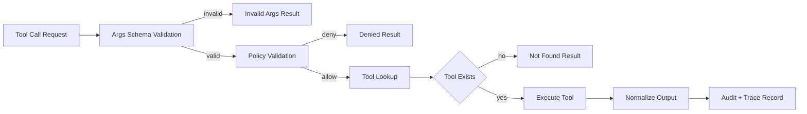
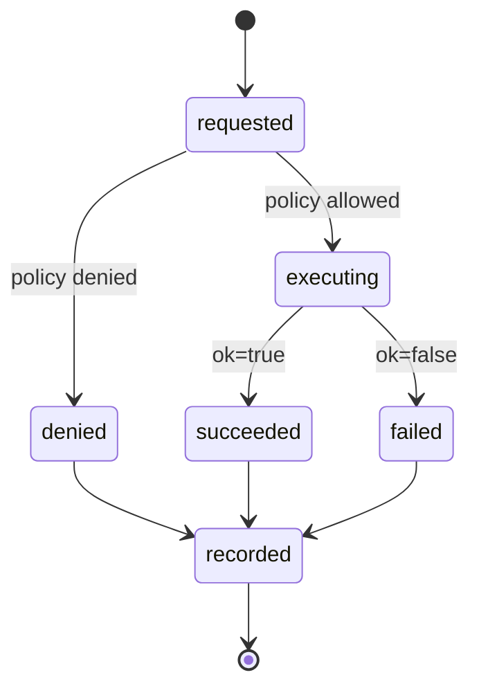

# Tool Runtime and Safety Model

## Scope

This document defines how tools are registered, authorized, executed, and
audited in HarnessLab.

## Execution Pipeline

Schema validation runs before the policy layer so that policy checks can
trust the shape of `call.args`. Unknown tools intentionally pass through
the schema gate and are denied by the policy layer instead, keeping the
"unknown tool" responsibility in exactly one place.

## Design Objectives

- Keep tool execution explicit and policy-gated
- Prevent accidental workspace escape
- Keep behavior deterministic enough for tests and replay
- Preserve a clear audit trail for every tool invocation

## Tool Runtime Components

### Tool Registry

The registry maps a tool name to an executable tool implementation.

Responsibilities:

- Registration (`name -> implementation`)
- Lookup and dispatch
- Standardized error behavior for unknown tools
- `validate_args(call) -> (bool, error)`: validate `call.args` against the
  registered tool's `args_schema`; unknown tools fall through (deferred to
  the policy layer) so the "unknown tool" responsibility lives in exactly
  one place
- Normalize any exception raised by a tool into `ToolResult(ok=False, error="crashed: ...")`
  so that the loop never observes raw exceptions

A registered tool must expose:

- `name`: stable identifier used for lookup
- `description`: short, human-readable purpose
- `args_schema`: JSON Schema describing accepted arguments
- `execute(call) -> ToolResult`: deterministic execution entry point

### Policy Layer

The policy runs before the tool executes.

Responsibilities:

- Validate whether the tool is allowed
- Validate tool arguments for safety boundaries
- Return a structured allow/deny decision with reason

Current checks:

- `read_file` / `write_file` / `edit_file` / `apply_patch`: path must resolve
  inside workspace root (`_check_path`).
- `grep` / `glob`: path is optional; when provided, must resolve
  inside workspace root (`_check_optional_path`).
- `read_pdf`: path must resolve inside workspace root (`_check_path`).
- `web_search` / `html_to_markdown`: schema-validated and allowed by
  default policy.
- `run_shell_safe`: command must contain no shell metacharacters
  (`& | ; < > \` $ ( ) \n \r`); after `shlex` parsing, `argv[0]`
  must not be on the denylist (`rm`, `sudo`, `curl`, `wget`,
  `dd`, `mkfs`, `mount`, `umount`, `chmod`, `chown`, `kill`,
  `killall`, `shutdown`, `reboot`, `scp`, `ssh`), and must appear
  in the allowlist. The Phase 2.5 allowlist is intentionally
  wide enough for everyday read-only inspection:
  - File inspection: `ls`, `pwd`, `echo`, `cat`, `head`, `tail`,
    `wc`, `file`, `du`, `df`, `stat`
  - Introspection: `which`, `env`, `date`, `whoami`, `hostname`,
    `uname`
  - Search: `find`, `tree`
  - Dev tooling: `python`, `python3`, `pytest`, `ruff`, `mypy`,
    `uv`
  - VCS: `git` (subcommand-gated, see below)
- `git` is special-cased: it is on the head allowlist, but
  `argv[1]` must be in `SAFE_GIT_SUBCOMMANDS` (read-only set:
  `status`, `log`, `diff`, `show`, `branch`, `remote`,
  `ls-files`, `ls-tree`, `rev-parse`, `describe`, `tag`,
  `blame`, `shortlog`, `config`). Write-side subcommands
  (`push`, `reset`, `checkout`, `clean`, `rebase`, `stash`,
  `merge`, `commit`, `fetch`, `pull`) are rejected with an
  advisory message listing the safe set.

The denylist is consulted before the allowlist so that a
destructive command stays rejected even if it is mistakenly added
to the allowlist.

**Sandbox claim.** The expanded allowlist defends against the
agent issuing a single obviously-destructive command directly.
``fetch_url`` defaults to **open** mode: any public HTTPS host is
reachable. SSRF protection rejects hostnames that resolve to private,
loopback, link-local, multicast, or reserved IP space, plus a built-in
deny set (`localhost`, `metadata.google.internal`, `169.254.169.254`,
etc.). Operators can pin a stricter posture:

- `strict`: host allowlist only (`wttr.in` by default)
- `open` (default): public HTTPS + SSRF protection + optional deny-host
  extensions via `fetch_url.deny_hosts`

In every mode, embedded credentials are denied and `curl` / `wget`
remain on the shell denylist.

### Tool Executor

The executor runs the selected tool and returns a normalized result object.

Required output shape:

- `ok`
- `output`
- optional `error`

## Safety Defaults

- Unknown tools are denied
- Out-of-workspace file access is denied
- Non-allowlisted shell commands are denied
- Tool output is bounded to a safe max length

## Built-in Tool Surface

| Tool | Purpose | Policy gate |
| --- | --- | --- |
| `read_file` | Read a workspace-relative text file | `_check_path` |
| `write_file` | Create/overwrite a workspace-relative text file | `_check_path` |
| `edit_file` | In-place string replacement (Phase 2.5); `old` must be present, must be unique unless `replace_all=True` | `_check_path` |
| `apply_patch` | Unified-diff hunk application (Phase 3.4); context must match exactly | `_check_path` |
| `grep` | UTF-8 regex search across the workspace, returns `path:lineno: line` matches with `glob` filter; default `max_matches=50`, hard cap `1000`; binary files and noise dirs skipped (Phase 2.5) | `_check_optional_path` |
| `glob` | Workspace-relative glob match returning sorted relative paths; default `max_results=100`, hard cap `5000`; same noise-dir skip list (Phase 2.5) | `_check_optional_path` |
| `fetch_url` | Read-only HTTP GET; defaults to open HTTPS (SSRF-safe: blocks private/loopback/link-local + cloud-metadata hosts); strict mode falls back to a host allowlist; text-like content only | `_check_fetch_url` |
| `web_search` | Web search hits via backend (`duckduckgo`, `brave`, `tavily`, `serpapi`) with capped result count | allow |
| `html_to_markdown` | Convert HTML to markdown-like text for summarization and downstream parsing | allow |
| `read_pdf` | Extract text from workspace PDF files with optional page cap | `_check_path` |
| `run_shell_safe` | Argv shell invocation against the expanded allowlist + git subcommand gate (Phase 2.5) | `_check_shell` |

### Tool lifecycle hooks (Phase 5.8)

Optional hooks can run before and after tool execution via
`tools.hooks` config:

- `pre_tool[]` (ordered): may `allow`, `warn`, or `block`
- `post_tool[]` (ordered): audit/annotation only (no blocking)
- Supported hook types: `prompt`, `shell`, `http`

Payload fields:

- Common: `session_id`, `tool_name`, `tool_args`
- Post-hook only: `tool_result` summary (`ok`, `error`, `output_size`)

Failure policy:

- Hook failure does not crash the turn; loop emits `hook_failed` and continues.
- `pre_tool` returning `block` yields a normalized tool denial reason.

### Shell allowlist profiles (Phase 3.4)

``run_shell_safe`` allowlists are selected by **profile name** (config
``policy.shell_profile``, default ``dev``). Explicit ``shell_allowlist``
constructor args still override profiles for tests.

| Profile | Intent |
| --- | --- |
| ``dev`` / ``default`` | Historical expanded allowlist (includes ``pytest``, ``uv``, ``python``, …) |
| ``read_only`` | Inspection + search + read-only ``git``; no dev runners |
| ``strict`` | Minimal file inspection + read-only ``git`` |

Denylist and git subcommand gate apply in every profile. Template:
``scripts/harnesslab.config.example.json``.

The "noise dir" skip list applied to `grep` / `glob`:
`.git`, `.venv`, `node_modules`, `__pycache__`, `dist`, `build`,
`target`, `.mypy_cache`, `.pytest_cache`, `.ruff_cache`.

## Current Sandboxing Level

The runtime uses process-level restrictions through policy checks
and safe defaults:

- Controlled working directory
- Allowlisted shell commands plus a destructive-command denylist
- Subcommand-gated `git` (read-only subset only)
- Configurable shell execution timeout (`RuntimeLimits.shell_timeout_seconds`)
- Configurable per-call output cap (`RuntimeLimits.output_bytes_cap`),
  applied uniformly to all file and shell tools
- Configurable context-window thresholds for the agent loop
  (`context_window_tokens`, `compaction_threshold_tokens`,
  `compaction_keep_last_messages`) so the loop compacts before
  the provider rejects the request

## Recommended Hardening Path

1. Add explicit resource limits (CPU, memory, output bytes)
2. Add denylist for sensitive command patterns
3. Add command argument schema validation per tool
4. Add execution audit records with call hashes
5. Add isolated worker process per tool call
6. Add optional container-based sandbox in non-local environments

## Auditing and Observability

Each tool call emits exactly one of the following trace events:

- `tool_invalid_args` — schema validation failed; policy and tool were not run
- `tool_denied` — schema passed but policy denied; tool was not run
- `tool_executed` — schema passed, policy allowed, tool ran (ok=true/false)
- `hook_invoked` — a pre/post hook was called
- `hook_blocked` — a pre hook explicitly blocked the tool
- `hook_failed` — hook execution failed (non-fatal; loop continues)

`tool_executed` (and `tool_denied`) carry the following payload fields:

- `tool_call_id`: stable ID linking back to `ToolCall.id`
- `tool`: tool name
- `args`: invocation arguments
- `policy_decision`: `allow:<reason>` or `deny:<reason>`
- `started_at` / `ended_at`: ISO-8601 UTC timestamps (null when denied)
- `duration_ms`: execution latency (null when denied)
- `ok`: success boolean (denied events use a separate `tool_denied` event_type)
- `error`: failure reason (null on success)
- `output_size`: byte length of the full tool output
- `output_preview`: first N bytes of `ToolResult.output` (current preview cap: 512)
- `output_truncated`: whether `output_preview` is shorter than `output_size`

`tool_invalid_args` carries `tool_call_id`, `tool`, `args`, and `error`
(the schema violation message).

Separately, the loop emits one `model_call` event per inner step
before `decision_made`; this is outside tool runtime but often
correlated in analysis. `model_call` includes:

- `decision_kind`
- `latency_ms`
- `context`: a `ContextSnapshot` (see
  `docs/architecture/data-model.md` for the field list)
- optional provider metadata: `model_name`, `provider`,
  `request_tokens`, `response_tokens`, `total_tokens`

The Phase 2.1 inner loop also wraps every step in
`step_started` / `step_completed` events and ends each session
with `session_finished`. Compactions are recorded as
`compaction_started` (with `trigger: threshold | overflow`) and
`compaction_completed`. See `docs/architecture/data-model.md`
for the payload shapes.

These records should be correlated by run/session IDs for replay
and debugging. All timestamps must come from the injected
`ClockPort` and IDs from `IdPort` so that replay runs can
reproduce the exact same trace. `ContextSnapshot` is excluded
from divergence comparison because its token estimates depend on
tool outputs that embed workspace paths.

Diagram style and naming rules are defined in
`docs/architecture/diagram-conventions.md`.
