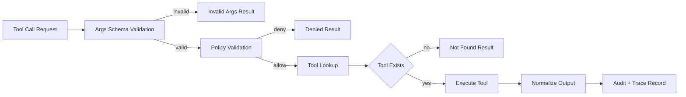
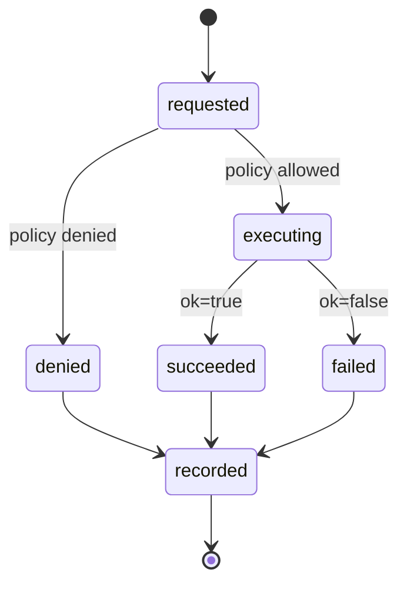

# Tool Runtime and Safety Model

## Scope

This document defines how tools are registered, authorized, executed, and
audited in HarnessLab.

## Execution Pipeline

Schema validation runs before the policy layer so that policy checks can
trust the shape of `call.args`. Unknown tools intentionally pass through
the schema gate and are denied by the policy layer instead, keeping the
"unknown tool" responsibility in exactly one place.

## Design Objectives

- Keep tool execution explicit and policy-gated
- Prevent accidental workspace escape
- Keep behavior deterministic enough for tests and replay
- Preserve a clear audit trail for every tool invocation

## Tool Runtime Components

### Tool Registry

The registry maps a tool name to an executable tool implementation.

Responsibilities:

- Registration (`name -> implementation`)
- Lookup and dispatch
- Standardized error behavior for unknown tools
- `validate_args(call) -> (bool, error)`: validate `call.args` against the
  registered tool's `args_schema`; unknown tools fall through (deferred to
  the policy layer) so the "unknown tool" responsibility lives in exactly
  one place
- Normalize any exception raised by a tool into `ToolResult(ok=False, error="crashed: ...")`
  so that the loop never observes raw exceptions

A registered tool must expose:

- `name`: stable identifier used for lookup
- `description`: short, human-readable purpose
- `args_schema`: JSON Schema describing accepted arguments
- `execute(call) -> ToolResult`: deterministic execution entry point

### Policy Layer

The policy runs before the tool executes.

Responsibilities:

- Validate whether the tool is allowed
- Validate tool arguments for safety boundaries
- Return a structured allow/deny decision with reason

Current checks:

- `read_file` and `write_file`: path must resolve inside workspace root
- `run_shell_safe`: command must contain no shell metacharacters
  (`& | ; < > \` $ ( ) \n \r`); after `shlex` parsing, `argv[0]` must not be
  on the denylist (`rm`, `sudo`, `curl`, `wget`, `dd`, `mkfs`, `mount`,
  `umount`, `chmod`, `chown`, `kill`, `killall`, `shutdown`, `reboot`,
  `scp`, `ssh`), and must appear in the allowlist
  (`ls`, `pwd`, `echo`, `cat` by default).

The denylist is consulted before the allowlist so that a destructive
command stays rejected even if it is mistakenly added to the allowlist.

### Tool Executor

The executor runs the selected tool and returns a normalized result object.

Required output shape:

- `ok`
- `output`
- optional `error`

## Safety Defaults

- Unknown tools are denied
- Out-of-workspace file access is denied
- Non-allowlisted shell commands are denied
- Tool output is bounded to a safe max length

## Current Sandboxing Level (MVP)

MVP uses process-level restrictions through policy checks and safe defaults.
It is intentionally simple:

- Controlled working directory
- Allowlisted shell commands plus a destructive-command denylist
- Configurable shell execution timeout (`RuntimeLimits.shell_timeout_seconds`)
- Configurable per-call output cap (`RuntimeLimits.output_bytes_cap`),
  applied uniformly to `read_file`, `write_file`, and `run_shell_safe`

## Recommended Hardening Path

1. Add explicit resource limits (CPU, memory, output bytes)
2. Add denylist for sensitive command patterns
3. Add command argument schema validation per tool
4. Add execution audit records with call hashes
5. Add isolated worker process per tool call
6. Add optional container-based sandbox in non-local environments

## Auditing and Observability

Each tool call emits exactly one of the following trace events:

- `tool_invalid_args` — schema validation failed; policy and tool were not run
- `tool_denied` — schema passed but policy denied; tool was not run
- `tool_executed` — schema passed, policy allowed, tool ran (ok=true/false)

`tool_executed` (and `tool_denied`) carry the following payload fields:

- `tool_call_id`: stable ID linking back to `ToolCall.id`
- `tool`: tool name
- `args`: invocation arguments
- `policy_decision`: `allow:<reason>` or `deny:<reason>`
- `started_at` / `ended_at`: ISO-8601 UTC timestamps (null when denied)
- `duration_ms`: execution latency (null when denied)
- `ok`: success boolean (denied events use a separate `tool_denied` event_type)
- `error`: failure reason (null on success)
- `output_size`: byte length of the full tool output
- `output_preview`: first N bytes of `ToolResult.output` (current preview cap: 512)
- `output_truncated`: whether `output_preview` is shorter than `output_size`

`tool_invalid_args` carries `tool_call_id`, `tool`, `args`, and `error`
(the schema violation message).

These records should be correlated by run/session IDs for replay and debugging.
All timestamps must come from the injected `ClockPort` and IDs from `IdPort`
so that replay runs can reproduce the exact same trace.

Diagram style and naming rules are defined in
`docs/architecture/diagram-conventions.md`.
