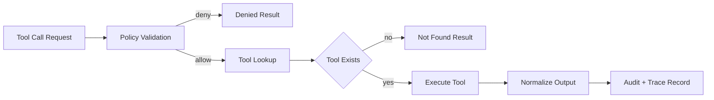
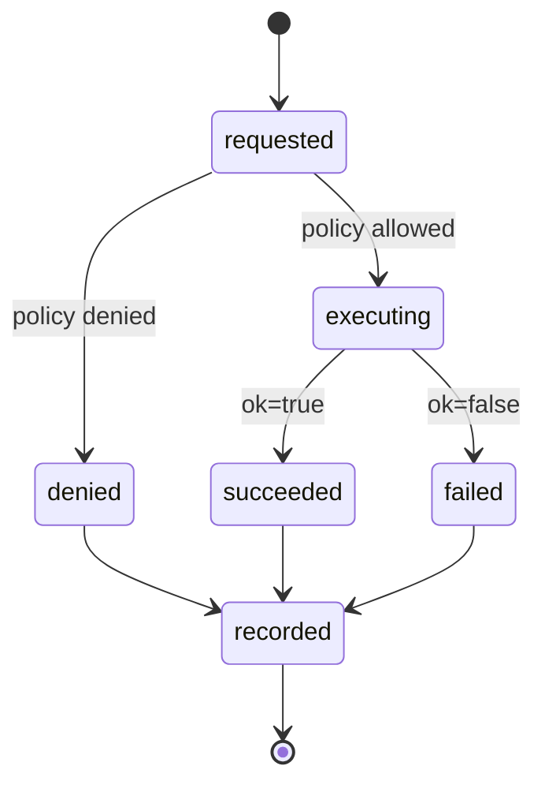

# Tool Runtime and Safety Model

## Scope

This document defines how tools are registered, authorized, executed, and
audited in HarnessLab.

## Execution Pipeline

## Design Objectives

- Keep tool execution explicit and policy-gated
- Prevent accidental workspace escape
- Keep behavior deterministic enough for tests and replay
- Preserve a clear audit trail for every tool invocation

## Tool Runtime Components

### Tool Registry

The registry maps a tool name to an executable tool implementation.

Responsibilities:

- Registration (`name -> implementation`)
- Lookup and dispatch
- Standardized error behavior for unknown tools

### Policy Layer

The policy runs before the tool executes.

Responsibilities:

- Validate whether the tool is allowed
- Validate tool arguments for safety boundaries
- Return a structured allow/deny decision with reason

Current checks:

- `read_file` and `write_file`: path must resolve inside workspace root
- `run_shell_safe`: first command token must be in allowlist

### Tool Executor

The executor runs the selected tool and returns a normalized result object.

Required output shape:

- `ok`
- `output`
- optional `error`

## Safety Defaults

- Unknown tools are denied
- Out-of-workspace file access is denied
- Non-allowlisted shell commands are denied
- Tool output is bounded to a safe max length

## Current Sandboxing Level (MVP)

MVP uses process-level restrictions through policy checks and safe defaults.
It is intentionally simple:

- Controlled working directory
- Allowlisted shell commands
- Basic timeout for shell execution

## Recommended Hardening Path

1. Add explicit resource limits (CPU, memory, output bytes)
2. Add denylist for sensitive command patterns
3. Add command argument schema validation per tool
4. Add execution audit records with call hashes
5. Add isolated worker process per tool call
6. Add optional container-based sandbox in non-local environments

## Auditing and Observability

Each tool call should produce:

- Tool identity and args
- Policy decision and reason
- Start/end timestamps
- Execution status
- Truncated output references

These records should be correlated by run/session IDs for replay and debugging.

Diagram style and naming rules are defined in
`docs/architecture/diagram-conventions.md`.
