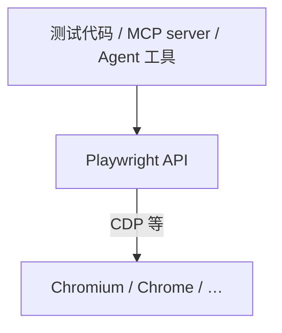

# 浏览器自动化

HarnessLab **不在 Python core 内置** Playwright 或 browser driver。需要真实浏览器（JS 渲染、登录、多步点击）时，操作员通过 **MCP Playwright server** 接入；HTTP 层研究仍优先使用内置 `web_search` / `fetch_url`。

**最后更新：** 2026-05-30

## 1. 项目立场

| 能力 | 实现方式 | 状态 |
| --- | --- | --- |
| 关键词搜索 | 内置 `web_search` | 已支持 |
| 静态 URL 抓取 | 内置 `fetch_url` + `html_to_markdown` | 已支持 |
| 完整浏览器自动化 | MCP `@playwright/mcp` | 操作员配置，见 [`mcp-servers.md`](mcp-servers.md) |
| Core 内嵌 Playwright driver | — | **刻意 defer**，见 [`roadmap.md`](../roadmap.md) |

**为何不内置 driver：**

- Playwright + Chromium 二进制体积大，跨平台打包与 CI 成本高。
- 浏览器可访问任意 URL、下载文件、持有 cookie，policy / SSRF / 资源清理边界比 `fetch_url` 复杂一个数量级。
- MCP 子进程隔离崩溃面；HarnessLab 不重复拥有「沙箱浏览器运行时」。

**何时 revisit 内置 driver：** Phase 5.4 MCP adapter 已落地；若 Playwright MCP 在真实任务中明显不足，再评估 in-process 方案。

## 2. 何时用什么（决策树）

```text
需要发现信息？
  └─ 是 → web_search（ddgs / tavily / brave / …）

已有具体 URL，只要正文？
  └─ 是 → fetch_url → html_to_markdown
           └─ 页面是 SPA / 强 JS / 需登录 / 要点击操作？
                └─ 是 → MCP Playwright（browser_navigate / snapshot / click …）
                └─ 否 → 继续 HTTP 链路即可
```

| 场景 | 推荐工具 |
| --- | --- |
| API 文档、静态博客 | `fetch_url` |
| 搜索引擎结果页（避免直接 fetch Google） | `web_search` → 选文章 URL → `fetch_url` |
| React/Vue SPA 空壳 HTML | MCP browser |
| 需已登录 session | MCP + CDP attach 已有 Chrome，或隔离 profile 内手动登录一次 |
| 填表、购物车、多步 wizard | MCP browser |
| HarnessLab Web UI 回归测试 | `webui/e2e/` Playwright（**不是** agent 工具） |

详见 [`web-research-providers.md`](web-research-providers.md) 中的 HarnessLab 工具表与 mainland 代理说明。

## 3. 快速开始（MCP Playwright）

1. 阅读 [`mcp-servers.md`](mcp-servers.md) §4。
2. 在 `~/.config/harnesslab/config.json` 配置 `mcp_servers` 与 `mcp_allowed_tools`。
3. `npx playwright install chromium`
4. 重启 `./hl-serve` 或 `harnesslab serve`。
5. 在 Web UI **Settings** 确认 MCP health 为 ok。
6. 在对话中让 agent 使用已 allowlist 的 `mcp_playwright_*` 工具。

**安全提醒：**

- MCP 浏览器不受 `fetch_url` SSRF 规则约束；allowlist 只控制**工具名**，不控制导航 URL。
- 勿在 agent 可触达的环境 attach 含敏感 cookie 的生产 Chrome profile，除非你完全信任任务与 policy。
- `@playwright/mcp` 完整 CLI 与工具列表以 [官方仓库](https://github.com/microsoft/playwright-mcp) 为准，本文不重复维护参数表。

## 4. Playwright 概念（极简）

Playwright 通过 **Chrome DevTools Protocol (CDP)** 等协议控制**真实**浏览器引擎，而非简单 mock HTTP。



| 概念 | 含义 |
| --- | --- |
| Browser | 浏览器进程 |
| BrowserContext | 隔离的 cookie / storage 上下文 |
| Page | 单个标签页 |
| Locator | 带自动等待的元素定位 |

### 两种 Playwright 用途（勿混淆）

| | Agent 浏览器（MCP） | Web UI E2E（`webui/e2e/`） |
| --- | --- | --- |
| 目的 | Agent 研究 / 自动化网页 | 验证 TS 前端 + Python serve |
| 驱动方 | LLM 通过 tool call | 固定测试脚本 |
| 后端 | 任意公网或 attach 的 Chrome | 本地 `harnesslab serve --model simple` |
| 是否 mock 网络 | 否 | 否（真实 localhost HTTP） |
| 文档 | 本文 + `mcp-servers.md` | [`webui/README.md`](../../webui/README.md)、[`frontend-ts-migration.md`](../architecture/frontend-ts-migration.md) |

## 5. 与其他 harness 对比（非规范）

仅供选型参考，**不构成** HarnessLab 实现承诺。

### OpenClaw

- **内置** `browser` 插件（Gateway 内嵌），非 MCP 外挂。
- 架构：loopback 控制服务 → CDP 连 Chromium → Playwright 层做 snapshot / act。
- **Profile 模型：**
  - `openclaw` — 隔离的 agent 专用浏览器（默认）。
  - `user` — 通过 Chrome DevTools MCP attach 已登录 Chrome。
- **页面表示：** 无障碍树 + 短 ref（`e1`, `e2`），agent 用 ref 点击，减少 CSS selector 与 vision 依赖。
- 文档：[OpenClaw Browser](https://docs.openclaw.ai/tools/browser)、[Web tools](https://docs.openclaw.ai/tools/web)。

### HarnessLab

- MCP adapter + 操作员自配 `@playwright/mcp`。
- 学习曲线：需理解 allowlist 与子进程；优势：core 轻量、进程隔离、与 eval/replay 解耦。
- 无 first-class `browser` 内置工具名；能力完全取决于所接 MCP server 的工具面。

| 维度 | OpenClaw | HarnessLab |
| --- | --- | --- |
| 集成 | Gateway 内置 | MCP 外挂 |
| 开箱浏览器 | 是（装 Playwright 即可） | 需配置 MCP |
| 隔离 profile | 一等公民 | 由 MCP / Playwright 参数决定 |
| 与 HTTP fetch 关系 | `web_fetch` + `browser` 并列 | `fetch_url` + MCP browser |

## 6. 相关文档

- [`mcp-servers.md`](mcp-servers.md) — 配置与故障排查
- [`web-research-providers.md`](web-research-providers.md) — 搜索/抓取后端与定价
- [`architecture/tool-runtime.md`](../architecture/tool-runtime.md) — Policy 与 MCP 注册
- [`research/harness-landscape.md`](../research/harness-landscape.md) — 能力地图
- [`roadmap.md`](../roadmap.md) — defer in-process browser 的理由
