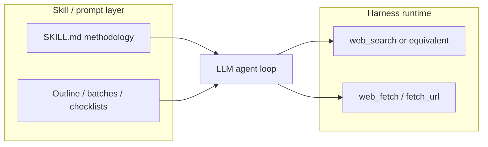

# Deep research: landscape, comparisons, and HarnessLab design

Last updated: **2026-05-27**.

This document summarizes how **deep research** is implemented across DeerFlow,
OpenCode, OpenClaw, Claude Code, and HarnessLab. It separates **skill
methodology** (prompts and workflow) from **tool/runtime** (who actually
searches the web), and records design choices for stable research with
**minimal dependence on paid search APIs**.

Related (tree `c7625595e226daf7ebb715cec82b4d08931ea586`):

- [Web research providers](https://github.com/zhumengzhu/HarnessLab/blob/c7625595e226daf7ebb715cec82b4d08931ea586/docs/guides/web-research-providers.md) — provider pricing and proxy notes
- [Deep research skill](https://github.com/zhumengzhu/HarnessLab/blob/c7625595e226daf7ebb715cec82b4d08931ea586/skills/deep-research.md) — HarnessLab skill workflow
- [Tool runtime](https://github.com/zhumengzhu/HarnessLab/blob/2273f9c3ff038b4f1bc5499832d5d8951ba3430b) — `web_search` / `fetch_url` contracts

---

## Core insight: skills do not search the web

Every project in this comparison uses the same pattern:



| Layer | Responsibility | Examples |
| --- | --- | --- |
| **Skill** | When to research, phases, quality bar, output shape | DeerFlow `deep-research`, OpenCode `research-deep`, HarnessLab `/deep-research` |
| **Tool** | HTTP/API calls that return URLs and page text | `web_search`, `websearch`, `WebSearch`, Brave API, Exa MCP |
| **Orchestration** | Parallelism, resume, structured artifacts | OpenCode Task + `outline.yaml`; HarnessLab `spawn_sub_agent` (optional) |

If research “just works” without configuring DuckDuckGo or Tavily, the platform
is usually **subsidizing or bundling** a search backend (Exa MCP, Anthropic
server tools), not magic inside the skill file.

---

## Exa vs Tavily (not the same product)

**Exa and Tavily are separate companies and APIs.** Both sell “search for AI
agents,” but they are competitors in the same category, not one rebranding of
the other.

| | **Exa** | **Tavily** |
| --- | --- | --- |
| Site | [exa.ai](https://exa.ai/) | [tavily.com](https://tavily.com/) |
| API base | `api.exa.ai`, MCP at `mcp.exa.ai` | `api.tavily.com` |
| Typical integration | OpenCode built-in `websearch`, DeerFlow optional plugin, Firecrawl-adjacent crawl/search | HarnessLab `web_search` backend, DeerFlow wizard option |
| OpenCode default path | Hosted MCP, often **no user API key** in docs | Not OpenCode’s built-in default |
| Free tier (verify on site) | Shared MCP limits; optional `EXA_API_KEY` | 1,000 credits/month documented |

Easy to confuse them because:

- Both appear in “agent search API” comparisons
- Both are used behind OpenCode / DeerFlow / HarnessLab without the user writing scrape code
- Marketing language overlaps (“real-time web for agents”)

**HarnessLab today:** supports **Tavily** (and Brave, SerpAPI) as explicit
`web_search` backends; does **not** yet ship an **Exa** backend (OpenCode’s
default path).

---

## HarnessLab `web_search`: one backend, no automatic fallback

**Current behavior (as of 2026-05-27):**

- Exactly **one** backend is active per process, chosen by:
  1. `WEB_SEARCH_BACKEND` env (if set), else
  2. `tools.web_search.backend` in `~/.config/harnesslab/config.json`, else
  3. **`duckduckgo`** (default)
- There is **no** “try DuckDuckGo first, then fall back to Tavily if configured.”

| Your config | What runs on each `web_search` call |
| --- | --- |
| Default (no `tools.web_search`) | **Only** DuckDuckGo HTML scrape |
| `"backend": "tavily"` + `TAVILY_API_KEY` | **Only** Tavily API |
| Env has `TAVILY_API_KEY` but backend still `duckduckgo` | **Only** DuckDuckGo (key unused for search) |

Implementation: `WebSearchTool._search()` branches on `self._backend` — see
`src/harnesslab/tools/research_tools.py`. API keys are resolved for the
**configured** backend only (`resolve_web_search_api_key` in the same module).

**Implication for deep research:** if you set Tavily in config, you should set
`"backend": "tavily"` explicitly. Having a Tavily key in env alone does not
change runtime behavior.

**Planned improvement (not implemented yet):** optional
`tools.web_search.fallback_backend` (e.g. `duckduckgo` → `tavily`) for
cost-aware deployments. See [Recommended HarnessLab direction](#recommended-harnesslab-direction) below.

---

## Project-by-project comparison

### DeerFlow — `skills/public/deep-research`

**Location:** single file `SKILL.md` (methodology only).

**Trigger:** any question needing web research; “use instead of WebSearch for
superficial single queries.”

**Methodology (4 phases):**

1. Broad exploration — map subtopics
2. Deep dive — targeted queries + **`web_fetch` full pages**
3. Diversity — facts, cases, experts, trends, comparisons, criticisms
4. Synthesis checklist — do not generate until checklist passes

**Tools (harness config, not in skill):**

| Tool | Default in `config.example.yaml` | API key |
| --- | --- | --- |
| `web_search` | DuckDuckGo via **`ddgs` Python library** | None |
| `web_fetch` | **Jina Reader** (`r.jina.ai`) | Optional `JINA_API_KEY` |

**Design note:** DeerFlow separates **free search** (DDG library) from **better
fetch** (Jina). Skill text says `web_fetch`; stability depends on swapping
harness plugins (Tavily, Exa, Firecrawl) without changing the skill.

**Also relevant:** `github-deep-research` skill — **GitHub API scripts first**,
then web search; good pattern for reducing search API dependence.

---

### OpenCode — `research` + `research-deep` skill chain

**Location:** `~/.config/opencode/skills/` (user-installed); orchestration skills
plus `agents/web-search.md` subagent.

**Pipeline:**

```
/research          → outline.yaml + fields.yaml (items + schema)
/research-add-*    → extend outline
/research-deep     → parallel web-search-agent per batch → JSON per item
/research-report   → final report
```

**`research-deep` mechanics:**

- Finds `*/outline.yaml`, skips completed JSON in `output_dir` (resume)
- Batches parallel **Task** subagents (`web-search-agent`)
- Hard-coded prompt template + `validate_json.py` gate
- `allowed-tools`: Bash, Read, Write, Glob, **WebSearch**, Task

**Search/fetch (runtime, not skill):**

| Tool | Implementation |
| --- | --- |
| `websearch` | **Exa** via MCP (`https://mcp.exa.ai/mcp`, tool `web_search_exa`) |
| `webfetch` | HTTP fetch for known URLs |

Enable: `OPENCODE_ENABLE_EXA=1` or OpenCode provider. Docs: [OpenCode Tools](https://opencode.ai/docs/tools/).

**Subagent `web-search.md`:** query variants, module routing (GitHub / academic /
Chinese tech / Stack Overflow), mandatory sources section — **methodology in
agent prompt**, search still Exa-backed.

**Why it feels “zero config”:** OpenCode bundles Exa MCP; the skill never mentions
DuckDuckGo or Tavily.

---

### OpenClaw — `web_search` + `web_fetch`

Docs: [Web tools](https://docs.claw.so/engine/tools/web/).

| Tool | Default | Notes |
| --- | --- | --- |
| `web_search` | **Brave Search API** | Optional Perplexity Sonar |
| `web_fetch` | Readability extraction | Optional **Firecrawl** fallback for JS/bots |

Skills such as ClawHub “deep research” are prompt methodology; runtime expects
**API keys** (Brave) unless switched to Perplexity.

---

### Claude Code — `WebSearch` + `WebFetch`

| Tool | Implementation |
| --- | --- |
| `WebSearch` | **Anthropic server-side** tool (`web_search_*` on Messages API) |
| `WebFetch` | Client fetch + extraction for a given URL |

Not available on all third-party endpoints (e.g. hidden on some Bedrock/Vertex
setups). Pricing on API: see [Anthropic web search tool](https://platform.claude.com/docs/en/agents-and-tools/tool-use/web-search-tool).

Skill files (`SkillTool`) orchestrate; search is **subscription/API-backed**, not DDG scrape.

---

### HarnessLab — `/deep-research` skill

**Location:** [skills/deep-research.md](https://github.com/zhumengzhu/HarnessLab/blob/c7625595e226daf7ebb715cec82b4d08931ea586/skills/deep-research.md).

**Invoke:** `/deep-research <topic>` pins skill and runs agent loop (Cursor-style).

**Workflow:** clarify → plan sub-questions → `web_search` → `fetch_url` +
`html_to_markdown` → synthesize → `write_file` under `.harnesslab/research/`.

**Tools today:**

| Step | Tool | Default implementation |
| --- | --- | --- |
| Discover | `web_search` | DuckDuckGo HTML scrape (fragile; anti-bot 202) |
| Fetch | `fetch_url` | Raw HTTPS GET (no JS) |
| Parse | `html_to_markdown` | Local parser |
| Optional parallel | `spawn_sub_agent` | Requires `loop.multi_agent.enabled` |

**Gap vs DeerFlow / OpenCode:**

- No **Jina** or Readability fetch provider yet
- No **ddgs** library backend (DeerFlow-style DDG)
- No outline JSON + validate + resume pipeline (OpenCode-style)
- Single backend only (no DDG→Tavily fallback)

---

## Comparison matrix

| | **Skill depth** | **Search default** | **Fetch default** | **Parallel research** | **Structured resume** |
| --- | --- | --- | --- | --- | --- |
| DeerFlow `deep-research` | 4-phase checklist | DDG (`ddgs`) | Jina Reader | Multi-agent framework | Framework-dependent |
| OpenCode `research-deep` | Outline + JSON schema | Exa MCP | webfetch | Task batches | Skip existing JSON |
| OpenClaw | External skills | Brave API | Readability + Firecrawl | Browser + subagents | Varies |
| Claude Code | SkillTool + plans | Anthropic server search | WebFetch | Subagents | Session-based |
| HarnessLab `/deep-research` | Plan + report template | DDG scrape | Raw fetch | `spawn_sub_agent` (opt) | Session `continue` |

---

## Recommended HarnessLab direction

Goal: **stable deep research without requiring paid search APIs by default**, with
optional upgrades.

### Principles

1. **Skill = methodology + artifacts** (outline, findings files, report path).
2. **Tools = swappable backends** (search + fetch configured independently).
3. **Degrade gracefully:** search failure → direct URL strategies + better fetch,
   not 20× empty `web_search` loops.
4. **Optional paid APIs** (Tavily, Brave, Exa) are **explicit backends**, not hidden subsidies.

### Proposed tiers

| Tier | Search | Fetch | API key required |
| --- | --- | --- | --- |
| **P0 default** | `ddgs` (DDG library) | `fetch_url` + optional **Jina** provider | No |
| **P0 fallback** | (future) `duckduckgo` → `tavily` if primary empty/errors | Jina on JS-heavy URLs | Only if fallback is Tavily |
| **User explicit** | `tavily` / `brave` / `serpapi` / **`exa`** | unchanged | Tavily/Brave/SerpAPI yes; Exa optional |
| ~~**Future**~~ | ~~`exa` MCP/API backend~~ | Firecrawl-style optional | **Shipped:** `backend: exa` |

### Skill enhancements (aligned with DeerFlow + OpenCode)

- Persist **`outline.md`** (sub-questions) before searching
- DeerFlow **4-phase checklist** and **synthesis gate** in skill text
- OpenCode-style **per–sub-question artifacts** (e.g. `findings/{slug}.md`) for resume
- **`spawn_sub_agent`** one child per sub-question when multi-agent enabled
- GitHub / arXiv **direct API** skill variant (like DeerFlow `github-deep-research`)

### Configuration examples

**Tavily only (no DuckDuckGo):**

```json
{
  "tools": {
    "web_search": {
      "backend": "tavily",
      "max_results": 8,
      "api_key_env": "TAVILY_API_KEY"
    }
  }
}
```

**Free-first (today — DDG scrape until P0 lands):**

```json
{
  "tools": {
    "web_search": {
      "backend": "duckduckgo",
      "max_results": 5
    }
  }
}
```

Set proxy in `~/.config/harnesslab/env`; run `uv run harnesslab check network`.

---

## FAQ

### If I set `TAVILY_API_KEY` in env but leave backend as `duckduckgo`, does Tavily run as fallback?

**No.** Only DuckDuckGo runs. Change `"backend": "tavily"` (or `WEB_SEARCH_BACKEND=tavily`).

### Is Exa the same as Tavily?

**No.** Different vendors ([exa.ai](https://exa.ai/) vs [tavily.com](https://tavily.com/)).
OpenCode defaults to Exa MCP; HarnessLab integrates Tavily as an optional backend.

### Why does OpenCode deep research work without me configuring search?

The **`websearch` tool** calls Exa’s hosted MCP when `OPENCODE_ENABLE_EXA=1` (or
OpenCode provider). The skill only orchestrates agents that call that tool.

### What should HarnessLab users do today for reliable `/deep-research`?

1. Set `HTTPS_PROXY` in `~/.config/harnesslab/env` if in mainland China.
2. Prefer `"backend": "tavily"` + key for reliable search **or** accept DDG fragility.
3. Use **`fetch_url` → `html_to_markdown`** on article URLs; avoid Google search pages.
4. Increase `serve.max_steps` and use **`continue`** if the run hits step budget.

See [Web research providers](https://github.com/zhumengzhu/HarnessLab/blob/c7625595e226daf7ebb715cec82b4d08931ea586/docs/guides/web-research-providers.md) for provider links and pricing snapshot.
