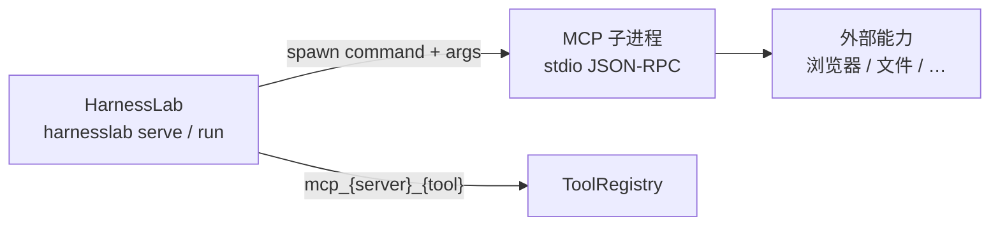

# MCP 服务器（操作员指南）

HarnessLab 通过 **stdio 子进程** 连接 [Model Context Protocol (MCP)](https://modelcontextprotocol.io/) 服务器，将其工具目录映射为原生 `ToolPort`，与内置 `web_search`、`fetch_url` 等工具走同一套 **PolicyPort → 执行 → trace** 链路。

**最后更新：** 2026-05-30

## 1. 这是什么

| 概念 | 说明 |
| --- | --- |
| MCP server | 在本机以子进程运行的 MCP 实现（如 `@playwright/mcp`、filesystem server） |
| 与「云端服务」 | **不是**远程 MCP 云服务；HarnessLab 用 `subprocess` 拉起你配置的 `command` |
| 与 Cursor / Claude Desktop | 配置形态类似（`command` + `args`），但写在 `~/.config/harnesslab/config.json`，由 runtime 在启动时注册 |
| 与 Agent 浏览器 | Playwright MCP 控浏览器；HarnessLab E2E（`webui/e2e/`）是另一套 Playwright 用途，见 [`browser-automation.md`](browser-automation.md) |



实现入口：`src/harnesslab/tools/mcp_adapter.py`、`mcp_client.py`（lazy import，无 MCP SDK 硬依赖）。

## 2. 配置

### 2.1 配置文件

路径：`~/.config/harnesslab/config.json`（operator config）。

相关字段：

| 字段 | 位置 | 说明 |
| --- | --- | --- |
| `tools.mcp_servers[]` | 数组 | 每个 MCP 服务器一条 |
| `tools.mcp_allowed_tools[]` | 字符串数组 | **必须显式 allowlist**；未列出的 `mcp_*` 工具会被 policy 拒绝 |

每条 `mcp_servers` 条目：

| 字段 | 必填 | 说明 |
| --- | --- | --- |
| `name` | 是 | 服务器别名，用于工具名前缀 |
| `command` | 是 | 可执行文件（如 `npx`、`python3`） |
| `args` | 否 | 参数数组 |
| `env_names` | 否 | 要从**当前进程环境**转发给子进程的环境变量名列表 |
| `policy_profile` | 否 | 默认 `strict`（预留；MCP 工具仍以 allowlist 为准） |

### 2.2 工具命名

注册后的工具名为：

```text
mcp_{name}_{原始工具名}
```

例如 `name: "playwright"` + MCP 工具 `browser_navigate` → `mcp_playwright_browser_navigate`。

**注意：** 实际名称以 MCP server 启动后 `tools/list` 为准；配置 allowlist 前请先确认 health 或 trace 中的注册名。

### 2.3 最小示例（测试用 echo server）

仓库内契约测试使用 `tests/fixtures/mcp_echo_server.py`：

```json
{
  "tools": {
    "mcp_servers": [
      {
        "name": "echo",
        "command": "python3",
        "args": ["/path/to/HarnessLab/tests/fixtures/mcp_echo_server.py"],
        "policy_profile": "strict"
      }
    ],
    "mcp_allowed_tools": [
      "mcp_echo_echo"
    ]
  }
}
```

将路径改为你本机 clone 的绝对路径。启动后 agent 可调用 `mcp_echo_echo`，参数 `{"message": "hello"}`。

## 3. 生命周期

1. **`build_runtime` / `harnesslab serve` 启动** — 读取 operator config，调用 `register_mcp_servers`。
2. **连接** — 对每个条目 `Popen([command, *args])`，stdio 上完成 MCP `initialize`。
3. **`tools/list`** — 将每个工具包装为 `McpToolAdapter` 并 `registry.register`。
4. **Policy** — 仅 `tools.mcp_allowed_tools` 中的 `mcp_*` 名称可通过 `DefaultPolicy`。
5. **Health** — 返回 `{name: {status, tools, error}}`；Web UI **Settings** 面板展示 MCP 健康状态（需配置 `mcp_servers`）。

未配置 MCP 时，runtime **不**在 import 时依赖 MCP SDK；eval / replay 路径不受影响。

## 4. 示例：Playwright MCP（`@playwright/mcp`）

浏览器自动化推荐通过 [Microsoft Playwright MCP](https://github.com/microsoft/playwright-mcp) 接入，而非在 Python core 内置 driver（见 [`browser-automation.md`](browser-automation.md)）。

### 4.1 前置依赖

```bash
# 安装浏览器二进制（一次性）
npx playwright install chromium
```

需本机已安装 Node.js / `npx`（与 Web UI 的 bun 无关）。

### 4.2 配置片段

```json
{
  "tools": {
    "mcp_servers": [
      {
        "name": "playwright",
        "command": "npx",
        "args": ["-y", "@playwright/mcp@latest", "--headless"],
        "env_names": [],
        "policy_profile": "strict"
      }
    ],
    "mcp_allowed_tools": [
      "mcp_playwright_browser_navigate",
      "mcp_playwright_browser_snapshot",
      "mcp_playwright_browser_click"
    ]
  }
}
```

**allowlist 说明：** 上列为常见工具名示例；`@playwright/mcp` 版本升级可能增减工具。启动后查看 Settings → MCP health 中的注册数量，或查阅 [Playwright MCP 文档](https://playwright.dev/docs/getting-started-mcp) 中的工具列表，再填入 `mcp_allowed_tools`。

### 4.3 Headed / Headless

| 需求 | `args` 建议 |
| --- | --- |
| 无界面（CI、服务器） | 加 `"--headless"` |
| 本机调试、可见窗口 | 省略 `--headless`（Playwright MCP 默认 headed） |

### 4.4 连接已有 Chrome（高级）

若需 attach 到已打开的 Chrome（保留登录态），在 `args` 中增加 CDP 端点（以 Playwright MCP 当前 CLI 为准）：

```json
"args": [
  "-y", "@playwright/mcp@latest",
  "--cdp-endpoint", "http://127.0.0.1:9222"
]
```

Chrome 需以 remote debugging 启动，例如：

```bash
/Applications/Google\ Chrome.app/Contents/MacOS/Google\ Chrome --remote-debugging-port=9222
```

安全提示：attach 真实浏览器 profile 风险高于隔离 headless Chromium；仅在有意识地允许 agent 使用该会话时使用。

### 4.5 重启

修改 `config.json` 后重启 serve / run，例如：

```bash
./hl-serve restart
# 或
uv run harnesslab serve --workspace-root .
```

## 5. 示例：官方 filesystem MCP

只读文件访问可选用 `@modelcontextprotocol/server-filesystem`（需自行限制目录与 allowlist）：

```json
{
  "tools": {
    "mcp_servers": [
      {
        "name": "fs",
        "command": "npx",
        "args": [
          "-y",
          "@modelcontextprotocol/server-filesystem",
          "/path/to/allowed/dir"
        ]
      }
    ],
    "mcp_allowed_tools": [
      "mcp_fs_read_file"
    ]
  }
}
```

具体工具名以 `tools/list` 为准；务必只 allowlist 你需要的工具。

## 6. 故障排查

| 现象 | 可能原因 | 处理 |
| --- | --- | --- |
| Settings 中 MCP status `error` | `command` 找不到、MCP 进程崩溃 | 在终端手动运行相同 `command` + `args` 看 stderr |
| `mcp tool '…' not in operator allowlist` | 未加入 `mcp_allowed_tools` | 补全精确工具名 |
| Playwright 工具 501 / 浏览器缺失 | 未 `playwright install` | 运行 `npx playwright install chromium` |
| 配置了但不注册 | `name` 或 `command` 为空 | 检查 JSON 字段 |
| 子进程无 env | 密钥在 shell 但未导出 | 把变量名加入 `env_names`，并写入 `~/.config/harnesslab/env` |

MCP 客户端实现：`src/harnesslab/tools/mcp_client.py`（单行 JSON-RPC over stdio）。

## 7. 当前限制

- **仅 stdio**：通过 `command` + `args` 启动；**尚未**实现 HTTP/SSE MCP 客户端（roadmap 中 `url` 字段为预留描述）。
- **无内置 in-process 浏览器**：浏览器能力依赖 MCP 或未来 revisit；见 [`roadmap.md`](../roadmap.md) deferred 条目。
- **默认 deny**：与内置工具不同，每个 MCP 工具必须 operator 显式 allow。
- **进程隔离**：MCP 子进程崩溃不会拖垮 Python loop，但需重启 runtime 或依赖下次 tool call 重连（当前为启动时连接）。

## 8. 相关文档

- [`architecture/tool-runtime.md`](../architecture/tool-runtime.md) — MCP 在工具流水线中的位置
- [`browser-automation.md`](browser-automation.md) — 何时用 fetch vs 浏览器
- [`web-research-providers.md`](web-research-providers.md) — 搜索与抓取后端
- [`roadmap.md`](../roadmap.md) — Phase 5.4 MCP adapter
