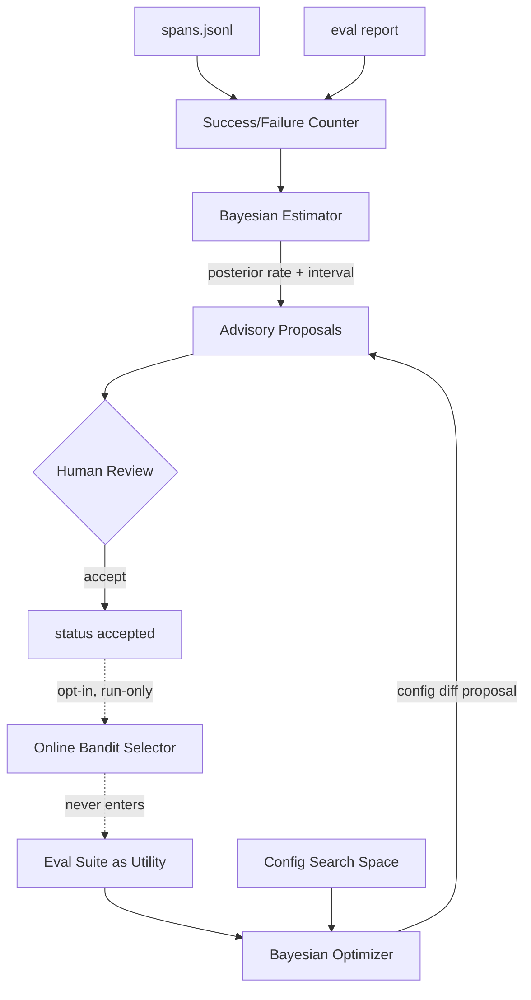

# Bayesian Self-Evolution — Design Proposal

Status: **partially implemented** (2026-06). Layer A (Beta-Binomial failure
estimation), Layer B1 (deterministic GP config tuning), and Layer B2
(LLM-generated prompt candidates scored by an isolated live-model benchmark)
are **implemented**; Layer C (online bandit selection) remains a design
proposal. This document extends the advisory Improvement Loop
([`docs/architecture/overview.md`](../architecture/overview.md) §"Improvement
Loop") from a frequency-count heuristic toward a layered Bayesian design.
The §7.1(b) rule amendment required for B2 landed in AGENTS.md "Proposal
Handling" §5.

## 1. Motivation

The current "self-evolution" surface is `harnesslab propose`: it fingerprints
failures, clusters them, and emits a proposal once a cluster crosses a raw
count threshold:

```text
build_clusters(..., min_occurrences=2)  →  emit Proposal if occurrences >= 2
```

This is a **count threshold**, not a statistical estimate. It has no
denominator (failures are counted, successes are discarded), no notion of
rate, no uncertainty quantification, and no time decay. In the small-sample
regime it actually operates in (`occurrences = 2, 3`), a single environmental
blip can cross the bar, and a genuinely high-rate failure on a rarely-invoked
tool can stay invisible.

The goal of this proposal is to replace the count heuristic with a principled
**Bayesian estimation** layer, and to add an optional **Bayesian optimization**
layer that can *search* for better agent configurations against the existing
deterministic `eval` suite — without breaking the determinism and
advisory-only contracts that define the project.

## 2. Literature & Prior Art

Mapped onto the taxonomy of *A Survey of Self-Evolving Agents*
([arXiv:2507.21046](https://arxiv.org/abs/2507.21046), TMLR 2026), Bayesian
methods appear at three distinct points of the "how to evolve" axis:

| Class | Representative work | Mechanism | "when" axis |
| --- | --- | --- | --- |
| ① Bayesian estimation / calibration | BayesAgent (vPGM); internal-confidence rewards | Posterior over failure rate / uncertainty for ranking and calibration | inter-test-time, offline |
| ② Bayesian optimization (search) | **DSPy MIPROv2**; OPRO ([arXiv:2309.03409](https://arxiv.org/html/2309.03409)) | Treat agent config as a search space; BO (TPE/GP) over an eval utility | inter-test-time, offline |
| ③ Bayesian online selection | **PDO** ([arXiv:2510.13907](https://arxiv.org/abs/2510.13907), [meta-llama/prompt-ops](https://github.com/meta-llama/prompt-ops)); BARL ([arXiv:2505.20561](https://arxiv.org/html/2505.20561v2)) | Double Thompson Sampling / dueling bandit; Bayes-adaptive RL | intra/inter, online |

Key adopted references:

- **DSPy MIPROv2** searches the instruction + few-shot demonstration space
  with Bayesian optimization, scored against a held-out eval set. This is the
  closest production-grade analogue to what HarnessLab can do with its
  `PromptComposer` blocks and `eval` suite.
- **Prompt Duel Optimizer (PDO)** casts prompt selection as a dueling-bandit
  problem and uses Double Thompson Sampling under a fixed comparison budget —
  the best engineering reference for the optional online layer.
- The survey repeatedly stresses that the **utility/reward function**
  `U(Π, T)` is the make-or-break design choice; mis-specified rewards let an
  agent "efficiently evolve toward the wrong objective".

## 3. The Enabling Insight: HarnessLab Already Has a Deterministic Utility

Most agent projects stall on reward definition. HarnessLab does not need to
invent one: the `eval` task suite plus `eval/baseline.json` already provide a
deterministic, version-pinned utility.

```text
U(Π, T)  :=  eval.runner over task suite  →  TaskResult metrics
            compared against Baseline via eval.baseline.compare(...)
```

`eval.baseline.compare` already encodes "did this get worse" (task now
failing, `tool_failures` up, `invalid_args` up). This is the lever that lets
us run Bayesian optimization (Layer B) without leaving the deterministic
replay/eval guarantees.

## 4. Proposed Architecture: Three Layers



### Layer A — Bayesian Estimation (required, foundation) — **IMPLEMENTED (2026-06)**

> Shipped in `src/harnesslab/improve/scoring.py` + `cluster.py`. Proposals now
> carry `trials`, `posterior_failure_rate`, `credible_interval`, and
> `priority` (lower 90% credible bound). The denominator counts total tool
> invocations (successes + failures). Closed-form, dependency-free,
> deterministic. See `tests/test_improve_scoring.py`.


- **what** = context/tools · **when** = inter-test-time · **how** =
  Beta-Binomial posterior.
- Replace the count threshold in `improve/cluster.py` with a per-fingerprint
  failure-rate posterior. Use a hierarchical / empirical-Bayes prior derived
  from the global base rate so sparse clusters shrink toward the mean instead
  of over-firing.
- New `Proposal` fields: `posterior_failure_rate`, `credible_interval`,
  `priority`. Ranking moves from "most occurrences" to "highest posterior
  rate" / "highest P(rate > threshold)".
- **Determinism:** the closed-form Beta-Binomial posterior is a pure function
  of the input counts. It does **not** break the eval/replay contract.

### Layer B — Bayesian Optimization (core "evolution", mirrors MIPROv2)

> **Implementation finding (2026-06).** The deterministic eval models
> (`SimpleModel` / `ReplayModel`) do **not** read the composed prompt or
> sampling params — they parse `user_input` directly. So the "eval suite as
> utility" lever only scores knobs the deterministic loop reacts to:
> `RuntimeLimits`, `shell_profile`, and budget. Optimizing prompt **text** or
> temperature against the deterministic eval would be optimizing against a
> constant. Prompt/sampling optimization therefore requires a *live-model*
> benchmark (non-deterministic, isolated from eval/replay) and is deferred to
> B2 alongside LLM candidate generation. **B1 below was re-scoped to the
> deterministically-scorable knob space accordingly.**

- **what** = context (`PromptComposer` blocks) + policy/tool config · **when**
  = inter-test-time, offline · **how** = sequential BO (TPE/GP).
- Use the `eval` suite as `U`. Run sequential Bayesian optimization over
  offline eval scores to find a better configuration, then emit a **config
  diff proposal**. A human accepts it under the standard gate.
- **Determinism:** with a fixed eval suite and a fixed RNG seed, the BO trace
  is reproducible; the output is still an advisory proposal.

The search space splits into two sub-spaces with different industry-standard
candidate-generation methods. We adopt them in two sub-phases:

**B1 — deterministically-scorable knobs (no LLM)** — **IMPLEMENTED (2026-06)**.
The `RuntimeLimits` fields (compaction thresholds, context window, output cap)
plus `shell_profile` — the knobs the deterministic eval actually reacts to.
This is a finite, low-dimensional space where deterministic Bayesian
optimization is exactly the right tool, and it stays inside every binding
rule: deterministic, no network/credential dependency, no rule amendment.

> Shipped in `src/harnesslab/tune/` + `harnesslab tune`. A dependency-free,
> RNG-free Gaussian-process surrogate (RBF kernel, hand-rolled Cholesky) with
> Expected-Improvement acquisition searches the knob grid; the deterministic
> `eval` suite is the utility (weighted cost: failed tasks dominate, then tool
> failures / invalid args / denials, with a tiny tool-call regularizer). The
> tuner emits an advisory `config_tuning` proposal (default-vs-best diff); it
> is never applied automatically. See `tests/test_tune_*.py`.

Note: temperature / top-p / prompt-block *text* are **not** in B1 because the
deterministic eval cannot score them (see the finding above); they move to B2.

**B2 — free-form instruction text (controlled LLM, do second).** **IMPLEMENTED
(2026-06).** Rewriting the *wording* of the system prompt is a combinatorially
infinite semantic space; templates/grids hit a hard ceiling, and the field is
near-unanimous that an LLM must *generate* the candidates (OPRO, MIPROv2
proposer, EvoPrompt, GEPA, TextGrad, PDO mutation). B2 required the §7.1(b)
rule amendment (now landed in AGENTS.md "Proposal Handling" §5).

Implementation lives in `src/harnesslab/tune/prompt/`:

- `candidate.py` — `PromptCandidate` (the whole system prompt for one run) +
  `freeze_candidates` / `load_candidates`; `StaticCandidateGenerator` and
  `ModelCandidateGenerator` (LLM via an injectable `TextGenerator`).
  `make_model_text_generator` wraps any `ModelPort` as a one-shot text
  generator (stages the meta-prompt as a user message, returns the assistant
  text), so the CLI can drive generation through the same provider stack.
- `benchmark.py` — `PromptBenchmark` drives the production loop with an
  injectable `ModelFactory` (a real provider with `composer=candidate.composer()`)
  and scores each task with the prompt-quality checks in `suite.py` (not the
  eval `Task` contract).
- `suite.py` — `PromptBenchmarkSuite` / `PromptCheck` / `score_reply`: a
  benchmark decoupled from `eval`. Check kinds: `contains`, `not_contains`,
  `regex`, `iregex`, `equals`, `max_chars`, optional `judge`. Ships
  `DEFAULT_BENCHMARK_SUITE` (five single-turn tasks that reward terse,
  instruction-following prompts). YAML loader for `--benchmark-dir`.
- `judge.py` — injectable `Judge` + `make_model_judge(ModelPort)` for
  LLM-as-judge checks (opt-in via `--judge-model`; default suite uses only
  deterministic checks).
- `selection.py` — ranks candidates by a Beta-Binomial **success-rate**
  posterior, **reusing the Layer A estimator** (the pass count is the
  numerator); ranking is by lower credible bound so thin evidence is penalised.
- `report.py` / `pipeline.py` — advisory `prompt_tuning` proposal + the
  `run_prompt_tuning` orchestrator (baseline always benchmarked alongside).
- CLI: `harnesslab tune-prompt`. Two candidate sources (mutually exclusive):
  `--candidates <frozen.json>` (produced upstream by any means) or
  `--generate "<instruction>" --n N` (live LLM generation that freezes the
  candidates to `--save-candidates` before benchmarking). `--model` selects the
  live backend; `simple` is rejected. Default benchmark: bundled suite; override
  with `--benchmark-dir` (YAML file or directory). Optional `--judge-model` for
  tasks that declare a `judge` check.

**Scoring is a LIVE-model benchmark, not the deterministic `eval` suite.**
This corrects the original B2 sketch (which assumed `eval` would score the
candidates): the same finding that re-scoped B1 applies — `SimpleModel` /
`ReplayModel` ignore the system prompt, so the deterministic suite cannot tell
two prompts apart. B2 therefore scores against a real model and is **fully
isolated from `eval` / `replay`** (like the Layer C `run` path), so it never
makes those deterministic paths non-deterministic.

**Generation/scoring separation (still the safety key for B2).** Borrow the
MIPROv2 proposer/optimizer split: the LLM proposes candidate texts *offline*
(non-deterministic, treated like a provider call); those candidates are
**frozen and serialized** into a JSON artifact (`--candidates`); only then does
the live benchmark score them and the Beta-Binomial ranking select. The LLM
generation is a build-time artifact upstream of the scored loop, the benchmark
is opt-in and off by default, and the output is an **advisory** proposal that
is never auto-applied.

### Layer C — Online Bayesian Selection (optional, default OFF)

- **what** = context · **when** = online · **how** = Thompson sampling /
  dueling bandit (PDO style).
- Among accepted candidate configs, select online on the `run` path.
- **Hard isolation:** like the provider layer, this is `run`-only, **never**
  enters `eval` / `replay`, logs every selection as a span, and **never**
  auto-commits code. Gated behind explicit opt-in config.

## 5. Data-Model Changes

1. **Denominator (the real prerequisite).** Today `fingerprint_for_span`
   returns `None` for successful tool spans (`harnesslab.tool.ok=true`), so
   successes are discarded. Layer A needs a Binomial denominator: count
   successes per `(tool, call-shape)` key alongside failures. Either extend
   fingerprinting to emit a success-side key, or add a dedicated success
   counter keyed by the same signature.
2. **Proposal schema.** Add optional `posterior_failure_rate: float`,
   `credible_interval: tuple[float, float]`, `priority: float`. These are
   additive and backward-compatible with existing on-disk proposals.
3. **Config space descriptor (Layer B).** A declarative description of the
   tunable `PromptComposer` blocks and runtime knobs, plus a serialized BO
   trial log for reproducibility.
4. **Time decay (optional).** A forgetting factor / sliding window on the
   prior so stale failures do not weigh equally with recent ones.

## 6. Determinism Strategy

| Layer | RNG / non-determinism | Allowed in eval/replay? | Why safe |
| --- | --- | --- | --- |
| A — Estimation | none (closed form) | yes | pure function of counts |
| B1 — Structural/numeric BO | seeded RNG | yes (seed-pinned) | reproducible trial log, no LLM |
| B2 — LLM prompt candidates | LLM generation (offline) + live-model benchmark | **no** | generation/scoring split; scoring is an isolated live benchmark, never `eval`/`replay` |
| C — Online selection | live RNG | **no** | isolated to `run`, span-logged |

The invariant: anything that touches `eval` / `replay` must be a deterministic
function of its inputs. Closed-form posteriors (A) and seed-pinned BO (B1)
satisfy this and run on the deterministic paths. B2's LLM generation **and**
its live-model benchmark are both non-deterministic, so — like the Layer C
bandit (C) — B2 is fenced off from `eval` / `replay` entirely; the frozen
candidate artifact keeps generation reproducible/reviewable even though the
scoring is not.

## 7. Open Decisions (binding rules affected)

These require a human ruling because they touch **binding** rules in
`AGENTS.md` and the contract documented in
[`docs/architecture/overview.md`](../architecture/overview.md) §"Improvement
Loop".

1. **"No LLM in the proposal pipeline."** MIPROv2's strength is that an LLM
   *generates* candidate instructions. Two options for Layer B candidate
   generation:
   - **(a) No-LLM, template/grid candidates** — stays inside the current
     binding rule; lower ceiling on candidate quality.
   - **(b) LLM-proposed candidates** — higher ceiling, but **requires
     amending** the "No LLM in the proposal pipeline" rule in `AGENTS.md`
     (Proposal Handling §5), the overview "Improvement Loop" rationale, and
     the Non-Goals — *in the same change*.

   > Operator note (2026-06): the rule **may be changed when necessary**. If
   > Layer B adopts option (b), the amendment must be explicit and must
   > preserve the other guarantees below (advisory-only, human-driven status
   > transitions, deterministic eval/replay).

   **Recommendation (adopted 2026-06): phase it — (a) first, then (b),
   scoped.** Do B1 (structural/numeric knobs) with **no LLM**; it needs no
   rule change and matches how the field optimizes that sub-space. Adopt
   option (b) **only for B2** (free-form instruction text), where the field is
   near-unanimous that an LLM must generate candidates. When B2 lands, amend
   the rule and rely on the generation/scoring separation in
   [§4 Layer B](#layer-b--bayesian-optimization-core-evolution-mirrors-miprov2)
   so the deterministic eval/replay path never sees the LLM call.

2. **Advisory-only is non-negotiable.** Even with LLM candidate generation,
   proposals remain advisory; status transitions stay human-driven; nothing
   auto-applies or auto-commits. Layer C must never change a proposal's
   status.

3. **Eval/replay determinism is non-negotiable.** Any LLM use in candidate
   generation must sit in the offline proposal-generation path, never inside
   the deterministic eval/replay scoring path.

## 8. Phased Rollout

1. **Layer A** — add the success/failure denominator and the Beta-Binomial
   scorer; surface `priority` + credible interval on proposals. Small
   refactor, no red-line risk, immediate ranking improvement.
   **Done (2026-06).**
2. **Layer B1** — define the deterministically-scorable knob space
   (`RuntimeLimits` + `shell_profile`) and run **no-LLM** Bayesian optimization
   against the eval suite. Core self-evolution, no rule change, no
   network/credential dependency. **Done (2026-06)** — `harnesslab tune`.
3. **Layer B2** — add **controlled LLM candidate generation** for free-form
   prompt rewriting, scored by an isolated **live-model benchmark** (not the
   deterministic eval suite — `SimpleModel`/`ReplayModel` ignore prompt text),
   ranked by a Beta-Binomial success posterior. Used the generation/scoring
   separation (frozen candidate artifact) and the §7.1(b) `AGENTS.md`
   amendment. **Done (2026-06)** — `harnesslab tune-prompt`.
4. **Layer C** — explicit opt-in experimental feature, `run`-only, default
   OFF. Build last.

Each phase ships independently and must pass the standard quality gate
(`scripts/check_package_layout.py`, `pytest`, `ruff`).

## 9. References

- *A Survey of Self-Evolving Agents* — [arXiv:2507.21046](https://arxiv.org/abs/2507.21046)
- *LLM Prompt Duel Optimizer (PDO)* — [arXiv:2510.13907](https://arxiv.org/abs/2510.13907) · [meta-llama/prompt-ops](https://github.com/meta-llama/prompt-ops)
- *Large Language Models as Optimizers (OPRO)* — [arXiv:2309.03409](https://arxiv.org/html/2309.03409)
- *Beyond Markovian: Reflective Exploration via Bayes-Adaptive RL (BARL)* — [arXiv:2505.20561](https://arxiv.org/html/2505.20561v2)
- DSPy MIPROv2 Bayesian optimization — [prompt-optimization comparison (2026)](https://www.morphllm.com/prompt-optimization)
- HarnessLab: [`docs/architecture/overview.md`](../architecture/overview.md) §"Improvement Loop", `src/harnesslab/improve/`, `src/harnesslab/eval/baseline.py`
