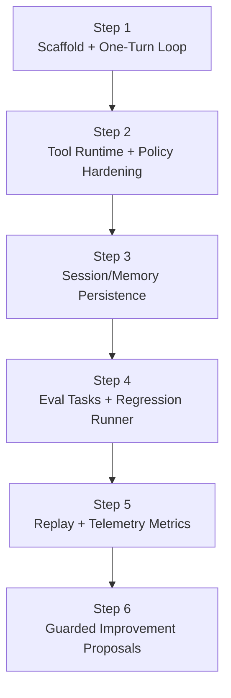

# HarnessLab Roadmap (MVP First)

## Scope

HarnessLab is a local, single-process harness built for learning:

- Minimal agent loop
- Sandboxed tool execution (policy enforced)
- Session and memory persistence
- Traceable runs and repeatable tests

## Design Principles

- Minimum closed loop before feature expansion
- Ports and adapters for replaceable components
- Safety by default (deny by default for risky actions)
- Observability as a first-class concern
- Contract-driven tests before heavy refactors

## Layered Architecture

1. `core`: loop, state transitions, interfaces
2. `tools`: tool registry and executions
3. `policy`: path and command checks
4. `session`: session state repository
5. `memory`: long-lived memory records
6. `telemetry`: run trace and spans

## Step Model (Not a Timeline)

Progress is tracked in **steps**, not weeks. Each step is a contract that
defines:

- **Entry criteria**: what must be true before starting the step
- **Deliverables**: concrete artifacts (code, tests, docs) the step produces
- **Exit criteria**: the objective signals that the step is "done"

Steps are dependency-ordered, not time-boxed. An AI-driven implementer can
finish a step in hours; a human-driven implementer may take days. Either way,
the same Exit criteria apply.

## MVP Deliverables

- `run_once()` loop:
  - read user goal
  - choose action (assistant/tool)
  - execute tool through policy checks
  - append message + trace
- Built-in tools:
  - `read_file`
  - `write_file` (workspace-limited)
  - `run_shell_safe` (allowlist + timeout placeholder)
- In-memory session and memory stores
- JSONL trace recorder
- CLI command + unit tests

## Interfaces Stable for TS Migration

- `ModelPort`: model interaction contract
- `ToolPort`: tool contract with schema and execution
- `PolicyPort`: authorization contract
- `SessionStorePort`: session persistence contract
- `MemoryStorePort`: memory persistence contract
- `TraceRecorderPort`: telemetry contract
- `ClockPort`: time source for deterministic replay
- `IdPort`: ID source for deterministic replay

Stable interfaces reduce migration risk from Python to TypeScript.

## Steps

### Step 1 — Scaffold + One-Turn Loop — DONE
- **Entry**: empty repository, AGENTS.md and architecture docs in place.
- **Deliverables**:
  - Package layout (`core`, `policy`, `tools`, `session`, `memory`, `telemetry`)
  - Stable Ports: `ModelPort`, `PolicyPort`, `ToolPort`, `SessionStorePort`,
    `MemoryStorePort`, `TraceRecorderPort`, `ClockPort`, `IdPort`
  - One-turn loop with deterministic `ClockPort`/`IdPort` injection
  - Built-in tools `read_file`, `write_file`, `run_shell_safe` with
    `args_schema`
  - `DefaultPolicy` with workspace-safe path checks and shell metacharacter
    rejection (`shell=False`, `shlex` parsing)
  - `ToolRegistry` that normalizes unknown-tool and exception cases into
    `ToolResult(ok=False)`
  - Audit-grade `tool_executed` / `tool_denied` trace payloads
  - JSONL trace recorder, CLI entry point
  - Unit + contract tests (policy, registry, loop trace, determinism)
- **Exit**: `uv run pytest` and `uv run ruff check` are green; two independent
  runs of a canonical scenario produce byte-identical JSONL traces under
  `FrozenClock` + `SeqIdProvider`.

### Step 2 — Tool Runtime + Policy Hardening — DONE
- **Entry**: Step 1 exit criteria met.
- **Deliverables**:
  - Wire `ToolPort.args_schema` into runtime validation (reject malformed
    arguments before the policy layer) — `ToolRegistry.validate_args`
    enforced in `HarnessLoop` before the policy check; emits a new
    `tool_invalid_args` trace event.
  - Add a shell-command denylist (e.g. `rm`, `sudo`, `curl`) layered on top
    of the existing allowlist — `DefaultPolicy.shell_denylist` consulted
    before the allowlist so destructive commands stay rejected even if
    accidentally allowlisted.
  - Parameterize resource limits (`output_bytes_cap`, `timeout_seconds`) via
    policy configuration rather than hardcoded constants —
    `core.config.RuntimeLimits` injected into every tool from a single
    construction point in `cli.build_runtime`.
  - Contract tests covering each stable Port (one minimal compliance test
    per Port) — `tests/test_port_contracts.py` exercises all 8 Ports
    against their production default implementations.
  - `ReplayModel` and `ReplayTraceRecorder` stubs to unblock Step 4 —
    `core.replay` provides both, and the loop drives them end-to-end in
    `tests/test_replay.py`.
- **Exit**: malformed args never reach a tool; shell denylist is enforced
  and tested; resource limits are configurable; every Port has at least one
  compliance test; replay stubs satisfy the existing Port contracts.

### Step 3 — Session/Memory Persistence — IN PROGRESS
- **Entry**: Step 2 exit criteria met.
- **Deliverables**:
  - SQLite-backed `SessionStorePort` adapter — DONE
    (`src/harnesslab/session/sqlite_store.py`).
  - SQLite-backed `MemoryStorePort` adapter — DONE
    (`src/harnesslab/memory/sqlite_store.py`). Retrieval/writeback policy
    is deferred to Step 4 where eval tasks need it.
  - Storage schema + migration mechanism — DONE
    (`src/harnesslab/storage/sqlite.py::MIGRATIONS` + `apply_migrations`).
    Migrations are tracked in a `schema_version` table for future
    incremental versions.
  - Contract tests reused unchanged against the SQLite adapter — DONE
    (`tests/test_port_contracts.py` parametrizes the store fixtures over
    `[in_memory, sqlite]`).
  - CLI surface — DONE (`harnesslab --storage sqlite [--sqlite-path PATH]`).
- **Exit**: in-memory and SQLite adapters pass the same Port contract suite;
  a session survives process restart (covered by
  `tests/test_cli_storage.py::test_session_persists_via_cli_with_sqlite` and
  `tests/test_sqlite_storage.py::test_session_persists_across_store_instances`).
- **Remaining for full DONE**: memory retrieval/writeback policy, once the
  Step 4 eval runner shows what the loop actually needs to read/write.

### Step 4 — Eval Tasks + Regression Runner — DONE
- **Entry**: Step 3 exit criteria met; `ReplayModel` available.
- **Deliverables**:
  - A small, versioned eval task set (input + expected outcome) — DONE
    (`eval/tasks/*.yaml`: 5 starter tasks covering assistant fallback,
    write+read round-trip, path-escape denial, schema gate, shell
    denylist). YAML is loaded into Pydantic `Task` models, and a task
    may pre-record `Decision`s to drive `ReplayModel` instead of
    `SimpleModel`.
  - Baseline comparison + regression runner — DONE
    (`src/harnesslab/eval/{runner,baseline}.py`). `TaskRunner` executes
    each task in an isolated tmp workspace with `FrozenClock` +
    `SeqIdProvider` for byte-stable traces. Baseline regressions cover
    pass→fail flips and growth in `tool_failures` / `invalid_args`;
    other metric drift is informational.
  - Compact run-quality report — DONE (`src/harnesslab/eval/report.py`).
    `render_stdout` prints PASS/FAIL with metrics and regressions;
    `write_json` produces `<reports-dir>/latest.json` for downstream
    tooling. Reports dir is ignored from git (`eval/reports/`).
  - CLI subcommand surface — DONE. `harnesslab run <input>` and
    `harnesslab eval [--task STEM] [--update-baseline]` replace the
    single-positional CLI. Exit codes: 0 pass, 2 task failure, 3
    baseline regression, 64 usage error.
- **Exit**: a known-good baseline exists at `eval/baseline.json`; every
  shipped task passes against the live loop
  (`tests/test_eval_tasks.py`); the CLI returns exit code 3 when the
  current run regresses against the baseline
  (`tests/test_cli_subcommands.py::test_eval_regression_exit_code`).
- **Deferred to later steps**: memory retrieval/writeback policy (no
  shipped task currently requires it; revisit alongside Step 5
  telemetry aggregation), GitHub Actions integration
  (template-only in this step, wired up after the workflow stabilizes).

### Step 5 — Replay + Telemetry Metrics — DONE
- **Entry**: Step 4 exit criteria met.
- **Deliverables**:
  - Deterministic replay from JSONL trace using injected
    `ClockPort` / `IdPort` — DONE. `src/harnesslab/replay/`:
    - `trace_reader.read_trace` parses JSONL into `TraceEvent`s.
    - `trace_reader.group_by_session` splits multi-session traces.
    - `replayer.replay_session` re-drives a single session through
      the production loop with `FrozenClock` + `SeqIdProvider` and a
      `ReplayModel` built from the trace's `decision_made` payloads.
      Refuses to proceed with `UnreplayableTraceError` when the trace
      lacks `user_input_received` or has malformed `decision_made`.
    - Trace was first enriched (Step 5.1) with `user_input_received`
      and full `decision_made` payload (`tool_args`, `assistant_message`)
      so this replay is feasible without a second source of truth.
    - Promoted `FrozenClock` / `SeqIdProvider` / `DEFAULT_REPLAY_CLOCK_START`
      from the eval runner's private surface into `core.runtime` so
      eval and replay share the same deterministic primitives.
  - Telemetry aggregation — DONE
    (`src/harnesslab/telemetry/aggregate.py`). `Metrics` covers
    sessions, turns, tool_calls / successes / failures, denials,
    invalid_args, `tool_success_rate`, `denial_rate`, and
    `LatencyStats` (min / p50 / p95 / max, linear-interpolation,
    stdlib-only). No "session pass rate" — production traces lack a
    pass/fail signal; that lives in `harnesslab eval`.
  - Replay-vs-original divergence detector — DONE
    (`replay/divergence.py::detect_divergence`). Semantic mode
    (default) normalizes prefix ids (ses/msg/tool/run_<…> →
    `<prefix>_001…`) and scrubs volatile fields (timestamps +
    `output_preview` / `output_size` / `output_truncated`) so traces
    produced by `SystemClock` can still match a replay produced by
    `FrozenClock`. Strict mode compares byte-for-byte. Output is a
    structured `DivergenceReport` with per-event `Divergence`
    records.
  - CLI surface — DONE. Two new subcommands:
    - `harnesslab replay <trace.jsonl>
        [--session-id ID] [--workspace PATH] [--strict]`
      Exit codes: 0 match · 2 unreplayable · 4 diverged.
      `--workspace` lets operators re-use the original workspace when
      tools depend on cross-session filesystem state.
    - `harnesslab metrics <trace.jsonl> [--json]`
      Always exit 0 — observation, not a gate.
- **Exit**: every shipped eval task's trace replays divergence-free
  against itself (`tests/test_replay_module.py::test_replay_matches_eval_task_traces`);
  a tampered trace yields a precise `DivergenceReport`
  (`test_divergence_detects_tampered_decision`); the round-trip works
  end-to-end through the CLI on real JSONL written by the production
  loop (`tests/test_cli_replay_metrics.py::test_replay_with_shared_workspace_round_trips_across_sessions`).

### Step 6 — Guarded Improvement Proposals
- **Entry**: Step 5 exit criteria met.
- **Deliverables**:
  - Failed-run clustering
  - Proposal generation (human-readable suggestions; no autonomous code
    edits)
  - Regression gate + rollback playbook
- **Exit**: proposals are produced from real failure clusters; every
  proposal is gated by the Step 4 regression runner before any merge.
  Consistent with the project's Non-Goal of "fully automated self-modifying
  code paths".
