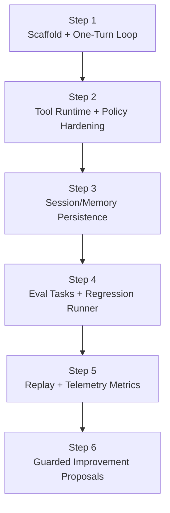

# HarnessLab Roadmap (MVP First)

## Scope

HarnessLab is a local, single-process harness built for learning:

- Minimal agent loop
- Sandboxed tool execution (policy enforced)
- Session and memory persistence
- Traceable runs and repeatable tests

## Design Principles

- Minimum closed loop before feature expansion
- Ports and adapters for replaceable components
- Safety by default (deny by default for risky actions)
- Observability as a first-class concern
- Contract-driven tests before heavy refactors

## Layered Architecture

1. `core`: loop, state transitions, interfaces
2. `tools`: tool registry and executions
3. `policy`: path and command checks
4. `session`: session state repository
5. `memory`: long-lived memory records
6. `telemetry`: run trace and spans

## Step Model (Not a Timeline)

Progress is tracked in **steps**, not weeks. Each step is a contract that
defines:

- **Entry criteria**: what must be true before starting the step
- **Deliverables**: concrete artifacts (code, tests, docs) the step produces
- **Exit criteria**: the objective signals that the step is "done"

Steps are dependency-ordered, not time-boxed. An AI-driven implementer can
finish a step in hours; a human-driven implementer may take days. Either way,
the same Exit criteria apply.

## MVP Deliverables

- `run_once()` loop:
  - read user goal
  - choose action (assistant/tool)
  - execute tool through policy checks
  - append message + trace
- Built-in tools:
  - `read_file`
  - `write_file` (workspace-limited)
  - `run_shell_safe` (allowlist + timeout placeholder)
- In-memory session and memory stores
- JSONL trace recorder
- CLI command + unit tests

## Interfaces Stable for TS Migration

- `ModelPort`: model interaction contract
- `ToolPort`: tool contract with schema and execution
- `PolicyPort`: authorization contract
- `SessionStorePort`: session persistence contract
- `MemoryStorePort`: memory persistence contract
- `TraceRecorderPort`: telemetry contract
- `ClockPort`: time source for deterministic replay
- `IdPort`: ID source for deterministic replay

Stable interfaces reduce migration risk from Python to TypeScript.

## Steps

### Step 1 — Scaffold + One-Turn Loop — DONE
- **Entry**: empty repository, AGENTS.md and architecture docs in place.
- **Deliverables**:
  - Package layout (`core`, `policy`, `tools`, `session`, `memory`, `telemetry`)
  - Stable Ports: `ModelPort`, `PolicyPort`, `ToolPort`, `SessionStorePort`,
    `MemoryStorePort`, `TraceRecorderPort`, `ClockPort`, `IdPort`
  - One-turn loop with deterministic `ClockPort`/`IdPort` injection
  - Built-in tools `read_file`, `write_file`, `run_shell_safe` with
    `args_schema`
  - `DefaultPolicy` with workspace-safe path checks and shell metacharacter
    rejection (`shell=False`, `shlex` parsing)
  - `ToolRegistry` that normalizes unknown-tool and exception cases into
    `ToolResult(ok=False)`
  - Audit-grade `tool_executed` / `tool_denied` trace payloads
  - JSONL trace recorder, CLI entry point
  - Unit + contract tests (policy, registry, loop trace, determinism)
- **Exit**: `uv run pytest` and `uv run ruff check` are green; two independent
  runs of a canonical scenario produce byte-identical JSONL traces under
  `FrozenClock` + `SeqIdProvider`.

### Step 2 — Tool Runtime + Policy Hardening — DONE
- **Entry**: Step 1 exit criteria met.
- **Deliverables**:
  - Wire `ToolPort.args_schema` into runtime validation (reject malformed
    arguments before the policy layer) — `ToolRegistry.validate_args`
    enforced in `HarnessLoop` before the policy check; emits a new
    `tool_invalid_args` trace event.
  - Add a shell-command denylist (e.g. `rm`, `sudo`, `curl`) layered on top
    of the existing allowlist — `DefaultPolicy.shell_denylist` consulted
    before the allowlist so destructive commands stay rejected even if
    accidentally allowlisted.
  - Parameterize resource limits (`output_bytes_cap`, `timeout_seconds`) via
    policy configuration rather than hardcoded constants —
    `core.config.RuntimeLimits` injected into every tool from a single
    construction point in `cli.build_runtime`.
  - Contract tests covering each stable Port (one minimal compliance test
    per Port) — `tests/test_port_contracts.py` exercises all 8 Ports
    against their production default implementations.
  - `ReplayModel` and `ReplayTraceRecorder` stubs to unblock Step 4 —
    `core.replay` provides both, and the loop drives them end-to-end in
    `tests/test_replay.py`.
- **Exit**: malformed args never reach a tool; shell denylist is enforced
  and tested; resource limits are configurable; every Port has at least one
  compliance test; replay stubs satisfy the existing Port contracts.

### Step 3 — Session/Memory Persistence
- **Entry**: Step 2 exit criteria met.
- **Deliverables**:
  - SQLite-backed `SessionStorePort` adapter
  - SQLite-backed `MemoryStorePort` adapter with retrieval/writeback policy
  - Storage schema + migration scripts
  - Contract tests reused unchanged against the SQLite adapter (proving the
    Port abstraction holds)
- **Exit**: in-memory and SQLite adapters pass the same Port contract suite;
  a session survives process restart.

### Step 4 — Eval Tasks + Regression Runner
- **Entry**: Step 3 exit criteria met; `ReplayModel` available.
- **Deliverables**:
  - A small, versioned eval task set (input + expected outcome)
  - Baseline comparison + regression runner
  - Compact run-quality report (pass rate, tool success rate, latency)
- **Exit**: a known-good baseline exists; CI gate fails when pass rate
  regresses against the baseline.

### Step 5 — Replay + Telemetry Metrics
- **Entry**: Step 4 exit criteria met.
- **Deliverables**:
  - Deterministic replay from JSONL trace using injected
    `ClockPort` / `IdPort`
  - Telemetry aggregation (pass rate, tool success, latency, denial rate)
  - Replay-vs-original divergence detector
- **Exit**: any historical trace can be replayed and either matches exactly
  or produces a precise divergence report.

### Step 6 — Guarded Improvement Proposals
- **Entry**: Step 5 exit criteria met.
- **Deliverables**:
  - Failed-run clustering
  - Proposal generation (human-readable suggestions; no autonomous code
    edits)
  - Regression gate + rollback playbook
- **Exit**: proposals are produced from real failure clusters; every
  proposal is gated by the Step 4 regression runner before any merge.
  Consistent with the project's Non-Goal of "fully automated self-modifying
  code paths".
