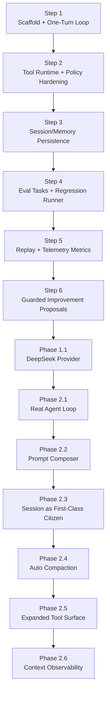
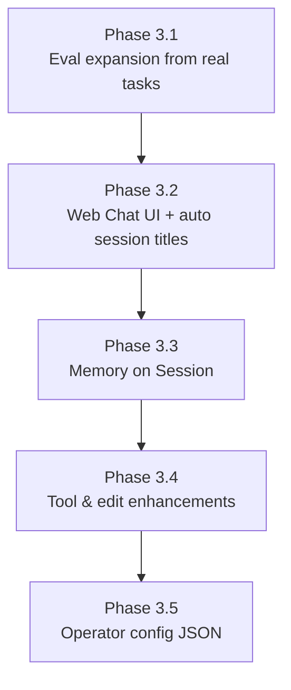
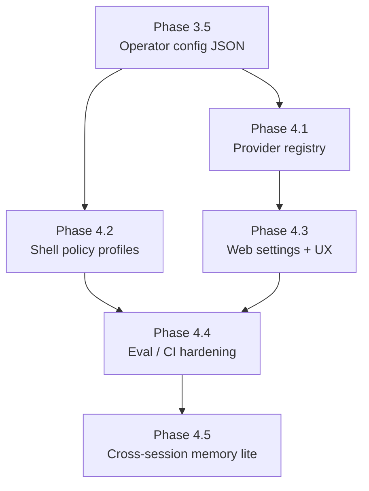
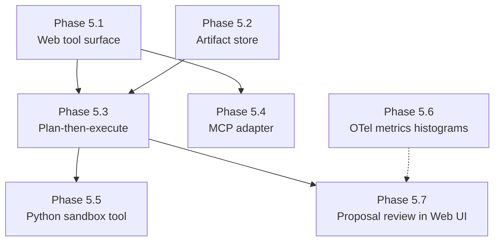
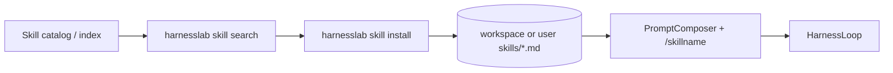

# HarnessLab Roadmap (MVP First)

## Scope

HarnessLab is a local, single-process harness built for learning (see
[`why-harnesslab.md`](why-harnesslab.md)):

- Minimal agent loop
- Sandboxed tool execution (policy enforced)
- Session and memory persistence
- Traceable runs and repeatable tests

## Design Principles

- Minimum closed loop before feature expansion
- Ports and adapters for replaceable components
- Safety by default (deny by default for risky actions)
- Observability as a first-class concern
- Contract-driven tests before heavy refactors

## Layered Architecture

1. `core`: loop, state transitions, interfaces, prompt composition,
   compaction, context snapshots
2. `tools`: tool registry and executions
3. `policy`: path and command checks
4. `session`: session state repository (first-class lifecycle)
5. `memory`: long-lived memory records (store only; writeback deferred)
6. `telemetry`: run trace and metrics aggregation
7. `eval` / `replay` / `improve`: regression, divergence, proposals
8. `providers`: external `ModelPort` adapters

## Step Model (Not a Timeline)

Progress is tracked in **steps**, not weeks. Each step is a contract that
defines:

- **Entry criteria**: what must be true before starting the step
- **Deliverables**: concrete artifacts (code, tests, docs) the step produces
- **Exit criteria**: the objective signals that the step is "done"

Steps are dependency-ordered, not time-boxed. An AI-driven implementer can
finish a step in hours; a human-driven implementer may take days. Either way,
the same Exit criteria apply.

## Current State (2026-05 — Phase 5 substantially complete)

HarnessLab is a **daily-usable local agent harness** and a **learning
codebase** for building your own agent runtime. Shipped capabilities include
everything through Phase 4 **plus** most of Phase 5:

- **Multi-provider** `ModelPort` adapters (DeepSeek, Anthropic, OpenAI, Gemini, `simple`)
- **Research tools** — `web_search`, tiered `fetch_url`, `html_to_markdown`, `read_pdf`
- **Artifact store**, **MCP adapter**, **Python sandbox**, **tool hooks**
- **Plan mode** (`Decision.kind == plan`), **checkpoints + CLI rewind**
- **Cost/token budgets** (soft/hard enforcement; USD cost mapping partial)
- **OTel** trace fan-out + metrics histograms
- **Proposal review Web UI** with local pytest/eval gates
- **TS Web UI default** when built — SSE step + token streaming, slash palette,
  `/compact`, `/skillname`, session restore, model persist
- **Multi-agent PoC** — `spawn_sub_agent` + `start_child` (opt-in via config);
  **production sub-agent** planned (Phase 6)
- **Workspace skills** — `skills/*.md`, `/skillname`, composer palette;
  **skill search/install** planned (Phase 7)
- **Sixteen eval tasks** + GitHub Actions offline gate (`--skip-tags network`)

**Authoritative future work:** see [What's next](#whats-next-prioritized) below.

Historical snapshot (Phase 2–4 baseline):

- Multi-step agent loop, prompt composer, session first-class, auto compaction
- Web chat UI, session/workspace memory, operator config, eval/replay/propose

## MVP Deliverables (historical — Step 1 baseline)

- `run_once()` loop:
  - read user goal
  - choose action (assistant/tool)
  - execute tool through policy checks
  - append message + trace
- Built-in tools:
  - `read_file`
  - `write_file` (workspace-limited)
  - `run_shell_safe` (allowlist + timeout placeholder)
- In-memory session and memory stores
- JSONL trace recorder
- CLI command + unit tests

## Interfaces Stable for TS Migration

- `ModelPort`: model interaction contract
- `ToolPort`: tool contract with schema and execution
- `PolicyPort`: authorization contract
- `SessionStorePort`: session persistence contract
- `MemoryStorePort`: memory persistence contract
- `TraceRecorderPort`: telemetry contract
- `ClockPort`: time source for deterministic replay
- `IdPort`: ID source for deterministic replay

Stable interfaces reduce migration risk from Python to TypeScript.

## Steps

### Step 1 — Scaffold + One-Turn Loop — DONE
- **Entry**: empty repository, AGENTS.md and architecture docs in place.
- **Deliverables**:
  - Package layout (`core`, `policy`, `tools`, `session`, `memory`, `telemetry`)
  - Stable Ports: `ModelPort`, `PolicyPort`, `ToolPort`, `SessionStorePort`,
    `MemoryStorePort`, `TraceRecorderPort`, `ClockPort`, `IdPort`
  - One-turn loop with deterministic `ClockPort`/`IdPort` injection
  - Built-in tools `read_file`, `write_file`, `run_shell_safe` with
    `args_schema`
  - `DefaultPolicy` with workspace-safe path checks and shell metacharacter
    rejection (`shell=False`, `shlex` parsing)
  - `ToolRegistry` that normalizes unknown-tool and exception cases into
    `ToolResult(ok=False)`
  - Audit-grade `tool_executed` / `tool_denied` trace payloads
  - JSONL trace recorder, CLI entry point
  - Unit + contract tests (policy, registry, loop trace, determinism)
- **Exit**: `uv run pytest` and `uv run ruff check` are green; two independent
  runs of a canonical scenario produce byte-identical JSONL traces under
  `FrozenClock` + `SeqIdProvider`.

### Step 2 — Tool Runtime + Policy Hardening — DONE
- **Entry**: Step 1 exit criteria met.
- **Deliverables**:
  - Wire `ToolPort.args_schema` into runtime validation (reject malformed
    arguments before the policy layer) — `ToolRegistry.validate_args`
    enforced in `HarnessLoop` before the policy check; emits a new
    `tool_invalid_args` trace event.
  - Add a shell-command denylist (e.g. `rm`, `sudo`, `curl`) layered on top
    of the existing allowlist — `DefaultPolicy.shell_denylist` consulted
    before the allowlist so destructive commands stay rejected even if
    accidentally allowlisted.
  - Parameterize resource limits (`output_bytes_cap`, `timeout_seconds`) via
    policy configuration rather than hardcoded constants —
    `core.config.RuntimeLimits` injected into every tool from a single
    construction point in `cli.build_runtime`.
  - Contract tests covering each stable Port (one minimal compliance test
    per Port) — `tests/test_port_contracts.py` exercises all 8 Ports
    against their production default implementations.
  - `ReplayModel` and `ReplayTraceRecorder` stubs to unblock Step 4 —
    `core.replay` provides both, and the loop drives them end-to-end in
    `tests/test_replay.py`.
- **Exit**: malformed args never reach a tool; shell denylist is enforced
  and tested; resource limits are configurable; every Port has at least one
  compliance test; replay stubs satisfy the existing Port contracts.

### Step 3 — Session/Memory Persistence — DONE
- **Entry**: Step 2 exit criteria met.
- **Deliverables**:
  - SQLite-backed `SessionStorePort` adapter — DONE
    (`src/harnesslab/session/sqlite_store.py`).
  - SQLite-backed `MemoryStorePort` adapter — DONE
    (`src/harnesslab/memory/sqlite_store.py`). Retrieval/writeback policy
    is deferred (see Deferred section below).
  - Storage schema + migration mechanism — DONE
    (`src/harnesslab/storage/sqlite.py::MIGRATIONS` + `apply_migrations`).
    Migrations are tracked in a `schema_version` table for future
    incremental versions.
  - Contract tests reused unchanged against the SQLite adapter — DONE
    (`tests/test_port_contracts.py` parametrizes the store fixtures over
    `[in_memory, sqlite]`).
  - CLI surface — DONE (`harnesslab run --storage sqlite [--sqlite-path PATH]`).
- **Exit**: in-memory and SQLite adapters pass the same Port contract suite;
  a session survives process restart (covered by
  `tests/test_cli_storage.py::test_session_persists_via_cli_with_sqlite` and
  `tests/test_sqlite_storage.py::test_session_persists_across_store_instances`).
- **Note**: memory retrieval/writeback into the loop was intentionally
  deferred until the session substrate matured (Phase 2.3). The store
  adapters remain available; loop integration is future work.

### Step 4 — Eval Tasks + Regression Runner — DONE
- **Entry**: Step 3 exit criteria met; `ReplayModel` available.
- **Deliverables**:
  - A small, versioned eval task set (input + expected outcome) — DONE
    (`eval/tasks/*.yaml`: 5 starter tasks covering assistant fallback,
    write+read round-trip, path-escape denial, schema gate, shell
    denylist). YAML is loaded into Pydantic `Task` models, and a task
    may pre-record `Decision`s to drive `ReplayModel` instead of
    `SimpleModel`.
  - Baseline comparison + regression runner — DONE
    (`src/harnesslab/eval/{runner,baseline}.py`). `TaskRunner` executes
    each task in an isolated tmp workspace with `FrozenClock` +
    `SeqIdProvider` for byte-stable traces. Baseline regressions cover
    pass→fail flips and growth in `tool_failures` / `invalid_args`;
    other metric drift is informational.
  - Compact run-quality report — DONE (`src/harnesslab/eval/report.py`).
    `render_stdout` prints PASS/FAIL with metrics and regressions;
    `write_json` produces `<reports-dir>/latest.json` for downstream
    tooling. Reports dir is ignored from git (`eval/reports/`).
  - CLI subcommand surface — DONE. `harnesslab run <input>` and
    `harnesslab eval [--task STEM] [--update-baseline]` replace the
    single-positional CLI. Exit codes: 0 pass, 2 task failure, 3
    baseline regression, 64 usage error.
- **Exit**: a known-good baseline exists at `eval/baseline.json`; every
  shipped task passes against the live loop
  (`tests/test_eval_tasks.py`); the CLI returns exit code 3 when the
  current run regresses against the baseline
  (`tests/test_cli_subcommands.py::test_eval_regression_exit_code`).
- **Deferred to later steps**: memory retrieval/writeback policy (no
  shipped task currently requires it; revisit alongside Step 5
  telemetry aggregation), GitHub Actions integration
  (template-only in this step, wired up after the workflow stabilizes).

### Step 5 — Replay + Telemetry Metrics — DONE
- **Entry**: Step 4 exit criteria met.
- **Deliverables**:
  - Deterministic replay from JSONL trace using injected
    `ClockPort` / `IdPort` — DONE. `src/harnesslab/replay/`:
    - `trace_reader.read_trace` parses JSONL into `TraceEvent`s.
    - `trace_reader.group_by_session` splits multi-session traces.
    - `replayer.replay_session` re-drives a single session through
      the production loop with `FrozenClock` + `SeqIdProvider` and a
      `ReplayModel` built from the trace's `decision_made` payloads.
      Refuses to proceed with `UnreplayableTraceError` when the trace
      lacks `user_input_received` or has malformed `decision_made`.
    - Trace was first enriched (Step 5.1) with `user_input_received`
      and full `decision_made` payload (`tool_args`, `assistant_message`)
      so this replay is feasible without a second source of truth.
    - Promoted `FrozenClock` / `SeqIdProvider` / `DEFAULT_REPLAY_CLOCK_START`
      from the eval runner's private surface into `core.runtime` so
      eval and replay share the same deterministic primitives.
  - Telemetry aggregation — DONE
    (`src/harnesslab/telemetry/aggregate.py`). `Metrics` covers
    sessions, turns, tool_calls / successes / failures, denials,
    invalid_args, `tool_success_rate`, `denial_rate`, tool latency,
    model-call latency, and model token counters (`request` /
    `response` / `total`) from the `model_call` event.
    No "session pass rate" — production traces lack a pass/fail
    signal; that lives in `harnesslab eval`.
  - Replay-vs-original divergence detector — DONE
    (`replay/divergence.py::detect_divergence`). Semantic mode
    (default) normalizes prefix ids (ses/msg/tool/run_<…> →
    `<prefix>_001…`) and scrubs volatile fields (timestamps +
    `output_preview` / `output_size` / `output_truncated`) so traces
    produced by `SystemClock` can still match a replay produced by
    `FrozenClock`. Strict mode compares byte-for-byte. Output is a
    structured `DivergenceReport` with per-event `Divergence`
    records.
  - CLI surface — DONE. Two new subcommands:
    - `harnesslab replay <trace.jsonl>
        [--session-id ID] [--workspace PATH] [--strict]`
      Exit codes: 0 match · 2 unreplayable · 4 diverged.
      `--workspace` lets operators re-use the original workspace when
      tools depend on cross-session filesystem state.
    - `harnesslab metrics <trace.jsonl> [--json]`
      Always exit 0 — observation, not a gate.
- **Exit**: every shipped eval task's trace replays divergence-free
  against itself (`tests/test_replay_module.py::test_replay_matches_eval_task_traces`);
  a tampered trace yields a precise `DivergenceReport`
  (`test_divergence_detects_tampered_decision`); the round-trip works
  end-to-end through the CLI on real JSONL written by the production
  loop (`tests/test_cli_replay_metrics.py::test_replay_with_shared_workspace_round_trips_across_sessions`).

### Step 6 — Guarded Improvement Proposals — DONE
- **Entry**: Step 5 exit criteria met.
- **Deliverables**:
  - Failed-run clustering — DONE
    (`src/harnesslab/improve/{fingerprint,cluster}.py`). Failure
    signals are mined from two sources: `tool_executed(ok=false)` /
    `tool_denied` / `tool_invalid_args` events in JSONL traces, and
    `failures` arrays from `eval/reports/latest.json`. Each is reduced
    to a compact, human-readable signature
    (e.g. `tool_denied:run_shell_safe:command not in allowlist`) and
    grouped; clusters below `--min-occurrences` (default 2) are
    dropped so single events do not warrant a proposal.
  - Proposal generation — DONE
    (`src/harnesslab/improve/{proposal,templates,generator,render}.py`).
    `Proposal` is a Pydantic model with `status` (`open` | `accepted`
    | `rejected` | `superseded`) and a stable id
    (`prop_<YYYYMMDDhhmm>_<sha1(sig)[:8]>`). Suggested actions are
    generated from hand-written templates keyed by cluster kind — no
    LLM call, consistent with the Non-Goal of "fully automated
    self-modifying code paths". Markdown rendering writes YAML
    front-matter (machine-readable) plus body sections (Cluster,
    Sample events, Sample task failures, Suggested actions,
    Acceptance checklist) targeted at humans.
  - Regression gate + rollback playbook — DONE. Every proposal's
    "Acceptance checklist" literally names `uv run harnesslab eval`
    and `uv run pytest`, so acceptance binds the Step 4 regression
    runner into the Step 6 workflow. `AGENTS.md` "Proposal Handling"
    pins the binding contract: proposals are advisory, AI must not
    auto-apply, status moves require all four checklist items.
    Rollback is by design — proposals are never auto-applied, so
    "undo" is just `git revert` of the accepting commit (proposal
    file then needs its status edited back to `open`).
  - CLI — DONE. `harnesslab propose [--trace TRACE]
    [--eval-report REPORT] [--out proposals/] [--min-occurrences N]
    [--format md|json]`. Idempotent across reruns via
    `dedupe_against_existing` against on-disk `open` proposals.
- **Exit**: shipped fixture trace
  (`tests/fixtures/sample_failure_trace.jsonl`) yields exactly the
  expected two proposals (`tests/test_improve.py::test_generate_against_shipped_fixture`);
  rerun on the same input yields zero new proposals
  (`tests/test_cli_propose.py::test_propose_md_is_idempotent_across_runs`);
  every shipped proposal's Acceptance checklist requires
  `uv run harnesslab eval`, satisfying the "gated by the Step 4
  regression runner" Exit criterion.

## Post-MVP Phase 1 — Provider Integration

MVP Steps 1-6 are complete. Phase 1 wires in a real model provider
without giving up the deterministic eval/replay surface.

### Phase 1.1 — Provider integration (`deepseek`) — DONE

- Added `DeepSeekModel` (`src/harnesslab/providers/deepseek.py`) as a
  `ModelPort` implementation over DeepSeek's OpenAI-compatible API.
- `harnesslab run` now accepts `--model {simple,deepseek}` (default:
  `simple`). DeepSeek reads credentials from `DEEPSEEK_API_KEY`.
- Added `model_call` trace event to record model latency and token
  usage (`request_tokens`, `response_tokens`, `total_tokens`), and
  wired telemetry aggregation to include those metrics.

## Post-MVP Phase 2 — Real Agent (Current)

Phase 1 added a model but kept the loop one-shot. Phase 2 turns
HarnessLab into an actual autonomous agent: the model drives a
multi-step inner loop, the prompt is composed from versioned blocks,
sessions are first-class persistent entities, long conversations
auto-compact, and the tool/observability surface is wide enough to
do non-trivial work without falling back to raw shell.

The "Memory retrieval/writeback policy" / "Metrics dashboard
artifact" / "Eval task expansion from real failures" items
originally drafted as Phase 1.2–1.4 are deferred to a future
Phase 3 in light of the deeper agent-loop work Phase 2 introduced.
Memory in particular is intentionally postponed until the
session-as-first-class-citizen substrate (Phase 2.3) is exercised
by real workflows — see AGENTS.md "Memory is built on Session, not
the other way around".

### Phase 2.1 — Real agent loop — DONE

- `Decision.kind` extended with terminal kinds `final` and
  `ask_user`; `assistant` / `tool` are now intermediate steps.
- `HarnessLoop.run_session(session_id, user_input, max_steps=N)`
  drives the inner loop: each iteration calls the model, applies
  the decision (tool / text), emits `step_started` and
  `step_completed`, and stops on a terminal decision or when
  `max_steps` is reached. `run_turn` is now a thin
  `max_steps=1` wrapper preserved for compatibility.
- New trace events: `step_started`, `step_completed`,
  `session_finished` (with `reason` ∈ `{final, ask_user,
  max_steps, overflow}`).
- `SimpleModel` extended with `/final <msg>` and `/ask <msg>`
  commands so the agent loop can be exercised deterministically
  from CLI without a live LLM.
- Replay and eval adapted: `_extract_turns` collects every
  `decision_made` between `user_input_received` events,
  `TaskTurn.max_steps` drives multi-step task replay, and a new
  `eval/tasks/06_multi_step_tool_then_final.yaml` covers the
  tool-then-final pattern.

### Phase 2.2 — Prompt composer — DONE

- New `core/prompt/` package:
  - `PromptBlock`: named, role-tagged, origin-tagged
    (`static | dynamic | conversation`) text fragment.
  - `ComposedPrompt`: ordered list of blocks with
    `as_text` / `as_openai_messages` / `snapshot` views.
  - `PromptComposer.build(session, dynamic_blocks=..., variables=...)`:
    assembles `static + dynamic + conversation` blocks, runs
    `${var}` substitution (used today for `${model_name}`), and
    returns a `ComposedPrompt`.
- Five packaged static blocks under
  `core/prompt/blocks/` (`00_identity`, `01_harness`,
  `02_safety`, `03_style`, `04_engineering`) loaded in lexical
  order at import time. Files are markdown so they version cleanly
  in Git.
- Dynamic block factories in `core/prompt/dynamic.py`:
  - `build_env_block(workspace_root)` — CWD, platform, date,
    optional git summary.
  - `build_agents_md_block(workspace_root)` — reads `AGENTS.md`
    when present and folds it into the prompt.
  - `build_tool_guide_block(registry)` — lists registered tools
    with their descriptions so the model sees the live tool surface.
- `DeepSeekModel` rebuilt to consume the composer instead of a
  hardcoded system string; the CLI wires the env/agents_md/tool_guide
  trio through `_make_dynamic_blocks_provider`.
- `pyproject.toml` `[tool.hatch.build.targets.wheel.force-include]`
  ensures the `.md` block files ship with the wheel.

### Phase 2.3 — Session as first-class citizen — DONE

- `Session` model gained
  `status: pending|running|waiting_user|done|failed|aborted`,
  `step_count`, `last_step_at`, `parent_session_id`, and `title`.
  `loop.start(goal=…)` derives a short title from the goal.
- `HarnessLoop.fork(session_id, *, new_goal=None)` creates a child
  session with fresh message ids and `parent_session_id` set, so
  forks can persist into SQLite without violating uniqueness.
- `SessionStorePort.list(*, limit=None, status=None)` added.
  Both `InMemorySessionStore` and `SqliteSessionStore` implement it.
- SQLite schema bumped to v2 (`storage/sqlite.py::MIGRATIONS`) with
  ALTERs for the new session columns plus supporting indexes.
- New CLI surface: `harnesslab session
  [--workspace-root .] [--sqlite-path PATH] ACTION` with
  `ls / show / resume / fork` actions. The session subcommand
  defaults to `sqlite` storage.

### Phase 2.4 — Auto compaction — DONE

- `core/compaction.py`:
  - `estimate_tokens` / `estimate_messages_tokens`
    (`len(text) // 4`, intentionally provider-agnostic).
  - `should_compact(messages, threshold_tokens)`.
  - `compact_messages(messages, keep_last, summarizer, …)`:
    replaces all but the last `keep_last` messages with a single
    summary system message, fenced in `<system-reminder>`.
  - `Summarizer` protocol + `_fallback_summarizer` (deterministic,
    LLM-free).
  - `LiveSummarizer(model)` — opt-in wrapper that uses a real
    `ModelPort` to summarize, with the fallback summary used when
    the model returns an empty string.
  - `ModelOverflowError` — the contract between adapters and the
    loop for "the API rejected this request because the context
    window is full".
- `RuntimeLimits` gained `context_window_tokens`,
  `compaction_threshold_tokens`, `compaction_keep_last_messages`.
- `HarnessLoop`:
  - `_maybe_compact` runs before each model call and triggers a
    threshold-driven compaction when needed.
  - `_call_model_with_overflow` catches `ModelOverflowError`,
    runs an emergency compaction (`keep_last = max(1, configured
    // 2)`), retries once, and surfaces a final decision with an
    explanatory message if overflow persists.
  - New trace events `compaction_started` (with
    `trigger: threshold|overflow`) and `compaction_completed`.
- `DeepSeekModel` detects OpenAI/DeepSeek HTTP 400 context-length
  responses and raises `ModelOverflowError` so the loop can
  recover.

### Phase 2.5 — Expanded tool surface — DONE

- New file tools in `tools/file_tools.py`:
  - `EditFileTool` — in-place string replacement; `old` must be
    present, must be unique unless `replace_all=True`, never
    silently overwrites.
  - `GrepTool` — UTF-8 walk of the workspace returning
    `path:lineno: line` matches; optional `glob` filter, default
    `max_matches=50`, hard cap `1000`, skips binary files and a
    standard noise-dir list (`.git`, `.venv`, `node_modules`,
    `__pycache__`, `dist`, `build`, …).
  - `GlobTool` — workspace-relative path matches sorted
    deterministically; default `max_results=100`, hard cap `5000`,
    same noise-dir skip list.
- `DefaultPolicy` admits all three: `edit_file` reuses the strict
  `_check_path`; `grep` / `glob` use a new `_check_optional_path`
  (path optional; must resolve in-workspace when supplied).
- Read-only shell allowlist expanded from `{ls, pwd, echo, cat}`
  to also cover file inspection (`head, tail, wc, file, du, df,
  stat`), introspection (`which, env, date, whoami, hostname,
  uname`), search (`find, tree`), dev tooling (`python, python3,
  pytest, ruff, mypy, uv`), and `git`. `git` is special-cased:
  it is on the head allowlist, but argv[1] must be one of
  `SAFE_GIT_SUBCOMMANDS` (read-only set: `status, log, diff,
  show, branch, remote, ls-files, ls-tree, rev-parse, describe,
  tag, blame, shortlog, config`). Write-side subcommands
  (`push`, `reset`, `checkout`, `clean`, …) stay rejected with
  an advisory message listing the safe set.

### Phase 2.6 — Context observability — DONE

- `core/context.py::ContextSnapshot` — per-call snapshot of
  conversation tokens / message count / configured budget /
  usage ratios, with optional adapter-supplied prompt-side fields
  (`prompt_tokens_estimate`, `static_block_tokens`,
  `dynamic_block_tokens`, `prompt_block_names`).
- `HarnessLoop._model_call_payload` attaches
  `payload["context"]` to every `model_call` event. The replay
  divergence detector ignores `context` (token estimates depend on
  tool outputs that embed tmp workspace paths and are
  informational, not behavioral).
- `DeepSeekModel` publishes prompt-side fields by walking the
  composed prompt blocks after each call.
- New CLI: `harnesslab context <trace>`
  - `show [--session-id ID] [--json]` — peak conversation
    tokens, peak usage ratio, full breakdown of the latest
    snapshot.
  - `series [--session-id ID] [--limit N]` — one row per
    `model_call` so growth over time is visible.
- `Metrics` (and `render_metrics`) gained
  `max_conversation_tokens`, `peak_usage_ratio`, `compactions`,
  `overflow_recoveries`; pre-Phase-2.6 traces still aggregate
  cleanly (missing fields default to `0` / `None`).

## Post-MVP Phase 3 — Usability & Production Feedback — DONE

Phase 2 delivered a working multi-step agent. Phase 3 turns it into
something people actually use daily: browser chat, smarter session
labels, and eval coverage that tracks real failures.

### Phase 3.1 — Eval expansion from real tasks — DONE

- Codify recurring `harnesslab propose` clusters as YAML eval tasks
  before merging fixes — see `eval/README.md` (propose→eval workflow).
- Shipped tasks: `grep_then_edit`, `compaction_on_threshold`,
  `session_resume_second_turn`, `apply_patch_unified_diff`,
  `fetch_url_weather` (twelve tasks total).
- Eval runner registers all eight built-in tools; optional per-task
  `limits:` overrides for compaction tests.
- GitHub Actions workflow `.github/workflows/eval.yml` runs
  `pytest` + `harnesslab eval` on pull requests.

**Exit**: shipped eval tasks cover Phase 2 core paths; propose→eval
workflow documented.

### Phase 3.2 — Web Chat UI + session auto-titles — DONE

**Web UI (`harnesslab serve`)**

- Localhost-only HTTP server (`127.0.0.1:8787` by default).
- Static chat page: message list, composer, session sidebar.
- JSON API backed by the same `HarnessLoop` + SQLite session store
  as the CLI (`GET/POST /api/sessions`, `POST .../messages`).
- Default model: `deepseek` (requires `DEEPSEEK_API_KEY`); `--model
  simple` for offline smoke tests.
- No auth, no public bind — learning/dev tool, not a production web
  service.

**Auto LLM session titles (robust / fast / low token)**

- After the **first** completed user turn (`turn_count == 1`), an
  optional `LiveTitleNamer` replaces the placeholder title derived
  from the goal string.
- Prompt sends only the first user message + a short assistant
  excerpt (no full transcript, no tool output).
- Expects a plain-text `final` reply; tool decisions fall back silently.
- Output sanitized (single line, 60-char cap); emits `session_titled`
  trace event on success.
- Wired automatically when `--model deepseek`; skipped for `simple`
  (deterministic eval/replay path unchanged).

**Deliverables (3.2.1 — shipped in this step)**

- `src/harnesslab/web/` — stdlib `http.server` + static assets (no
  new runtime dependencies).
- `harnesslab serve [--port 8787] [--model deepseek|simple]`.
- `./hl-serve` — Python lifecycle helper at repo root (`start|stop|
  restart|status`); optional `~/.config/harnesslab/env` for secrets.
- `src/harnesslab/core/title.py` — `derive_title_from_text`,
  `LiveTitleNamer`, loop hook `_maybe_auto_title`.

**Deliverables (3.2.2 — Web UX polish)**

- SSE streaming on `POST .../messages` (`Accept: text/event-stream`
  or `"stream": true`); live `trace` events via `TraceHub`.
- Tool/run inspector panel (`GET /api/sessions/{id}/trace`).
- Fork button + `POST /api/sessions/{id}/fork`.
- `/remember` affordance in composer; session detail exposes
  `memory_notes`.

**Exit (3.2)**: browser chat completes a multi-step turn; session
list shows LLM titles when using DeepSeek; CLI `session ls/show`
sees the same SQLite rows; streaming turn shows tool/step events.

### Phase 3.3 — Memory on Session — DONE

- Wire `MemoryStorePort` read/write into `HarnessLoop` with explicit
  session-scoped policy (`core/memory_policy.py`).
- **Read:** inject `session:{id}:notes` as a `system` message each
  turn; trace `memory_read`.
- **Write:** on ``/remember <text>`` only; trace ``memory_written``
  with ``source: remember``. No auto-write on ``final``.
- Eval task `session_memory_persists` guards the path.
- **Not in scope:** cross-session RAG, vector index, LLM memory
  extraction.

### Phase 3.4 — Tool & edit enhancements — DONE

- `apply_patch` unified-diff editing — **shipped**.
- `fetch_url` read-only HTTP for allowlisted hosts (MVP: `wttr.in`) — **shipped**.
- Shell allowlist profiles (`dev`, `read_only`, `strict`) — **shipped**
  (`policy/shell_profiles.py`; config `policy.shell_profile`).
- Eval task `shell_profile_strict` guards profile-specific denial.
- UI affordances for tool output — partial (main chat hides raw `tool`
  messages; richer inline tool cards remain optional).

### Phase 3.5 — Operator configuration — DONE

- `core/operator_config.py` loads `~/.config/harnesslab/config.json`.
- Precedence: CLI > env > config > defaults; secrets stay in
  [`scripts/hl-serve.example.env`](../scripts/hl-serve.example.env).
- Example schema: [`scripts/harnesslab.config.example.json`](../scripts/harnesslab.config.example.json).
- `harnesslab run` / `serve` consume shared defaults; `./hl-serve` too.
- Eval: `--skip-tags network` + pytest `network` marker for CI (Phase 4.4
  partial — shipped early).

**Configuration ladder (shipped)**

| Layer | Location | Purpose |
|-------|----------|---------|
| Secrets | `~/.config/harnesslab/env` | API keys only. Template: [`scripts/hl-serve.example.env`](../scripts/hl-serve.example.env) |
| Operator defaults | `~/.config/harnesslab/config.json` | Non-secret defaults. Example: [`scripts/harnesslab.config.example.json`](../scripts/harnesslab.config.example.json) |
| Serve lifecycle | `./hl-serve` + `HL_SERVE_*` | start/stop/restart overrides |
| CLI flags | `harnesslab run/serve/eval …` | per-invocation overrides (highest precedence) |

Precedence: `CLI flag > process env > config.json > built-in default`.

---

## Post-MVP Phase 4 — Hardening & operator ergonomics — DONE

Phase 3 made the harness *usable*. Phase 4 should make it *trustworthy
under daily use* without violating AGENTS.md non-goals (no multi-agent
orchestration, no distributed runtime, no plugin marketplace, no
auto-applied proposal pipelines).

Each item below uses the same **Entry / Deliverables / Exit** bar as
Steps 1–6. Nothing starts until its Entry criteria are objectively true.

### Phase 4.1 — Provider registry (config-driven backends) — DONE

- **Entry**: Phase 3.5 config loader shipped; `ModelPort` unchanged.
- **Deliverables**: map `config.model.default_backend` → adapter
  factory (`simple`, `deepseek`, future `openai`-compatible); CLI
  `--model` overrides config; provider failures still normalize to
  `Decision(kind=final, …)` per AGENTS.md.
- **Exit**: switching backend requires config edit only (no code change);
  contract tests per adapter; eval stays on `simple`/`ReplayModel` by
  default in CI.

### Phase 4.2 — Shell allowlist profiles — DONE

- **Entry**: policy tests cover current monolithic allowlist.
- **Deliverables**: named profiles (`read_only`, `dev`, `strict`) in
  config; `DefaultPolicy` selects profile at runtime; denylist unchanged;
  document in `tool-runtime.md`.
- **Exit**: eval task asserts profile-specific allow/deny; default profile
  matches today's behavior (no silent regression).

### Phase 4.3 — Web UI settings & tool UX — DONE

- **Entry**: config.json readable from Python; serve already on SQLite.
- **Deliverables**: optional settings panel (model label, workspace path,
  read-only config snapshot); optional inline tool result cards in chat
  (structured from trace, not raw `[tool:…]` strings).
- **Exit**: manual QA checklist + one integration test for settings API;
  chat still hides internal `tool` role rows by default.

### Phase 4.4 — Eval / CI hardening — DONE

- **Entry**: twelve tasks green locally; `fetch_url_weather` may need network.
- **Deliverables**: tag network-dependent tasks; document offline CI
  strategy (`pytest -m "not network"` or recorded replay stub); baseline
  update discipline in `eval/README.md`; wire `.github/workflows/eval.yml`
  if not already on PRs.
- **Exit**: CI green without live API keys; network tasks skippable but
  run in manual/`RUN_LIVE=1` lane.

### Phase 4.5 — Cross-session memory (lite) — DONE

- **Entry**: Phase 3.3 session memory stable; config loader exists.
- **Deliverables**: optional workspace-scoped notes key (not vector RAG);
  explicit write path (CLI or `/remember-global` TBD); trace events;
  **no** LLM-extracted memory (AGENTS.md proposal rules unchanged).
- **Exit**: eval task for read/inject across two sessions; docs updated;
  replay compare ignores volatile memory timestamps only.

**Explicitly deferred beyond Phase 4**

- Multi-agent orchestration, distributed workers, plugin marketplace
- Metrics HTML dashboard (JSON CLI remains sufficient)
- TS migration (Ports stay stable; migration is a separate program)
- Auto-apply improvement proposals
- **Provider SDK layer** — P0–P7 shipped: catalog, transforms, and adapters for DeepSeek
  (OpenAI Chat), Anthropic Messages, OpenAI Responses, Gemini generateContent, optional
  failover, and OTel fan-out. See
  [`docs/architecture/provider-expansion.md`](architecture/provider-expansion.md) §8.
- **Constrained provider plugins** — built-in `api_family` hooks first; optional local
  `entry_points` / plugin dir for third-party transports only (no marketplace, no
  policy/tool plugins); see provider-expansion §6.7.

**Recommended execution order**

1. Close **3.4** (shell profiles) — small, policy-bound, testable.
2. Ship **3.5** (config.json) — unblocks everything else; link env template.
3. **4.2** can merge with 3.4 if profiles are the same feature.
4. **4.4** early — protects main while 4.1/4.3 land.
5. **4.1** then **4.3** — user-visible provider switch.
6. **4.5** last — highest design risk; needs session + config substrate.

---

## Post-MVP Phase 5 — Research-capable harness — **substantially complete**

Phase 4 made the harness *trustworthy under daily use*. Phase 5 broadened
tool reach and task shape (research, artifacts, plan mode, MCP, sandbox,
budgets, proposal UX). Remaining Phase 5 polish is tracked in
[What's next](#whats-next-prioritized) (primarily **5.10 cost budgets** and
a few Web UI gaps).

Same **Entry / Deliverables / Exit** bar as previous phases.

### Phase 5.1 — Web tool surface — DONE

- **Entry**: `fetch_url` host allowlist is the only network surface; eval
  has a `network` tag.
- **Deliverables**:
  - `web_search` tool with pluggable backend (Brave / Tavily / SerpAPI /
    DuckDuckGo HTML); selected via `tools.web_search.backend` in config;
    secrets via env (`*_API_KEY`).
  - `fetch_url` allowlist becomes tiered:
    - `strict` profile: today's host allowlist (`wttr.in`)
    - `dev` / `read_only` profiles: arbitrary HTTPS hosts, with
      `robots.txt` advisory check, response size + content-type caps,
      and an env-deny list.
  - `html_to_markdown` and `read_pdf` (via `pypdfium2`) for ingest.
  - Optional eval task `research_summary` (network-tagged) — **DONE**
    (`eval/tasks/16_research_summary.yaml`; live lane via `RUN_LIVE_EVAL=1`).
- **Exit**: `harnesslab eval --skip-tags network` stays green; policy denials
  produce normalized `ToolResult(ok=False)`; docs in `tool-runtime.md` updated.

### Phase 5.2 — Artifact store — DONE

- **Entry**: Phase 5.1's larger outputs make message-embedded content
  expensive.
- **Deliverables**:
  - New stable Port `ArtifactStorePort` (`put(bytes, mime, *,
    session_id) -> ArtifactRef`, `get(ref) -> bytes`,
    `metadata(ref) -> ArtifactMeta`).
  - SQLite-backed default implementation (`storage/sqlite.py` schema
    bump); large blobs live on disk under `.harnesslab/artifacts/`
    with hashed filenames, the table stores metadata + ref.
  - Tools opt in via `RuntimeLimits.artifact_threshold_bytes`: large
    `output` is stored, `ToolResult.output` carries a short preview
    + `artifact_ref`; trace `tool_executed` payload includes
    `artifact_ref` (treated as volatile by semantic compare).
  - CLI: `harnesslab artifact show REF` / `ls --session ID`.
- **Exit**: trace size for a 50-step research task drops materially;
  `replay` still works (refs treated as volatile); contract tests for
  put/get/list; data-model.md updated.

### Phase 5.3 — Plan-then-execute loop mode — DONE

- **Entry**: Phase 5.1 + 5.2 shipped (research-class tasks already feasible).
- **Deliverables**:
  - `Decision.kind` gains optional `plan`; loop appends the plan as a
    persisted assistant message with `provider_extra={"is_plan": true}`,
    emits `plan_emitted` trace event, and continues to the next step.
  - New static prompt block `05_planning.md` describing the "research
    plan → execute → re-check" pattern; opt-in via config
    `loop.planning_mode: off|hint|required`.
  - `HarnessLoop` gains `replan_after_steps` knob: after N steps without
    a terminal decision, the loop nudges with a system reminder to
    re-evaluate the plan (no extra model call beyond the normal one).
  - Eval task `plan_then_execute` (deterministic via `SimpleModel`
    extension `/plan <msg>`).
- **Exit**: existing eval baseline unchanged when `planning_mode=off`;
  new task green; AGENTS.md Phase 2 Loop Contract gains `plan` as
  non-terminal kind (alongside `assistant`).

### Phase 5.4 — MCP (Model Context Protocol) adapter — DONE

- **Entry**: Phase 5.1 web tools exist as native baseline (so MCP is
  additive, not the only path).
- **Deliverables**:
  - New `tools/mcp_adapter.py`: maps an MCP server's tool catalog into
    `ToolPort` instances at startup; tool args + result schemas are
    translated 1:1, name-prefixed (`mcp_{server}_{tool}`).
  - Each MCP server entry in `config.tools.mcp_servers[]` carries
    `name`, `command` (or `url`), `args`, `env_names` (env keys to
    forward), and an explicit `policy_profile` defaulting to `strict`.
  - `PolicyPort` extension: per-tool name allowlist for MCP tools
    (operator must opt each one in; default deny matches existing rules).
  - Health: `harnesslab serve` settings panel lists configured MCP
    servers + last contact status.
  - Contract test against a local stdio MCP echo server.
- **Exit**: starting harnesslab with no MCP config does not depend on the
  MCP SDK at import time (lazy import); one documented server
  (e.g. `@modelcontextprotocol/server-filesystem`) round-trips a tool
  call end-to-end; eval/replay unaffected.

### Phase 5.5 — Python sandbox tool — DONE

- **Entry**: Phase 5.3 plan mode exists (gives the model a structured way
  to use a sandbox in research tasks).
- **Deliverables**:
  - `run_python_sandboxed` tool: subprocess `python -I -S` (isolated
    + no site-packages by default) under `resource` rlimits (CPU /
    address space / file descriptors / open files), bounded stdout
    bytes, no network namespace (best-effort on Linux via `unshare`,
    documented degraded mode on macOS).
  - Working directory is a fresh per-call tmpdir; only files inside it
    (and an opt-in workspace read-only mount on Linux) are visible.
  - New `policy.python_sandbox` profile knob: `disabled` (default) /
    `local` / `strict`; integrated with existing shell profiles.
  - Eval task `python_sandbox_compute` (deterministic seed; asserts
    a numeric answer in the final message).
- **Exit**: explicit docs in `tool-runtime.md` covering platform
  asymmetry (macOS vs Linux); default profile keeps the tool off;
  `harnesslab run --model simple` still passes existing eval.

### Phase 5.6 — OTel metrics histograms — DONE

- **Entry**: Phase 5.x telemetry on `model_call` / `tool_executed`
  unchanged; P7 OTel spans already shipped.
- **Deliverables**:
  - `telemetry/otel_metrics.py`: optional `OtelMetricsRecorder` that
    listens to the same `TraceEvent` stream and emits OTel metric
    instruments:
    - `harnesslab.model.latency_ms` (histogram, attrs: provider,
      api_family, decision_kind)
    - `harnesslab.model.tokens.total` (counter)
    - `harnesslab.tool.duration_ms` (histogram, attrs: tool, ok)
    - `harnesslab.session.steps` (histogram)
  - Wraps the existing `OtelTraceRecorder` fan-out; both ship in the
    same factory and respect `HARNESSLAB_OTEL` / OTLP env.
  - Sample Grafana dashboard JSON under `docs/observability/`.
- **Exit**: enabling OTel metrics changes neither JSONL trace nor eval
  baseline; metrics appear in a local OTel collector smoke test.

### Phase 5.7 — Proposal review surface (Web UI) — DONE

- **Entry**: `harnesslab propose` is shipped (Step 6); proposals on disk
  follow the AGENTS.md lifecycle.
- **Current implementation**:
  - Web API endpoints:
    - `GET /api/proposals?status=open|all`
    - `GET /api/proposals/{id}`
    - `POST /api/proposals/{id}/status` (guarded status transitions)
    - `POST /api/proposals/gates/run` (`pytest|eval` local gate execution)
  - TS Web UI supports list/detail and status transition actions.
  - `accepted` transition in UI requires explicit gate acknowledgements
    (human review + pytest green + eval no regression).
  - TS Web UI gate buttons can run `pytest/eval` and show captured output.
  - UI defaults to concise gate output preview with expandable full logs.
- **Deliverables**:
  - Web UI panel `/#proposals`: list `open` proposals (id, cluster
    signature, occurrences); show full markdown rendering; "diff
    against suggested actions" view; **read-only** affordances for
    accept / reject with mandatory reason field — clicking does not
    apply code; it updates the proposal markdown's front-matter
    (`status: accepted|rejected`) and appends a `## Decision` section.
  - Gate buttons: "Run `uv run pytest`" / "Run `uv run harnesslab eval`"
    that execute via the existing local runtime and show pass/fail
    before allowing the `accepted` transition (AGENTS.md rule 2).
  - No auto-applied code changes. No background daemon. Manual
    "rebuild proposal list" from the disk.
- **Exit**: AGENTS.md "Proposal Handling" rules preserved verbatim;
  acceptance still requires the green eval + pytest gate; UI surfaces
  the gate result but never bypasses it; integration test asserts
  guarded transition behavior.

### Phase 5.8 — Tool lifecycle hooks (pre/post) — DONE

- **Entry**: Phase 5.4 MCP adapter shipped (so native + MCP tools share
  one interception surface).
- **Current implementation**:
  - Config block `tools.hooks.pre_tool[]` / `tools.hooks.post_tool[]`
    parsed via operator config.
  - Supported hook types: `prompt`, `shell`, `http`.
  - Trace events: `hook_invoked`, `hook_blocked`, `hook_failed`.
  - `pre_tool` hooks can block with explicit reason (mapped to normalized
    tool denial), while `post_tool` is non-blocking.
- **Deliverables**:
  - New `hooks` configuration block in operator config:
    - `pre_tool[]`: ordered hooks before tool execution
    - `post_tool[]`: ordered hooks after tool execution
    - hook type: `shell` / `http` / `prompt`
  - Hook payload schema includes `session_id`, `tool_name`, `tool_args`,
    and in post hooks `tool_result` summary.
  - Hooks may annotate, warn, or block (`pre_tool` only) with explicit
    reason; default behavior remains no hooks, no behavior change.
  - Trace events: `hook_invoked`, `hook_blocked`, `hook_failed`.
- **Exit**: existing eval baseline unchanged with hooks disabled; one
  integration test verifies a `pre_tool` hook can block `run_shell_safe`
  and produce a normalized denial reason; docs in `tool-runtime.md`
  explain ordering and failure policy.

### Phase 5.9 — Checkpoint & rewind (session-safe undo) — **partial**

- **Shipped:** checkpoint snapshots before mutating tools; CLI
  `harnesslab session checkpoints|rewind`; trace events
  `checkpoint_created` / `checkpoint_restored`; deterministic rewind tests.
- **Remaining:** Web UI rewind on session timeline with diff preview +
  explicit confirm (see What's next).

### Phase 5.10 — Session token/cost budgets — **In progress**

- **Entry**: `ContextSnapshot` and provider token metadata are already
  available from Phase 2.6 + provider expansion.
- **Current implementation**:
  - Config + env-backed budget guardrails:
    - per-turn limits: `max_llm_calls_per_turn`,
      `max_tool_calls_per_turn`, `max_turn_wall_time_ms`
    - session limits: `max_session_tokens_total`,
      `max_session_tool_calls_total`, `max_session_wall_time_ms_total`
    - soft threshold ratio (`budget.soft_ratio`) and hard action
      (`ask_user|final|error`)
  - Loop emits `budget_soft_threshold`,
    `budget_hard_exceeded`, `budget_enforcement_action`.
  - Session persists cumulative budget usage (llm/tool/tokens/time) in
    state storage.
  - Web session detail shows cumulative budget usage and budget event
    timeline (`soft_threshold`, `hard_exceeded`, `enforcement_action`).
- **Remaining work**:
  - Add cost budgeting (`max_session_cost_usd_total`) with provider
    price-table mapping.
  - Add explicit budget surfaces in CLI session detail pages.
  - Add eval tasks that pin deterministic soft/hard crossing behavior.

**Phase 5 explicitly does NOT include**

- Full multi-agent fleet orchestration (Phase 6 below — PoC only today)
- Vector / semantic memory retrieval (deferred)
- Browser automation with in-process driver (use MCP Playwright instead)
- Plugin marketplace, distributed runtime

Historical note: the original Phase 5 execution order (5.1→5.10) guided
delivery; most items are now **DONE**. Use [What's next](#whats-next-prioritized)
for remaining work.

---

## What's next (prioritized)

This section is the **living backlog** after Phase 5 substantial completion.
Items are ordered by impact on daily use and learning clarity. Each should
ship with tests + doc updates per `AGENTS.md`.

**Priority note (2026-05):** Phase 6 sub-agent production and Phase 7 skills
discovery/install are **elevated** — daily research workflows depend on them
more than incremental provider polish.

### P0 — Correctness & provider parity

| Item | Why | Entry signal |
| --- | --- | --- |
| **Multi-turn thinking replay (OpenAI-chat / DeepSeek)** | API 400 without historical `reasoning_content` on tool assistants | **DONE** |
| **Anthropic / Gemini multi-turn tool+thinking replay audit** | Same class of bug on other transforms | Extend **fixture tests** in `tests/test_anthropic_messages_transform.py` / `tests/test_google_generate_content_transform.py` — **live API keys not required** for transform/replay coverage; live smoke optional via OpenRouter or native keys |
| **Token streaming beyond DeepSeek** | Web UI renders deltas; other backends step-only | After P0 replay audit green |

### P1 — Multi-agent & skills (elevated)

> Formerly P3 / P4. Sub-agent PoC and workspace skills exist; next is
> **operator-visible production paths**.

#### Phase 6 — Sub-agent production

| Item | Why | Notes |
| --- | --- | --- |
| **Supervisor loop hardening** | Safe, observable child runs | Trace fan-in; budget isolation |
| **Web UI: child session panel** | spawn → child activity → result | Sidebar or nested turn card |
| **Streaming / LiveTurn for children** | Parent turn shows progress | Nested Thinking/Tool rows |
| **Eval tasks for spawn** | Deterministic regression | `supervisor_research_then_write` |
| **Depth & concurrency limits** | Prevent runaway trees | `max_sub_agent_depth`, caps |
| **Operator enable path** | Discoverable toggle | Config + Web settings |

#### Phase 7 — Skills discovery & install

| Item | Why | Notes |
| --- | --- | --- |
| **Skill catalog / search** | Find skills without manual copy | Local cache + optional remote index |
| **`harnesslab skill search` / `install`** | CLI discovery + install | Git URL, catalog id, file path |
| **Web UI skill browser** | Search, preview, install | Composer `/` unchanged after install |
| **Global vs workspace scope** | Share across projects | `~/.config/harnesslab/skills/` |
| **Trust model** | No autonomous installs | Operator explicit only |

### P2 — Close Phase 5 & Web operator UX

| Item | Why | Notes |
| --- | --- | --- |
| **5.10 cost budgets** | USD guardrails incomplete | Price table; `max_session_cost_usd_total` |
| **5.10 eval tasks** | Pin budget crossings | YAML + `ReplayModel` |
| **5.9 Web UI rewind** | CLI only today | Confirm + file diff in Advanced mode |
| **`research_summary` eval** | Phase 5.1 deliverable | **DONE** — `16_research_summary.yaml` |
| **TS migration Phase D** | Advanced controls in TS only | MCP health **DONE**; rewind UI **next** |
| **TS migration Phase E** | Remove legacy `web/static/` | Deprecated; delete after stable window |
| **SSE stream integration tests** | Guard event ordering | **Started** — `sse-client.test.ts`; optional Python SSE test next |
| **Optional Playwright smoke** | E2E chat workflow | Non-blocking |
| **Provider failover UX** | P6 backend exists | Web surfacing TBD |
| **Chat long-reply expand UX** | **DONE** — Cursor-like full replies |

### P3 — Provider expansion & live smoke

| Item | Why |
| --- | --- |
| **Live multi-provider smoke** | OpenRouter or native keys — optional `RUN_*_LIVE=1` lanes |
| **OpenRouter / proxy profile** | Document `OPENAI_BASE_URL` + catalog `reasoning_support: proxy` caveats |
| **Constrained provider plugins** | §6.7 local entry_points only |

### P4 — Learning harness depth (optional)

| Item | Why |
| --- | --- |
| **Vector / semantic memory** | Deferred until ≥3 real sessions lack recall |
| **Offline metrics HTML dashboard** | OTel + Grafana cover most needs |
| **TUI client (`harnesslab tui`)** | Experimental |

### Explicit non-goals (unchanged)

- Distributed runtime / worker pool
- **Plugin marketplace** (Phase 7 skill install is operator-initiated only)
- Auto-applied improvement proposals
- Production SaaS / public bind / auth layer in core

---

## Post-MVP Phase 6 — Multi-agent exploration — **PoC shipped, orchestration incremental**

> **Status:** `spawn_sub_agent` + `start_child` PoC is live (opt-in via
> `loop.multi_agent`). Full fleet orchestration is **not approved** until
> the product shape in
> [`multi-agent-exploration.md`](architecture/multi-agent-exploration.md)
> is accepted and AGENTS.md is updated in the same change.

Goals of the exploration:

- Enumerate the candidate multi-agent **product shapes** (pipeline,
  supervisor / sub-agent, peer debate, background agents) and pick the
  one that fits HarnessLab's "single, observable, replayable" ethos.
- Map each shape onto the existing stable Ports — especially
  `SessionStorePort` (child sessions vs. one session with role tags)
  and `TraceRecorderPort` (per-agent fan-in).
- Decide whether multi-agent is implemented as:
  - **A.** A supervisor pattern using nested `Session` rows (child
    `parent_session_id` already exists; reuse it), or
  - **B.** A pure in-process role-tagging extension to a single
    session, or
  - **C.** A worker-pool model that shares one trace stream but uses
    isolated message lists.
- Identify the **minimum PoC** that yields product feedback without
  committing to a long-lived architecture.
- Identify which AGENTS.md rules must change and which must hold.

Phase 6 **started** with the design RFC and a deterministic eval PoC.
Next steps are in [What's next — P1 Multi-agent & skills](#p1--multi-agent--skills-elevated).
See the full RFC for candidate product shapes, decision criteria, and the
recommended supervisor PoC path.

### Phase 6.1 — Sub-agent production (planned)

- **Entry:** PoC tool + `parent_session_id` + opt-in config shipped; supervisor
  shape accepted in [`multi-agent-exploration.md`](architecture/multi-agent-exploration.md).
- **Deliverables:**
  - Documented operator enable (`loop.multi_agent` + Web settings).
  - Child session visibility: `harnesslab session show --include-children`;
    Web UI child panel / nested activity.
  - Spawn limits enforced and traced (`max_sub_agent_depth`,
    `max_sub_agents_per_session`).
  - Deterministic eval task covering parent → child → parent result round-trip.
  - Optional: LiveTurn rows when parent invokes `spawn_sub_agent`.
- **Exit:** daily-use supervisor workflow on one research task; child traces
  replay independently; AGENTS.md updated to list sub-agent under "Must include"
  (fleet orchestration still forbidden).

### Phase 6 explicitly does NOT include

- Distributed worker pool / cross-machine scheduling
- Sub-agents spawning unbounded child trees without depth caps
- Background agent fleet without operator visibility in trace

---

## Post-MVP Phase 7 — Skills discovery & install (planned)

Phase 5.2 shipped **workspace skills** as markdown files the composer can pin
and inject. Phase 7 adds **discovery and installation** so operators can find
and add skills without hand-copying repos.

- **Entry:** Phase 5 skills stable (`/skill`, `/skillname`, bounded injection);
  composer commands API shipped.
- **Deliverables:**
  - Skill metadata schema (YAML front-matter: `name`, `description`, `tags`,
    optional `source` URL) on each `*.md`.
  - Configurable **catalog sources** in `config.json` (local paths + HTTPS
    index URLs); offline-first with cached index.
  - CLI: `harnesslab skill list|search|install|remove`.
  - Web UI: skill browser (search, markdown preview, install button).
  - Install targets: `<workspace>/skills/` and optional
    `~/.config/harnesslab/skills/` (workspace wins on name conflict).
  - Trust: installs require explicit operator action; trace event
    `skill_installed` (optional) for audit.
- **Exit:** install from a documented sample catalog; installed skill appears
  in `/` palette; eval/replay unchanged; architecture doc for skill runtime.

**Phase 7 explicitly does NOT include:** Curated public marketplace UI,
auto-install from model tool calls, or skills that execute code outside the
existing tool/policy boundary (skills remain **prompt documents** only).

---

## Deferred (longer horizon)

> Items here have a recorded reason and, where possible, a "trigger to
> revisit". They are not abandoned; they are postponed until their entry
> conditions are objectively met.

- **Vector / semantic memory retrieval (`SemanticMemoryStorePort`).**
  - *Why deferred:* the AGENTS.md "Memory is built on Session, not the
    other way around" stance still holds; KV memory plus Phase 5.2
    artifact refs cover near-term research needs.
  - *Revisit when:* Phase 5 has produced ≥ 3 real research sessions that
    visibly suffered from missing cross-session recall.
  - *Sketch when picked up:* `SemanticMemoryStorePort` (`upsert(text,
    metadata) / search(query, k)`); local embedding (e.g.
    `sentence-transformers` or a Voyage/OpenAI API behind a
    `ModelPort`-style adapter); SQLite-vec or Chroma backend; reads only,
    no LLM auto-write (preserve "explicit `/remember`" rule).
- **Browser automation with in-process driver.**
  - *Why deferred:* shipping Playwright in-tree duplicates a sandboxed
    environment HarnessLab does not own.
  - *Revisit when:* Phase 5.4 MCP adapter is shipped and a Playwright
    MCP server proves insufficient.
- **Metrics dashboard HTML artifact.** Static report on top of
  `harnesslab metrics` / `harnesslab context`. Phase 5.6 OTel metrics +
  external Grafana cover most of this need; revisit only if an offline,
  zero-collector dashboard becomes important.
- **TypeScript migration.** Stable Ports reduce risk; not scheduled until
  Phase 5 is complete and Phase 6 has a settled multi-agent shape (so
  the migration target is not a moving target). Draft plan:
  `docs/architecture/frontend-ts-migration.md`. Progress update: Phase A/B
  are complete (foundation + read surfaces), and Phase C interactive parity
  is complete (`composer + SSE + fork + /remember + /skill`); Phase D
  has started with proposal gate actions and feature-slice UI refactor
  (`features/proposals`, `features/sessions`, `features/composer`,
  `features/settings`, `features/trace`) plus send-flow hook extraction.
  Frontend Vitest coverage includes utility + component tests (proposal
  gates, App Simple/Advanced mode toggle), and webui package management is
  now bun-first (`bun.lock` + bun command docs). TS bundle output
  (`static_ts/`) is build-time only (gitignored). Default **Simple Chat**
  mode in TS UI hides operator panels until Advanced is selected.
  Default serve UX is **TS when built** (`HARNESSLAB_WEB_UI_VERSION=ts`);
  legacy fallback when `static_ts/` is missing. Token SSE, slash palette,
  `/compact`, and `/skillname` invoke shipped in Phase C.
- **TUI client surface.** Backend remains Python. Stack options captured in
  `docs/architecture/tui-stack-options.md` (Textual-first recommendation).
- **Distributed runtime / plugin marketplace.** No path to a "must
  include" until at least Phase 6 closes.
- **Auto-apply improvement proposals.** Always requires human review per
  AGENTS.md; will remain deferred unless that contract changes.
