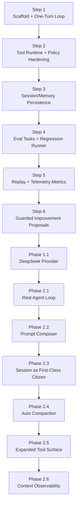
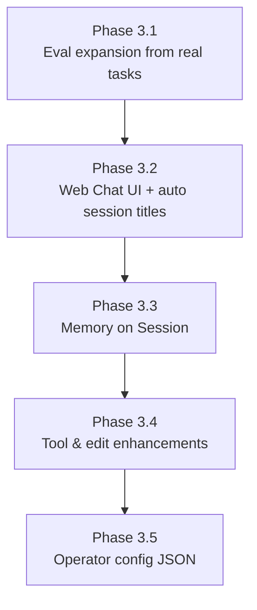
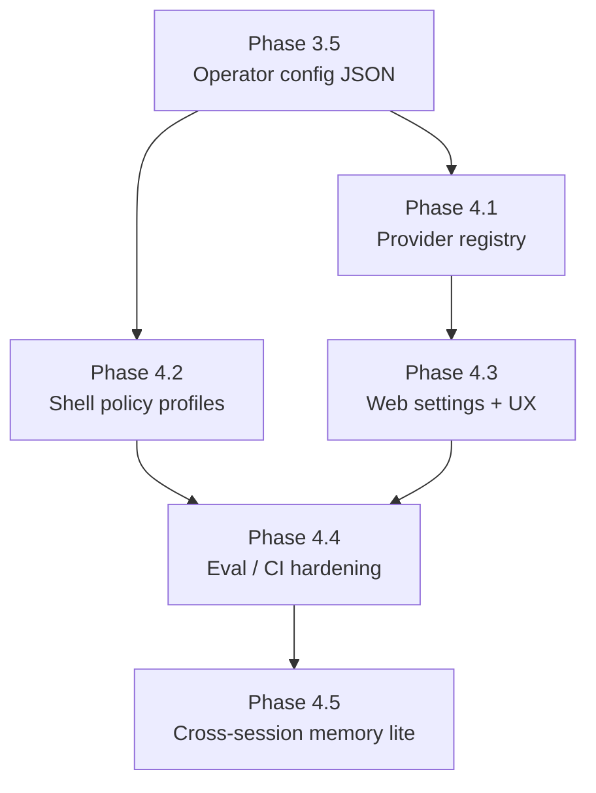

# HarnessLab Roadmap (MVP First)

## Scope

HarnessLab is a local, single-process harness built for learning:

- Minimal agent loop
- Sandboxed tool execution (policy enforced)
- Session and memory persistence
- Traceable runs and repeatable tests

## Design Principles

- Minimum closed loop before feature expansion
- Ports and adapters for replaceable components
- Safety by default (deny by default for risky actions)
- Observability as a first-class concern
- Contract-driven tests before heavy refactors

## Layered Architecture

1. `core`: loop, state transitions, interfaces, prompt composition,
   compaction, context snapshots
2. `tools`: tool registry and executions
3. `policy`: path and command checks
4. `session`: session state repository (first-class lifecycle)
5. `memory`: long-lived memory records (store only; writeback deferred)
6. `telemetry`: run trace and metrics aggregation
7. `eval` / `replay` / `improve`: regression, divergence, proposals
8. `providers`: external `ModelPort` adapters

## Step Model (Not a Timeline)

Progress is tracked in **steps**, not weeks. Each step is a contract that
defines:

- **Entry criteria**: what must be true before starting the step
- **Deliverables**: concrete artifacts (code, tests, docs) the step produces
- **Exit criteria**: the objective signals that the step is "done"

Steps are dependency-ordered, not time-boxed. An AI-driven implementer can
finish a step in hours; a human-driven implementer may take days. Either way,
the same Exit criteria apply.

## Current State (Post-MVP Phase 3–4 — complete)

HarnessLab is a daily-usable local agent harness. The shipped runtime includes
everything from Phase 2 **plus**:

- **Web chat UI** (`harnesslab serve`, `./hl-serve`) with SSE trace panel,
  settings snapshot, tool cards, fork, `/remember`, auto session titles (DeepSeek)
- **Session- and workspace-scoped memory** (`/remember`, `/remember-global`)
- **Eight built-in tools** including `apply_patch` and allowlisted `fetch_url`
- **Fourteen eval tasks** + GitHub Actions offline gate (`--skip-tags network`)
- **Operator config** (`config.json`) + **provider registry** (DeepSeek v4)
- **Provider message round-trip** — assistant `tool_calls` + tool results
  persisted for DeepSeek/OpenAI-compatible replay

Historical Phase 2 snapshot (for context):

- **Multi-step agent loop** (`run_session`, `--max-steps`; terminal
  decisions `final` / `ask_user`)
- **Prompt composer**, **session first-class**, **auto compaction**
- **Context observability**, **DeepSeek provider**, **eval / replay / propose**

## MVP Deliverables (historical — Step 1 baseline)

- `run_once()` loop:
  - read user goal
  - choose action (assistant/tool)
  - execute tool through policy checks
  - append message + trace
- Built-in tools:
  - `read_file`
  - `write_file` (workspace-limited)
  - `run_shell_safe` (allowlist + timeout placeholder)
- In-memory session and memory stores
- JSONL trace recorder
- CLI command + unit tests

## Interfaces Stable for TS Migration

- `ModelPort`: model interaction contract
- `ToolPort`: tool contract with schema and execution
- `PolicyPort`: authorization contract
- `SessionStorePort`: session persistence contract
- `MemoryStorePort`: memory persistence contract
- `TraceRecorderPort`: telemetry contract
- `ClockPort`: time source for deterministic replay
- `IdPort`: ID source for deterministic replay

Stable interfaces reduce migration risk from Python to TypeScript.

## Steps

### Step 1 — Scaffold + One-Turn Loop — DONE
- **Entry**: empty repository, AGENTS.md and architecture docs in place.
- **Deliverables**:
  - Package layout (`core`, `policy`, `tools`, `session`, `memory`, `telemetry`)
  - Stable Ports: `ModelPort`, `PolicyPort`, `ToolPort`, `SessionStorePort`,
    `MemoryStorePort`, `TraceRecorderPort`, `ClockPort`, `IdPort`
  - One-turn loop with deterministic `ClockPort`/`IdPort` injection
  - Built-in tools `read_file`, `write_file`, `run_shell_safe` with
    `args_schema`
  - `DefaultPolicy` with workspace-safe path checks and shell metacharacter
    rejection (`shell=False`, `shlex` parsing)
  - `ToolRegistry` that normalizes unknown-tool and exception cases into
    `ToolResult(ok=False)`
  - Audit-grade `tool_executed` / `tool_denied` trace payloads
  - JSONL trace recorder, CLI entry point
  - Unit + contract tests (policy, registry, loop trace, determinism)
- **Exit**: `uv run pytest` and `uv run ruff check` are green; two independent
  runs of a canonical scenario produce byte-identical JSONL traces under
  `FrozenClock` + `SeqIdProvider`.

### Step 2 — Tool Runtime + Policy Hardening — DONE
- **Entry**: Step 1 exit criteria met.
- **Deliverables**:
  - Wire `ToolPort.args_schema` into runtime validation (reject malformed
    arguments before the policy layer) — `ToolRegistry.validate_args`
    enforced in `HarnessLoop` before the policy check; emits a new
    `tool_invalid_args` trace event.
  - Add a shell-command denylist (e.g. `rm`, `sudo`, `curl`) layered on top
    of the existing allowlist — `DefaultPolicy.shell_denylist` consulted
    before the allowlist so destructive commands stay rejected even if
    accidentally allowlisted.
  - Parameterize resource limits (`output_bytes_cap`, `timeout_seconds`) via
    policy configuration rather than hardcoded constants —
    `core.config.RuntimeLimits` injected into every tool from a single
    construction point in `cli.build_runtime`.
  - Contract tests covering each stable Port (one minimal compliance test
    per Port) — `tests/test_port_contracts.py` exercises all 8 Ports
    against their production default implementations.
  - `ReplayModel` and `ReplayTraceRecorder` stubs to unblock Step 4 —
    `core.replay` provides both, and the loop drives them end-to-end in
    `tests/test_replay.py`.
- **Exit**: malformed args never reach a tool; shell denylist is enforced
  and tested; resource limits are configurable; every Port has at least one
  compliance test; replay stubs satisfy the existing Port contracts.

### Step 3 — Session/Memory Persistence — DONE
- **Entry**: Step 2 exit criteria met.
- **Deliverables**:
  - SQLite-backed `SessionStorePort` adapter — DONE
    (`src/harnesslab/session/sqlite_store.py`).
  - SQLite-backed `MemoryStorePort` adapter — DONE
    (`src/harnesslab/memory/sqlite_store.py`). Retrieval/writeback policy
    is deferred (see Deferred section below).
  - Storage schema + migration mechanism — DONE
    (`src/harnesslab/storage/sqlite.py::MIGRATIONS` + `apply_migrations`).
    Migrations are tracked in a `schema_version` table for future
    incremental versions.
  - Contract tests reused unchanged against the SQLite adapter — DONE
    (`tests/test_port_contracts.py` parametrizes the store fixtures over
    `[in_memory, sqlite]`).
  - CLI surface — DONE (`harnesslab run --storage sqlite [--sqlite-path PATH]`).
- **Exit**: in-memory and SQLite adapters pass the same Port contract suite;
  a session survives process restart (covered by
  `tests/test_cli_storage.py::test_session_persists_via_cli_with_sqlite` and
  `tests/test_sqlite_storage.py::test_session_persists_across_store_instances`).
- **Note**: memory retrieval/writeback into the loop was intentionally
  deferred until the session substrate matured (Phase 2.3). The store
  adapters remain available; loop integration is future work.

### Step 4 — Eval Tasks + Regression Runner — DONE
- **Entry**: Step 3 exit criteria met; `ReplayModel` available.
- **Deliverables**:
  - A small, versioned eval task set (input + expected outcome) — DONE
    (`eval/tasks/*.yaml`: 5 starter tasks covering assistant fallback,
    write+read round-trip, path-escape denial, schema gate, shell
    denylist). YAML is loaded into Pydantic `Task` models, and a task
    may pre-record `Decision`s to drive `ReplayModel` instead of
    `SimpleModel`.
  - Baseline comparison + regression runner — DONE
    (`src/harnesslab/eval/{runner,baseline}.py`). `TaskRunner` executes
    each task in an isolated tmp workspace with `FrozenClock` +
    `SeqIdProvider` for byte-stable traces. Baseline regressions cover
    pass→fail flips and growth in `tool_failures` / `invalid_args`;
    other metric drift is informational.
  - Compact run-quality report — DONE (`src/harnesslab/eval/report.py`).
    `render_stdout` prints PASS/FAIL with metrics and regressions;
    `write_json` produces `<reports-dir>/latest.json` for downstream
    tooling. Reports dir is ignored from git (`eval/reports/`).
  - CLI subcommand surface — DONE. `harnesslab run <input>` and
    `harnesslab eval [--task STEM] [--update-baseline]` replace the
    single-positional CLI. Exit codes: 0 pass, 2 task failure, 3
    baseline regression, 64 usage error.
- **Exit**: a known-good baseline exists at `eval/baseline.json`; every
  shipped task passes against the live loop
  (`tests/test_eval_tasks.py`); the CLI returns exit code 3 when the
  current run regresses against the baseline
  (`tests/test_cli_subcommands.py::test_eval_regression_exit_code`).
- **Deferred to later steps**: memory retrieval/writeback policy (no
  shipped task currently requires it; revisit alongside Step 5
  telemetry aggregation), GitHub Actions integration
  (template-only in this step, wired up after the workflow stabilizes).

### Step 5 — Replay + Telemetry Metrics — DONE
- **Entry**: Step 4 exit criteria met.
- **Deliverables**:
  - Deterministic replay from JSONL trace using injected
    `ClockPort` / `IdPort` — DONE. `src/harnesslab/replay/`:
    - `trace_reader.read_trace` parses JSONL into `TraceEvent`s.
    - `trace_reader.group_by_session` splits multi-session traces.
    - `replayer.replay_session` re-drives a single session through
      the production loop with `FrozenClock` + `SeqIdProvider` and a
      `ReplayModel` built from the trace's `decision_made` payloads.
      Refuses to proceed with `UnreplayableTraceError` when the trace
      lacks `user_input_received` or has malformed `decision_made`.
    - Trace was first enriched (Step 5.1) with `user_input_received`
      and full `decision_made` payload (`tool_args`, `assistant_message`)
      so this replay is feasible without a second source of truth.
    - Promoted `FrozenClock` / `SeqIdProvider` / `DEFAULT_REPLAY_CLOCK_START`
      from the eval runner's private surface into `core.runtime` so
      eval and replay share the same deterministic primitives.
  - Telemetry aggregation — DONE
    (`src/harnesslab/telemetry/aggregate.py`). `Metrics` covers
    sessions, turns, tool_calls / successes / failures, denials,
    invalid_args, `tool_success_rate`, `denial_rate`, tool latency,
    model-call latency, and model token counters (`request` /
    `response` / `total`) from the `model_call` event.
    No "session pass rate" — production traces lack a pass/fail
    signal; that lives in `harnesslab eval`.
  - Replay-vs-original divergence detector — DONE
    (`replay/divergence.py::detect_divergence`). Semantic mode
    (default) normalizes prefix ids (ses/msg/tool/run_<…> →
    `<prefix>_001…`) and scrubs volatile fields (timestamps +
    `output_preview` / `output_size` / `output_truncated`) so traces
    produced by `SystemClock` can still match a replay produced by
    `FrozenClock`. Strict mode compares byte-for-byte. Output is a
    structured `DivergenceReport` with per-event `Divergence`
    records.
  - CLI surface — DONE. Two new subcommands:
    - `harnesslab replay <trace.jsonl>
        [--session-id ID] [--workspace PATH] [--strict]`
      Exit codes: 0 match · 2 unreplayable · 4 diverged.
      `--workspace` lets operators re-use the original workspace when
      tools depend on cross-session filesystem state.
    - `harnesslab metrics <trace.jsonl> [--json]`
      Always exit 0 — observation, not a gate.
- **Exit**: every shipped eval task's trace replays divergence-free
  against itself (`tests/test_replay_module.py::test_replay_matches_eval_task_traces`);
  a tampered trace yields a precise `DivergenceReport`
  (`test_divergence_detects_tampered_decision`); the round-trip works
  end-to-end through the CLI on real JSONL written by the production
  loop (`tests/test_cli_replay_metrics.py::test_replay_with_shared_workspace_round_trips_across_sessions`).

### Step 6 — Guarded Improvement Proposals — DONE
- **Entry**: Step 5 exit criteria met.
- **Deliverables**:
  - Failed-run clustering — DONE
    (`src/harnesslab/improve/{fingerprint,cluster}.py`). Failure
    signals are mined from two sources: `tool_executed(ok=false)` /
    `tool_denied` / `tool_invalid_args` events in JSONL traces, and
    `failures` arrays from `eval/reports/latest.json`. Each is reduced
    to a compact, human-readable signature
    (e.g. `tool_denied:run_shell_safe:command not in allowlist`) and
    grouped; clusters below `--min-occurrences` (default 2) are
    dropped so single events do not warrant a proposal.
  - Proposal generation — DONE
    (`src/harnesslab/improve/{proposal,templates,generator,render}.py`).
    `Proposal` is a Pydantic model with `status` (`open` | `accepted`
    | `rejected` | `superseded`) and a stable id
    (`prop_<YYYYMMDDhhmm>_<sha1(sig)[:8]>`). Suggested actions are
    generated from hand-written templates keyed by cluster kind — no
    LLM call, consistent with the Non-Goal of "fully automated
    self-modifying code paths". Markdown rendering writes YAML
    front-matter (machine-readable) plus body sections (Cluster,
    Sample events, Sample task failures, Suggested actions,
    Acceptance checklist) targeted at humans.
  - Regression gate + rollback playbook — DONE. Every proposal's
    "Acceptance checklist" literally names `uv run harnesslab eval`
    and `uv run pytest`, so acceptance binds the Step 4 regression
    runner into the Step 6 workflow. `AGENTS.md` "Proposal Handling"
    pins the binding contract: proposals are advisory, AI must not
    auto-apply, status moves require all four checklist items.
    Rollback is by design — proposals are never auto-applied, so
    "undo" is just `git revert` of the accepting commit (proposal
    file then needs its status edited back to `open`).
  - CLI — DONE. `harnesslab propose [--trace TRACE]
    [--eval-report REPORT] [--out proposals/] [--min-occurrences N]
    [--format md|json]`. Idempotent across reruns via
    `dedupe_against_existing` against on-disk `open` proposals.
- **Exit**: shipped fixture trace
  (`tests/fixtures/sample_failure_trace.jsonl`) yields exactly the
  expected two proposals (`tests/test_improve.py::test_generate_against_shipped_fixture`);
  rerun on the same input yields zero new proposals
  (`tests/test_cli_propose.py::test_propose_md_is_idempotent_across_runs`);
  every shipped proposal's Acceptance checklist requires
  `uv run harnesslab eval`, satisfying the "gated by the Step 4
  regression runner" Exit criterion.

## Post-MVP Phase 1 — Provider Integration

MVP Steps 1-6 are complete. Phase 1 wires in a real model provider
without giving up the deterministic eval/replay surface.

### Phase 1.1 — Provider integration (`deepseek`) — DONE

- Added `DeepSeekModel` (`src/harnesslab/providers/deepseek.py`) as a
  `ModelPort` implementation over DeepSeek's OpenAI-compatible API.
- `harnesslab run` now accepts `--model {simple,deepseek}` (default:
  `simple`). DeepSeek reads credentials from `DEEPSEEK_API_KEY`.
- Added `model_call` trace event to record model latency and token
  usage (`request_tokens`, `response_tokens`, `total_tokens`), and
  wired telemetry aggregation to include those metrics.

## Post-MVP Phase 2 — Real Agent (Current)

Phase 1 added a model but kept the loop one-shot. Phase 2 turns
HarnessLab into an actual autonomous agent: the model drives a
multi-step inner loop, the prompt is composed from versioned blocks,
sessions are first-class persistent entities, long conversations
auto-compact, and the tool/observability surface is wide enough to
do non-trivial work without falling back to raw shell.

The "Memory retrieval/writeback policy" / "Metrics dashboard
artifact" / "Eval task expansion from real failures" items
originally drafted as Phase 1.2–1.4 are deferred to a future
Phase 3 in light of the deeper agent-loop work Phase 2 introduced.
Memory in particular is intentionally postponed until the
session-as-first-class-citizen substrate (Phase 2.3) is exercised
by real workflows — see AGENTS.md "Memory is built on Session, not
the other way around".

### Phase 2.1 — Real agent loop — DONE

- `Decision.kind` extended with terminal kinds `final` and
  `ask_user`; `assistant` / `tool` are now intermediate steps.
- `HarnessLoop.run_session(session_id, user_input, max_steps=N)`
  drives the inner loop: each iteration calls the model, applies
  the decision (tool / text), emits `step_started` and
  `step_completed`, and stops on a terminal decision or when
  `max_steps` is reached. `run_turn` is now a thin
  `max_steps=1` wrapper preserved for compatibility.
- New trace events: `step_started`, `step_completed`,
  `session_finished` (with `reason` ∈ `{final, ask_user,
  max_steps, overflow}`).
- `SimpleModel` extended with `/final <msg>` and `/ask <msg>`
  commands so the agent loop can be exercised deterministically
  from CLI without a live LLM.
- Replay and eval adapted: `_extract_turns` collects every
  `decision_made` between `user_input_received` events,
  `TaskTurn.max_steps` drives multi-step task replay, and a new
  `eval/tasks/06_multi_step_tool_then_final.yaml` covers the
  tool-then-final pattern.

### Phase 2.2 — Prompt composer — DONE

- New `core/prompt/` package:
  - `PromptBlock`: named, role-tagged, origin-tagged
    (`static | dynamic | conversation`) text fragment.
  - `ComposedPrompt`: ordered list of blocks with
    `as_text` / `as_openai_messages` / `snapshot` views.
  - `PromptComposer.build(session, dynamic_blocks=..., variables=...)`:
    assembles `static + dynamic + conversation` blocks, runs
    `${var}` substitution (used today for `${model_name}`), and
    returns a `ComposedPrompt`.
- Five packaged static blocks under
  `core/prompt/blocks/` (`00_identity`, `01_harness`,
  `02_safety`, `03_style`, `04_engineering`) loaded in lexical
  order at import time. Files are markdown so they version cleanly
  in Git.
- Dynamic block factories in `core/prompt/dynamic.py`:
  - `build_env_block(workspace_root)` — CWD, platform, date,
    optional git summary.
  - `build_agents_md_block(workspace_root)` — reads `AGENTS.md`
    when present and folds it into the prompt.
  - `build_tool_guide_block(registry)` — lists registered tools
    with their descriptions so the model sees the live tool surface.
- `DeepSeekModel` rebuilt to consume the composer instead of a
  hardcoded system string; the CLI wires the env/agents_md/tool_guide
  trio through `_make_dynamic_blocks_provider`.
- `pyproject.toml` `[tool.hatch.build.targets.wheel.force-include]`
  ensures the `.md` block files ship with the wheel.

### Phase 2.3 — Session as first-class citizen — DONE

- `Session` model gained
  `status: pending|running|waiting_user|done|failed|aborted`,
  `step_count`, `last_step_at`, `parent_session_id`, and `title`.
  `loop.start(goal=…)` derives a short title from the goal.
- `HarnessLoop.fork(session_id, *, new_goal=None)` creates a child
  session with fresh message ids and `parent_session_id` set, so
  forks can persist into SQLite without violating uniqueness.
- `SessionStorePort.list(*, limit=None, status=None)` added.
  Both `InMemorySessionStore` and `SqliteSessionStore` implement it.
- SQLite schema bumped to v2 (`storage/sqlite.py::MIGRATIONS`) with
  ALTERs for the new session columns plus supporting indexes.
- New CLI surface: `harnesslab session
  [--workspace-root .] [--sqlite-path PATH] ACTION` with
  `ls / show / resume / fork` actions. The session subcommand
  defaults to `sqlite` storage.

### Phase 2.4 — Auto compaction — DONE

- `core/compaction.py`:
  - `estimate_tokens` / `estimate_messages_tokens`
    (`len(text) // 4`, intentionally provider-agnostic).
  - `should_compact(messages, threshold_tokens)`.
  - `compact_messages(messages, keep_last, summarizer, …)`:
    replaces all but the last `keep_last` messages with a single
    summary system message, fenced in `<system-reminder>`.
  - `Summarizer` protocol + `_fallback_summarizer` (deterministic,
    LLM-free).
  - `LiveSummarizer(model)` — opt-in wrapper that uses a real
    `ModelPort` to summarize, with the fallback summary used when
    the model returns an empty string.
  - `ModelOverflowError` — the contract between adapters and the
    loop for "the API rejected this request because the context
    window is full".
- `RuntimeLimits` gained `context_window_tokens`,
  `compaction_threshold_tokens`, `compaction_keep_last_messages`.
- `HarnessLoop`:
  - `_maybe_compact` runs before each model call and triggers a
    threshold-driven compaction when needed.
  - `_call_model_with_overflow` catches `ModelOverflowError`,
    runs an emergency compaction (`keep_last = max(1, configured
    // 2)`), retries once, and surfaces a final decision with an
    explanatory message if overflow persists.
  - New trace events `compaction_started` (with
    `trigger: threshold|overflow`) and `compaction_completed`.
- `DeepSeekModel` detects OpenAI/DeepSeek HTTP 400 context-length
  responses and raises `ModelOverflowError` so the loop can
  recover.

### Phase 2.5 — Expanded tool surface — DONE

- New file tools in `tools/file_tools.py`:
  - `EditFileTool` — in-place string replacement; `old` must be
    present, must be unique unless `replace_all=True`, never
    silently overwrites.
  - `GrepTool` — UTF-8 walk of the workspace returning
    `path:lineno: line` matches; optional `glob` filter, default
    `max_matches=50`, hard cap `1000`, skips binary files and a
    standard noise-dir list (`.git`, `.venv`, `node_modules`,
    `__pycache__`, `dist`, `build`, …).
  - `GlobTool` — workspace-relative path matches sorted
    deterministically; default `max_results=100`, hard cap `5000`,
    same noise-dir skip list.
- `DefaultPolicy` admits all three: `edit_file` reuses the strict
  `_check_path`; `grep` / `glob` use a new `_check_optional_path`
  (path optional; must resolve in-workspace when supplied).
- Read-only shell allowlist expanded from `{ls, pwd, echo, cat}`
  to also cover file inspection (`head, tail, wc, file, du, df,
  stat`), introspection (`which, env, date, whoami, hostname,
  uname`), search (`find, tree`), dev tooling (`python, python3,
  pytest, ruff, mypy, uv`), and `git`. `git` is special-cased:
  it is on the head allowlist, but argv[1] must be one of
  `SAFE_GIT_SUBCOMMANDS` (read-only set: `status, log, diff,
  show, branch, remote, ls-files, ls-tree, rev-parse, describe,
  tag, blame, shortlog, config`). Write-side subcommands
  (`push`, `reset`, `checkout`, `clean`, …) stay rejected with
  an advisory message listing the safe set.

### Phase 2.6 — Context observability — DONE

- `core/context.py::ContextSnapshot` — per-call snapshot of
  conversation tokens / message count / configured budget /
  usage ratios, with optional adapter-supplied prompt-side fields
  (`prompt_tokens_estimate`, `static_block_tokens`,
  `dynamic_block_tokens`, `prompt_block_names`).
- `HarnessLoop._model_call_payload` attaches
  `payload["context"]` to every `model_call` event. The replay
  divergence detector ignores `context` (token estimates depend on
  tool outputs that embed tmp workspace paths and are
  informational, not behavioral).
- `DeepSeekModel` publishes prompt-side fields by walking the
  composed prompt blocks after each call.
- New CLI: `harnesslab context <trace>`
  - `show [--session-id ID] [--json]` — peak conversation
    tokens, peak usage ratio, full breakdown of the latest
    snapshot.
  - `series [--session-id ID] [--limit N]` — one row per
    `model_call` so growth over time is visible.
- `Metrics` (and `render_metrics`) gained
  `max_conversation_tokens`, `peak_usage_ratio`, `compactions`,
  `overflow_recoveries`; pre-Phase-2.6 traces still aggregate
  cleanly (missing fields default to `0` / `None`).

## Post-MVP Phase 3 — Usability & Production Feedback — DONE

Phase 2 delivered a working multi-step agent. Phase 3 turns it into
something people actually use daily: browser chat, smarter session
labels, and eval coverage that tracks real failures.

### Phase 3.1 — Eval expansion from real tasks — DONE

- Codify recurring `harnesslab propose` clusters as YAML eval tasks
  before merging fixes — see `eval/README.md` (propose→eval workflow).
- Shipped tasks: `grep_then_edit`, `compaction_on_threshold`,
  `session_resume_second_turn`, `apply_patch_unified_diff`,
  `fetch_url_weather` (twelve tasks total).
- Eval runner registers all eight built-in tools; optional per-task
  `limits:` overrides for compaction tests.
- GitHub Actions workflow `.github/workflows/eval.yml` runs
  `pytest` + `harnesslab eval` on pull requests.

**Exit**: shipped eval tasks cover Phase 2 core paths; propose→eval
workflow documented.

### Phase 3.2 — Web Chat UI + session auto-titles — DONE

**Web UI (`harnesslab serve`)**

- Localhost-only HTTP server (`127.0.0.1:8787` by default).
- Static chat page: message list, composer, session sidebar.
- JSON API backed by the same `HarnessLoop` + SQLite session store
  as the CLI (`GET/POST /api/sessions`, `POST .../messages`).
- Default model: `deepseek` (requires `DEEPSEEK_API_KEY`); `--model
  simple` for offline smoke tests.
- No auth, no public bind — learning/dev tool, not a production web
  service.

**Auto LLM session titles (robust / fast / low token)**

- After the **first** completed user turn (`turn_count == 1`), an
  optional `LiveTitleNamer` replaces the placeholder title derived
  from the goal string.
- Prompt sends only the first user message + a short assistant
  excerpt (no full transcript, no tool output).
- Expects a plain-text `final` reply; tool decisions fall back silently.
- Output sanitized (single line, 60-char cap); emits `session_titled`
  trace event on success.
- Wired automatically when `--model deepseek`; skipped for `simple`
  (deterministic eval/replay path unchanged).

**Deliverables (3.2.1 — shipped in this step)**

- `src/harnesslab/web/` — stdlib `http.server` + static assets (no
  new runtime dependencies).
- `harnesslab serve [--port 8787] [--model deepseek|simple]`.
- `./hl-serve` — Python lifecycle helper at repo root (`start|stop|
  restart|status`); optional `~/.config/harnesslab/env` for secrets.
- `src/harnesslab/core/title.py` — `derive_title_from_text`,
  `LiveTitleNamer`, loop hook `_maybe_auto_title`.

**Deliverables (3.2.2 — Web UX polish)**

- SSE streaming on `POST .../messages` (`Accept: text/event-stream`
  or `"stream": true`); live `trace` events via `TraceHub`.
- Tool/run inspector panel (`GET /api/sessions/{id}/trace`).
- Fork button + `POST /api/sessions/{id}/fork`.
- `/remember` affordance in composer; session detail exposes
  `memory_notes`.

**Exit (3.2)**: browser chat completes a multi-step turn; session
list shows LLM titles when using DeepSeek; CLI `session ls/show`
sees the same SQLite rows; streaming turn shows tool/step events.

### Phase 3.3 — Memory on Session — DONE

- Wire `MemoryStorePort` read/write into `HarnessLoop` with explicit
  session-scoped policy (`core/memory_policy.py`).
- **Read:** inject `session:{id}:notes` as a `system` message each
  turn; trace `memory_read`.
- **Write:** on ``/remember <text>`` only; trace ``memory_written``
  with ``source: remember``. No auto-write on ``final``.
- Eval task `session_memory_persists` guards the path.
- **Not in scope:** cross-session RAG, vector index, LLM memory
  extraction.

### Phase 3.4 — Tool & edit enhancements — DONE

- `apply_patch` unified-diff editing — **shipped**.
- `fetch_url` read-only HTTP for allowlisted hosts (MVP: `wttr.in`) — **shipped**.
- Shell allowlist profiles (`dev`, `read_only`, `strict`) — **shipped**
  (`policy/shell_profiles.py`; config `policy.shell_profile`).
- Eval task `shell_profile_strict` guards profile-specific denial.
- UI affordances for tool output — partial (main chat hides raw `tool`
  messages; richer inline tool cards remain optional).

### Phase 3.5 — Operator configuration — DONE

- `core/operator_config.py` loads `~/.config/harnesslab/config.json`.
- Precedence: CLI > env > config > defaults; secrets stay in
  [`scripts/hl-serve.example.env`](../scripts/hl-serve.example.env).
- Example schema: [`scripts/harnesslab.config.example.json`](../scripts/harnesslab.config.example.json).
- `harnesslab run` / `serve` consume shared defaults; `./hl-serve` too.
- Eval: `--skip-tags network` + pytest `network` marker for CI (Phase 4.4
  partial — shipped early).

**Configuration ladder (shipped)**

| Layer | Location | Purpose |
|-------|----------|---------|
| Secrets | `~/.config/harnesslab/env` | API keys only. Template: [`scripts/hl-serve.example.env`](../scripts/hl-serve.example.env) |
| Operator defaults | `~/.config/harnesslab/config.json` | Non-secret defaults. Example: [`scripts/harnesslab.config.example.json`](../scripts/harnesslab.config.example.json) |
| Serve lifecycle | `./hl-serve` + `HL_SERVE_*` | start/stop/restart overrides |
| CLI flags | `harnesslab run/serve/eval …` | per-invocation overrides (highest precedence) |

Precedence: `CLI flag > process env > config.json > built-in default`.

---

## Post-MVP Phase 4 — Hardening & operator ergonomics — DONE

Phase 3 made the harness *usable*. Phase 4 should make it *trustworthy
under daily use* without violating AGENTS.md non-goals (no multi-agent
orchestration, no distributed runtime, no plugin marketplace, no
auto-applied proposal pipelines).

Each item below uses the same **Entry / Deliverables / Exit** bar as
Steps 1–6. Nothing starts until its Entry criteria are objectively true.

### Phase 4.1 — Provider registry (config-driven backends) — DONE

- **Entry**: Phase 3.5 config loader shipped; `ModelPort` unchanged.
- **Deliverables**: map `config.model.default_backend` → adapter
  factory (`simple`, `deepseek`, future `openai`-compatible); CLI
  `--model` overrides config; provider failures still normalize to
  `Decision(kind=final, …)` per AGENTS.md.
- **Exit**: switching backend requires config edit only (no code change);
  contract tests per adapter; eval stays on `simple`/`ReplayModel` by
  default in CI.

### Phase 4.2 — Shell allowlist profiles — DONE

- **Entry**: policy tests cover current monolithic allowlist.
- **Deliverables**: named profiles (`read_only`, `dev`, `strict`) in
  config; `DefaultPolicy` selects profile at runtime; denylist unchanged;
  document in `tool-runtime.md`.
- **Exit**: eval task asserts profile-specific allow/deny; default profile
  matches today's behavior (no silent regression).

### Phase 4.3 — Web UI settings & tool UX — DONE

- **Entry**: config.json readable from Python; serve already on SQLite.
- **Deliverables**: optional settings panel (model label, workspace path,
  read-only config snapshot); optional inline tool result cards in chat
  (structured from trace, not raw `[tool:…]` strings).
- **Exit**: manual QA checklist + one integration test for settings API;
  chat still hides internal `tool` role rows by default.

### Phase 4.4 — Eval / CI hardening — DONE

- **Entry**: twelve tasks green locally; `fetch_url_weather` may need network.
- **Deliverables**: tag network-dependent tasks; document offline CI
  strategy (`pytest -m "not network"` or recorded replay stub); baseline
  update discipline in `eval/README.md`; wire `.github/workflows/eval.yml`
  if not already on PRs.
- **Exit**: CI green without live API keys; network tasks skippable but
  run in manual/`RUN_LIVE=1` lane.

### Phase 4.5 — Cross-session memory (lite) — DONE

- **Entry**: Phase 3.3 session memory stable; config loader exists.
- **Deliverables**: optional workspace-scoped notes key (not vector RAG);
  explicit write path (CLI or `/remember-global` TBD); trace events;
  **no** LLM-extracted memory (AGENTS.md proposal rules unchanged).
- **Exit**: eval task for read/inject across two sessions; docs updated;
  replay compare ignores volatile memory timestamps only.

**Explicitly deferred beyond Phase 4**

- Multi-agent orchestration, distributed workers, plugin marketplace
- Metrics HTML dashboard (JSON CLI remains sufficient)
- TS migration (Ports stay stable; migration is a separate program)
- Auto-apply improvement proposals
- **Provider SDK layer** — P0–P7 shipped: catalog, transforms, and adapters for DeepSeek
  (OpenAI Chat), Anthropic Messages, OpenAI Responses, Gemini generateContent, optional
  failover, and OTel fan-out. See
  [`docs/architecture/provider-expansion.md`](architecture/provider-expansion.md) §8.
- **Constrained provider plugins** — built-in `api_family` hooks first; optional local
  `entry_points` / plugin dir for third-party transports only (no marketplace, no
  policy/tool plugins); see provider-expansion §6.7.

**Recommended execution order**

1. Close **3.4** (shell profiles) — small, policy-bound, testable.
2. Ship **3.5** (config.json) — unblocks everything else; link env template.
3. **4.2** can merge with 3.4 if profiles are the same feature.
4. **4.4** early — protects main while 4.1/4.3 land.
5. **4.1** then **4.3** — user-visible provider switch.
6. **4.5** last — highest design risk; needs session + config substrate.

---

## Deferred (longer horizon)

- **Metrics dashboard artifact.** Static HTML report on top of
  `harnesslab metrics` / `harnesslab context`. The JSON CLI surfaces
  are sufficient for Phase 4; revisit after operator config exists.
- **TypeScript migration.** Stable Ports reduce risk; not scheduled until
  Phase 4 hardening exits are met.
- **Multi-agent orchestration, distributed workers, plugin marketplace.**
- **OTel metrics histograms** (`harnesslab.model.latency_ms`, token histograms) — spans
  ship in P7; metric instruments remain future work.
- **Auto-apply improvement proposals** (human review required per AGENTS.md).
