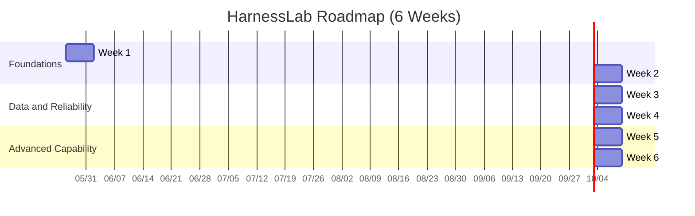

# HarnessLab Roadmap (MVP First)

## Scope

HarnessLab is a local, single-process harness built for learning:

- Minimal agent loop
- Sandboxed tool execution (policy enforced)
- Session and memory persistence
- Traceable runs and repeatable tests

## Design Principles

- Minimum closed loop before feature expansion
- Ports and adapters for replaceable components
- Safety by default (deny by default for risky actions)
- Observability as a first-class concern
- Contract-driven tests before heavy refactors

## Layered Architecture

1. `core`: loop, state transitions, interfaces
2. `tools`: tool registry and executions
3. `policy`: path and command checks
4. `session`: session state repository
5. `memory`: long-lived memory records
6. `telemetry`: run trace and spans

## Timeline

## MVP Deliverables

- `run_once()` loop:
  - read user goal
  - choose action (assistant/tool)
  - execute tool through policy checks
  - append message + trace
- Built-in tools:
  - `read_file`
  - `write_file` (workspace-limited)
  - `run_shell_safe` (allowlist + timeout placeholder)
- In-memory session and memory stores
- JSONL trace recorder
- CLI command + unit tests

## Interfaces Stable for TS Migration

- `ModelPort`: model interaction contract
- `ToolPort`: tool contract with schema and execution
- `PolicyPort`: authorization contract
- `SessionStorePort`: session persistence contract
- `MemoryStorePort`: memory persistence contract
- `TraceRecorderPort`: telemetry contract

Stable interfaces reduce migration risk from Python to TypeScript.

## Milestones

### Week 1
- Scaffold package and contracts
- Implement one-turn loop
- Add 4-6 unit tests

### Week 2
- Harden tool runtime behavior and edge-case handling
- Expand policy checks with explicit deny reasons
- Add shell execution timeout and output cap tests

### Week 3
- Add session persistence (SQLite)
- Add memory retrieval/writeback policy
- Introduce migration scripts for storage schema

### Week 4
- Build a small eval task set
- Add baseline comparison and regression runner
- Publish a compact run-quality report

### Week 5
- Add replay from trace
- Add telemetry aggregation (pass rate, tool success, latency)

### Week 6
- Add a controlled self-improvement pipeline:
  - failed run clustering
  - proposal generation
  - regression gate and rollback
